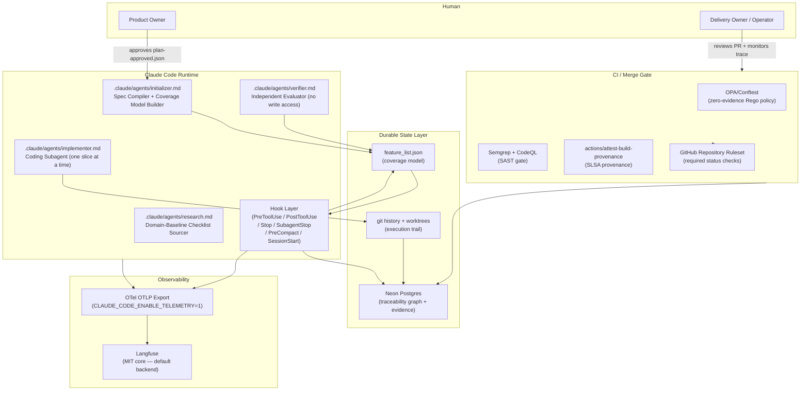
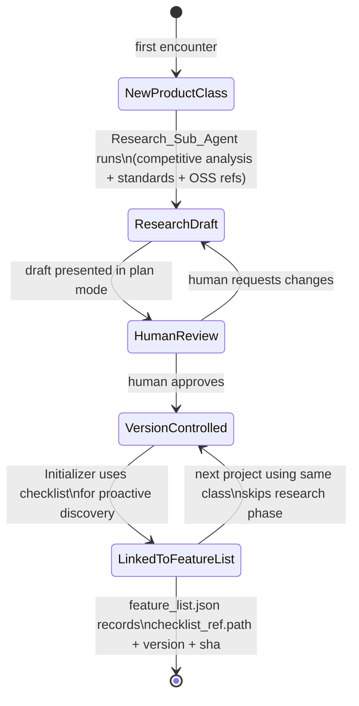

# Design Document — Spec-to-Evidence Coverage Control System

## Overview

The Spec-to-Evidence Coverage Control System is an autonomous agentic software-delivery control plane running on the Claude Code substrate. It converts product intent into a traceable, machine-verifiable coverage model and governs agent execution until every in-scope requirement is proven with captured evidence.

The governing invariant that shapes every design decision: **deterministic gates — Claude Code hooks, CI, OPA — decide whether delivery is complete, computed solely from verifiable facts. Model self-assessment and probabilistic predictions only inform; they never gate.**

The system is organized into five build phases:

| Phase | What gets built |
|-------|----------------|
| **Phase 0 (spine)** | `feature_list.json` + Stop hook + independent verifier subagent + git worktrees + GitHub required status check + Playwright CLI |
| **Phase 1 (verification depth)** | Semgrep + CodeQL + SonarQube + OPA/Conftest + PostToolUse hooks + schema validation |
| **Phase 2 (durable state)** | Postgres traceability graph + PreCompact checkpoints + SLSA attestations |
| **Phase 3 (observability)** | OTel + Langfuse + `requirement.id` Baggage + hook decision forwarding |
| **Phase 4 (optional)** | Temporal/Inngest outer loop (only when crash pain is felt) |

Phase 0 is the only phase with a hard build-first constraint. The spine must be runnable before any later phase begins.

---

## Architecture

### System Context



### Core Execution Loop

```mermaid
sequenceDiagram
    participant H as Human
    participant I as Initializer Agent
    participant Hook as Hook Layer
    participant Impl as Implementer Agent
    participant Ver as Verifier Agent
    participant CI as CI / OPA Gate

    H->>I: product intent
    I->>I: EARS → SMT-lib → Z3 validation
    I->>I: domain-baseline checklist expansion
    I->>I: emit feature_list.json (all unproven)
    I->>H: plan mode — present spec + coverage model
    H->>I: write plan-approved.json

    loop For each unproven item (highest priority first)
        Hook->>Impl: SessionStart — load git status + progress + coverage model
        Hook->>Hook: PreToolUse — check plan-approved.json exists
        Hook->>Hook: PreToolUse — check no prior slice item is unproven
        Impl->>Impl: implement one slice in dedicated git worktree
        Hook->>Hook: PostToolUse — lint + SAST + wiring check (next-turn feedback)
        Impl->>Impl: atomic commit with requirement ID in trailer
        Ver->>Ver: structural + semantic + behavioral + security verification
        Ver->>Ver: capture Evidence_Record (test_file, test_name, output_hash, collected_at)
        Hook->>Hook: SubagentStop — validate evidence schema
        Ver->>Hook: flip item unproven → proven in feature_list.json
        Hook->>Hook: Stop — check all items proven; block if any unproven remain
    end

    CI->>CI: OPA/Conftest — zero-evidence query on all requirements
    CI->>H: merge allowed only when all requirements have passing evidence
```

---

## Components and Interfaces

### Component Inventory

| Component | File path | Phase | Description |
|-----------|-----------|-------|-------------|
| `feature_list.json` | `/feature_list.json` | 0 | The canonical coverage model. Never deleted or reordered. |
| `stop_hook.py` | `.claude/hooks/stop_hook.py` | 0 | Stop hook — coverage validator; blocks if any item unproven. |
| `pre_tool_use_hook.py` | `.claude/hooks/pre_tool_use_hook.py` | 0 | Pre-execution gate — plan approval, scope sequencing, artifact protection. |
| `session_start_hook.py` | `.claude/hooks/session_start_hook.py` | 0 | Loads git status, progress file, and coverage model on session start. |
| `subagent_stop_hook.py` | `.claude/hooks/subagent_stop_hook.py` | 0/1 | Validates Evidence_Record schema before accepting a subagent result. |
| `post_tool_use_hook.py` | `.claude/hooks/post_tool_use_hook.py` | 1 | Runs lint + SAST + wiring checks after each file edit; returns errors as next-turn feedback. |
| `pre_compact_hook.py` | `.claude/hooks/pre_compact_hook.py` | 2 | Checkpoints progress and evidence before context compaction. |
| `spec_validator.py` | `tools/spec_validator.py` | 0 | Non-LLM Z3-backed EARS validator returning `{contradictions, ambiguities, uncovered, violation_count}`. |
| `evidence_collector.py` | `tools/evidence_collector.py` | 0 | Assembles and validates Evidence_Record; computes output_hash. |
| `wiring_checker.py` | `tools/wiring_checker.py` | 1 | Static call-graph / dead-code analysis; emits WIRING coverage items. |
| `orphan_detector.py` | `tools/orphan_detector.py` | 1 | Detects implementation units with no requirement ref and vice versa. |
| `coverage_query.rego` | `.github/policies/coverage_query.rego` | 1 | OPA/Conftest policy; denies merge if any requirement has zero passing evidence. |
| `schema/` | `schema/feature_list.schema.json` | 0 | JSON Schema for feature_list.json. PreToolUse validates against this. |
| `plan-approved.json` | `/plan-approved.json` | 0 | Approval marker written by human after plan mode review. |
| `db/migrations/` | `db/migrations/*.sql` | 2 | Postgres schema migrations for all six tables. |
| `initializer.md` | `.claude/agents/initializer.md` | 0 | Spec compiler + coverage model builder subagent definition. |
| `implementer.md` | `.claude/agents/implementer.md` | 0 | Coding subagent definition. Single slice, single worktree. |
| `verifier.md` | `.claude/agents/verifier.md` | 0 | Independent evaluator subagent. No write access to implementation. |
| `research.md` | `.claude/agents/research.md` | 0 | Domain-baseline checklist sourcing subagent. |

### Hook Configuration (`settings.json`)

```json
{
  "hooks": {
    "Stop": [
      {
        "type": "command",
        "command": "python3 .claude/hooks/stop_hook.py"
      }
    ],
    "PreToolUse": [
      {
        "type": "command",
        "command": "python3 .claude/hooks/pre_tool_use_hook.py"
      }
    ],
    "PostToolUse": [
      {
        "type": "command",
        "command": "python3 .claude/hooks/post_tool_use_hook.py",
        "matcher": "Write|Edit|MultiEdit"
      }
    ],
    "SubagentStop": [
      {
        "type": "command",
        "command": "python3 .claude/hooks/subagent_stop_hook.py"
      }
    ],
    "SessionStart": [
      {
        "type": "command",
        "command": "python3 .claude/hooks/session_start_hook.py"
      }
    ],
    "PreCompact": [
      {
        "type": "command",
        "command": "python3 .claude/hooks/pre_compact_hook.py"
      }
    ]
  }
}
```

All hooks are `command` type (not HTTP or MCP) so they fail closed. Exit code semantics: `0` = proceed, `2` = blocking error written to stderr and fed back to the model, any other non-zero = non-blocking feedback only.

### Hook Wiring Table

| Hook event | Trigger | What it does | What it blocks | Requirement enforced |
|------------|---------|--------------|----------------|---------------------|
| `Stop` | Agent attempts to end its turn | Reads `feature_list.json`; counts `unproven` items; reads `violation_count` from spec-completion state | Termination while any in-scope item is `unproven` or `violation_count > 0` | REQ-GATE-002, REQ-SPEC-021 |
| `PreToolUse` — plan gate | Any `Write` or `Edit` tool call | Checks `plan-approved.json` exists | All implementation writes until plan is approved | REQ-HITL-001, REQ-EXEC-004 |
| `PreToolUse` — scope gate | `Bash` with worktree create / slice assign | Reads `feature_list.json`; checks all prior-slice items are `proven` | New worktree or slice start when any prior item is `unproven` | REQ-EXEC-005 |
| `PreToolUse` — artifact guard | Any tool targeting `feature_list.json` schema, `tests/`, CI config, or destructive Bash (`rm -rf`, `DROP TABLE`) | Checks tool target against protected-artifact list | Edits to protected files or destructive operations | REQ-STEER-003, REQ-COV-002 |
| `PreToolUse` — status guard | Any write to `feature_list.json` | Validates proposed status transition; checks evidence schema completeness | Transitions other than `unproven → proven`; transitions with incomplete Evidence_Record | REQ-COV-002, REQ-COV-003, REQ-COV-006 |
| `PostToolUse` | `Write`, `Edit`, `MultiEdit` completion | Runs lint, type check, SAST (Semgrep), wiring check on changed files; returns specific errors via stdout | Nothing (exit 1 = non-blocking); errors returned as next-turn feedback only | REQ-VERIFY-004, REQ-STEER-002 |
| `SubagentStop` | Subagent result returned | Validates Evidence_Record schema (all four fields present and non-empty) | Acceptance of subagent result without complete evidence markers | REQ-VERIFY-005, REQ-COV-006 |
| `SessionStart` | Session begins | Reads `git status`, `claude-progress.txt`, `feature_list.json`; injects summary into context | Nothing (informational load) | REQ-STATE-003 |
| `PreCompact` | Context compaction imminent | Checkpoints `claude-progress.txt`, current evidence state, and `feature_list.json` to git | Nothing (checkpoint write; non-blocking) | REQ-STATE-002 |

### Subagent Definitions

Each subagent is a Markdown file in `.claude/agents/` following the Claude Code agent spec.

#### `.claude/agents/initializer.md` — Spec Compiler + Coverage Model Builder

**Role:** Transforms product intent into an EARS-compliant spec, validates it with Z3, builds `feature_list.json`, and presents the plan for human approval.

**Key behaviors:**
- Runs `spec_validator.py` after every elaboration pass; never accepts its own completion claim
- Loops (bounded to DEFAULT=7 passes) until `violation_count == 0` or no-progress triggers HANDOFF
- Expands intent against the domain-baseline checklist; flags any UNMAPPED items
- Writes `feature_list.json` with all items defaulting to `unproven`
- Enters plan mode to present the validated spec + coverage model for human sign-off
- Does NOT write `plan-approved.json` — only the human does

**Permissions:** Read/write to spec artifacts, `feature_list.json`, domain-baseline checklists. No access to `tests/`, CI config, or implementation source.

#### `.claude/agents/implementer.md` — Coding Subagent

**Role:** Implements exactly one highest-priority `unproven` item per session in an isolated git worktree.

**Key behaviors:**
- Reads `feature_list.json` to identify the single highest-priority `unproven` item
- Creates a dedicated git worktree (`git worktree add`)
- Targets ≤15 minutes / ≤1 feature per session
- Produces exactly one atomic commit with the requirement ID in the git trailer
- Does NOT run verification — verification is the Verifier's exclusive domain

**Permissions:** Write to implementation source files in its assigned worktree only. No write access to `tests/`, `feature_list.json` schema, CI config, or other worktrees.

#### `.claude/agents/verifier.md` — Independent Evaluator

**Role:** Independently verifies each completed slice across all four layers without any write access to implementation.

**Key behaviors:**
- Runs structural checks (lint, type check, AST analysis)
- Runs semantic checks (unit + integration tests)
- Runs behavioral checks via Playwright CLI — captures trace / screenshot as evidence artifact
- Runs security checks (Semgrep + CodeQL)
- Assembles a complete Evidence_Record for each proven item using `evidence_collector.py`
- Flips item status `unproven → proven` in `feature_list.json` only when all checks pass and Evidence_Record is complete
- Enforces line-coverage threshold ≥ 85% on touched files

**Permissions:** Read-only on implementation source. Read/write on `tests/`, `feature_list.json` status field only. No write to implementation source.

#### `.claude/agents/research.md` — Domain-Baseline Checklist Sourcer

**Role:** When a new product class is encountered, researches competitive analysis, industry standards, and open-source reference implementations to draft a domain-baseline checklist.

**Key behaviors:**
- Triggered by the Initializer when a product class has no existing checklist
- Queries web sources (competitive analysis, standards, OSS reference implementations)
- Produces a draft checklist named by product class (e.g., `baselines/saas-auth.md`)
- Presents draft for human review; does NOT use the checklist until it is approved
- Persists approved checklist as a version-controlled artifact linked to `feature_list.json`

**Permissions:** Read/write to `baselines/` directory. No access to implementation source, tests, or CI config.

---

## Data Models

### `feature_list.json` Schema

Full JSON Schema for the coverage model. This file is append-only (items are never removed or reordered). The only permitted mutation after creation is a status flip from `unproven` to `proven`.

```json
{
  "$schema": "http://json-schema.org/draft-07/schema#",
  "title": "FeatureList",
  "type": "object",
  "required": ["schema_version", "product_class", "checklist_ref", "items"],
  "properties": {
    "schema_version": {
      "type": "string",
      "description": "Semver of this schema (e.g. '1.0.0')"
    },
    "product_class": {
      "type": "string",
      "description": "Detected product class (e.g. 'agentic-sdlc-control-plane')"
    },
    "checklist_ref": {
      "type": "object",
      "description": "Which domain-baseline checklist and version was used",
      "required": ["path", "version", "sha"],
      "properties": {
        "path": { "type": "string" },
        "version": { "type": "string" },
        "sha": { "type": "string" }
      }
    },
    "items": {
      "type": "array",
      "items": { "$ref": "#/definitions/CoverageItem" },
      "description": "Append-only ordered list of coverage items"
    }
  },
  "definitions": {
    "CoverageItem": {
      "type": "object",
      "required": ["id", "type", "priority", "dependencies", "acceptance_criteria", "status"],
      "properties": {
        "id": {
          "type": "string",
          "pattern": "^[A-Z]+-[A-Z]+-[0-9]{3}$",
          "description": "Unique requirement ID (e.g. REQ-SPEC-001)"
        },
        "type": {
          "type": "string",
          "enum": ["functional", "NFR", "WIRING"],
          "description": "Coverage item type. WIRING items require integration-test evidence."
        },
        "priority": {
          "type": "integer",
          "minimum": 1,
          "description": "Implementation priority (1 = highest). Determines scheduling order."
        },
        "title": {
          "type": "string",
          "description": "Short human-readable title"
        },
        "ears_pattern": {
          "type": "string",
          "enum": ["ubiquitous", "event-driven", "state-driven", "unwanted", "optional"],
          "description": "Assigned EARS pattern"
        },
        "ears_statement": {
          "type": "string",
          "description": "Full EARS requirement statement"
        },
        "dependencies": {
          "type": "array",
          "items": { "type": "string" },
          "description": "IDs of coverage items that must be proven before this one"
        },
        "acceptance_criteria": {
          "type": "array",
          "items": { "type": "string" },
          "minItems": 1,
          "description": "Machine-checkable acceptance criteria (≥1 required)"
        },
        "provenance": {
          "type": "string",
          "enum": ["stated", "inferred"],
          "description": "Whether the requirement was explicitly stated or inferred by discovery"
        },
        "status": {
          "type": "string",
          "enum": ["unproven", "proven", "failed"],
          "default": "unproven",
          "description": "Coverage status. Transitions: unproven → proven only (with evidence). failed is set by the verifier."
        },
        "evidence": {
          "$ref": "#/definitions/EvidenceRecord",
          "description": "Required when status = proven. Must have all four fields."
        }
      }
    },
    "EvidenceRecord": {
      "type": "object",
      "required": ["test_file", "test_name", "output_hash", "collected_at"],
      "additionalProperties": false,
      "properties": {
        "test_file": {
          "type": "string",
          "description": "Path to the test file that produced the proof"
        },
        "test_name": {
          "type": "string",
          "description": "Unique test identifier within the test file"
        },
        "output_hash": {
          "type": "string",
          "pattern": "^sha256:[a-f0-9]{64}$",
          "description": "SHA-256 content-addressed hash of the test output artifact"
        },
        "collected_at": {
          "type": "string",
          "format": "date-time",
          "description": "ISO-8601 timestamp when the evidence was collected"
        }
      }
    }
  }
}
```

**Evidence_Record** has exactly four required fields with no additional properties allowed:

| Field | Type | Description |
|-------|------|-------------|
| `test_file` | `string` | Path to the test file |
| `test_name` | `string` | Unique test identifier |
| `output_hash` | `string` (sha256:...) | Content-addressed hash of test output |
| `collected_at` | `string` (ISO-8601) | Timestamp of evidence collection |

### Postgres Schema

Six tables. Managed on Neon (serverless Postgres with per-PR branching).

```sql
-- requirements: the authoritative spec record per project run
CREATE TABLE requirements (
    id           TEXT PRIMARY KEY,         -- REQ-SPEC-001 etc.
    project_id   TEXT NOT NULL,
    type         TEXT NOT NULL CHECK (type IN ('functional', 'NFR', 'WIRING')),
    priority     INTEGER NOT NULL,
    ears_pattern TEXT NOT NULL,
    ears_stmt    TEXT NOT NULL,
    provenance   TEXT NOT NULL CHECK (provenance IN ('stated', 'inferred')),
    created_at   TIMESTAMPTZ NOT NULL DEFAULT now()
);

-- coverage_items: mutable status view per requirement
CREATE TABLE coverage_items (
    id             SERIAL PRIMARY KEY,
    requirement_id TEXT NOT NULL REFERENCES requirements(id),
    status         TEXT NOT NULL CHECK (status IN ('unproven', 'proven', 'failed'))
                   DEFAULT 'unproven',
    slice_id       TEXT,
    updated_at     TIMESTAMPTZ NOT NULL DEFAULT now()
);

-- traceability_links: bidirectional requirement↔code↔test↔commit↔owner graph
CREATE TABLE traceability_links (
    id              SERIAL PRIMARY KEY,
    requirement_id  TEXT NOT NULL REFERENCES requirements(id),
    link_type       TEXT NOT NULL CHECK (link_type IN
                      ('implementation', 'test', 'evidence', 'commit', 'owner')),
    target_ref      TEXT NOT NULL,   -- file path, commit SHA, owner name, etc.
    direction       TEXT NOT NULL CHECK (direction IN ('forward', 'backward')),
    created_at      TIMESTAMPTZ NOT NULL DEFAULT now()
);

-- evidence_records: the four-field Evidence_Record per proven item
CREATE TABLE evidence_records (
    id              SERIAL PRIMARY KEY,
    requirement_id  TEXT NOT NULL REFERENCES requirements(id),
    commit_sha      TEXT NOT NULL,
    test_file       TEXT NOT NULL,
    test_name       TEXT NOT NULL,
    output_hash     TEXT NOT NULL,   -- sha256:<hex>
    collected_at    TIMESTAMPTZ NOT NULL,
    CONSTRAINT evidence_complete CHECK (
        test_file <> '' AND test_name <> '' AND
        output_hash <> '' AND collected_at IS NOT NULL
    )
);

-- run_state: per-session execution state for resumption
CREATE TABLE run_state (
    session_id        TEXT PRIMARY KEY,
    project_id        TEXT NOT NULL,
    current_item_id   TEXT REFERENCES requirements(id),
    status            TEXT NOT NULL CHECK (status IN
                        ('running', 'complete', 'handoff', 'blocked')),
    iteration_count   INTEGER NOT NULL DEFAULT 0,
    token_cost_usd    NUMERIC(10,4) NOT NULL DEFAULT 0,
    no_progress_n     INTEGER NOT NULL DEFAULT 0,  -- consecutive no-progress slices
    stop_hook_active  BOOLEAN NOT NULL DEFAULT FALSE,
    last_commit_sha   TEXT,
    updated_at        TIMESTAMPTZ NOT NULL DEFAULT now()
);

-- domain_baseline_checklists: version history of product-class checklists
CREATE TABLE domain_baseline_checklists (
    id              SERIAL PRIMARY KEY,
    product_class   TEXT NOT NULL,
    version         TEXT NOT NULL,
    sha             TEXT NOT NULL,    -- git blob SHA of the checklist file
    file_path       TEXT NOT NULL,    -- repo path (e.g. baselines/saas-auth.md)
    approved_at     TIMESTAMPTZ,      -- null = draft, non-null = human-approved
    approved_by     TEXT,
    created_at      TIMESTAMPTZ NOT NULL DEFAULT now(),
    UNIQUE (product_class, version)
);
```

---

## EARS → SMT-lib Translation Approach

The spec validator (`tools/spec_validator.py`) encodes EARS statements as Z3 Boolean formulas. The translation follows these rules.

### Pattern Encodings

Each EARS pattern maps to an implication or assertion in SMT-lib:

| EARS pattern | Natural form | SMT-lib encoding |
|-------------|--------------|-----------------|
| **Ubiquitous** | The system SHALL P | `(assert P)` — always holds |
| **Event-driven** | WHEN T THEN the system SHALL P | `(assert (=> T P))` |
| **State-driven** | WHILE S the system SHALL P | `(assert (=> S P))` |
| **Unwanted** | IF C THEN the system SHALL NOT Q | `(assert (=> C (not Q)))` |
| **Optional** | WHERE F the system SHALL P | `(assert (=> F P))` |

### Variable Extraction

The validator NLP-parses each EARS statement to extract:
1. **Trigger / condition variables** (T, S, C, F) — mapped to fresh Boolean variables
2. **Outcome variables** (P, Q) — mapped to Boolean variables representing the required system behavior
3. **Numeric constraints** — extracted as integer variables with comparison predicates

### Consistency Checks Run Per Spec

After encoding all requirements, `spec_validator.py` runs:

1. **Consistency** — `check-sat` on the full axiom set. UNSAT means a contradiction exists somewhere; the solver produces a minimal unsatisfiable core identifying the conflicting pair.
2. **Completeness** — for each domain-baseline item, check that at least one formula asserts its corresponding outcome variable. Items with no asserting formula are flagged `UNMAPPED`.
3. **Vacuity** — for each conditional assertion `(=> C P)`, verify both `C ∧ P` (fires and passes) and `¬C` (does not fire) are SAT. A vacuous rule whose condition can never be true is a dead requirement.
4. **Independence** — confirms gate decisions are independent of prediction variables by asserting `predA ≠ predB ∧ gateA = gateB` is SAT (gates ignore predictions).

### Example Translation

```
REQ-GATE-002: IF the agent attempts COMPLETE WHILE any item is unproven
              THEN the Stop_Hook SHALL block termination.
```

Translates to:
```smt2
; Variables
(declare-const complete Bool)
(declare-const unproven Bool)
(declare-const gateBlock Bool)

; REQ-GATE-001: gate is a pure function of unproven state
(assert (= gateBlock unproven))

; REQ-GATE-002: COMPLETE implies nothing is unproven (contrapositive of block)
(assert (=> complete (not gateBlock)))

; Check: complete ∧ unproven is UNSAT
(push)
(assert complete)
(assert unproven)
(check-sat) ; expected: unsat
(pop)
```

The harness in `formal_verification.py` already encodes 21 such checks; `spec_validator.py` extends this pattern dynamically as new requirements are added.

---

## Domain-Baseline Checklist Lifecycle



**Lifecycle rules:**
1. A checklist in `DRAFT` state (no `approved_at` in `domain_baseline_checklists`) MUST NOT be used for discovery.
2. The `checklist_ref` object in `feature_list.json` records the exact `path`, `version`, and git blob `sha` — making derivation auditable even if the file is later updated.
3. A checklist update (new version) requires a new human review cycle; the prior version remains valid for any `feature_list.json` already linked to it.
4. The Research_Sub_Agent is triggered only once per product class, then the approved checklist is reused. Re-research is triggered only by an explicit operator request.

---

## Phase 0 Component List (Spine)

These are the exact components that must be built and wired before any other work begins. The spine must be runnable end-to-end on a trivial test case before Phase 1 starts.

| # | Component | File | What it does | Test to pass |
|---|-----------|------|--------------|--------------|
| 1 | `feature_list.json` schema | `schema/feature_list.schema.json` | JSON Schema that PreToolUse validates writes against | Schema validates a hand-written valid example; rejects an example missing `output_hash` |
| 2 | Stop hook | `.claude/hooks/stop_hook.py` | Reads `feature_list.json`; exits 2 if any item `unproven`; sets `stop_hook_active` flag | With one unproven item → blocks. With all proven items → proceeds. |
| 3 | PreToolUse hook | `.claude/hooks/pre_tool_use_hook.py` | Checks plan approval, scope sequencing, artifact protection, status-transition validity | No `plan-approved.json` + Write tool → blocks. Prior item unproven + worktree create → blocks. |
| 4 | SessionStart hook | `.claude/hooks/session_start_hook.py` | Loads git status + progress file + coverage model | On mock session start → context injection contains all three sources |
| 5 | SubagentStop hook | `.claude/hooks/subagent_stop_hook.py` | Validates Evidence_Record has all four fields | Missing `output_hash` → blocks. All four fields present → proceeds. |
| 6 | Initializer subagent | `.claude/agents/initializer.md` | Spec compilation + Z3 validation + feature_list.json builder | Hand-run: produces valid `feature_list.json` from sample intent |
| 7 | Verifier subagent | `.claude/agents/verifier.md` | Independent evaluator; no write access to implementation | Has no write permission on `src/`; can write Evidence_Records to `feature_list.json` |
| 8 | Implementer subagent | `.claude/agents/implementer.md` | One-slice coder; creates worktree; produces one commit | Creates worktree; commits with requirement ID in trailer |
| 9 | Research subagent | `.claude/agents/research.md` | Domain-baseline checklist sourcer | Produces draft checklist artifact for a known product class |
| 10 | `spec_validator.py` | `tools/spec_validator.py` | Z3-backed EARS validator returning `{contradictions, ambiguities, uncovered, violation_count}` | `python3 formal_verification.py` exits 0 (all 21 checks pass) |
| 11 | `evidence_collector.py` | `tools/evidence_collector.py` | Assembles Evidence_Record; computes SHA-256 `output_hash` | Round-trip: collect → validate → assert all four fields present and hash matches |
| 12 | Git worktree wiring | (shell scripts / Implementer agent) | Creates and removes dedicated worktrees per slice | `git worktree list` shows exactly one worktree per active slice |
| 13 | GitHub required status check | `.github/workflows/coverage-gate.yml` | OPA/Conftest zero-evidence check | Workflow fails when any requirement has zero evidence; passes when all have evidence |
| 14 | Playwright CLI | (CI workflow step) | Behavioral E2E proof captured as artifact | `playwright test` produces trace file at expected path |

---

## No-Progress Watchdog

The no-progress predicate is operationalized in `stop_hook.py` and `run_state` Postgres table:

**Definition (from REQ-LOOP-002):** No-progress fires when BOTH of the following are simultaneously true across the last N=3 consecutive slices:
- Zero coverage items flipped from `unproven` to `proven`
- Zero commits produced

**Implementation:**

```python
def check_no_progress(run_state: RunState, feature_list: FeatureList) -> bool:
    """
    Returns True iff the no-progress predicate fires.
    Both conditions must be simultaneously true.
    """
    window = run_state.no_progress_n  # consecutive slices with no progress
    
    # Condition A: no items proven in the last N slices
    proven_in_window = count_items_proven_since(
        run_state.session_id, 
        slices_back=N_PROGRESS_WINDOW  # DEFAULT = 3
    )
    
    # Condition B: no commits produced in the last N slices
    commits_in_window = count_commits_since(
        run_state.last_commit_sha,
        slices_back=N_PROGRESS_WINDOW
    )
    
    no_progress = (proven_in_window == 0) and (commits_in_window == 0)
    
    if no_progress:
        run_state.no_progress_n += 1
    else:
        run_state.no_progress_n = 0  # reset on any progress
    
    return no_progress

# In stop_hook.py
def evaluate_stop(event: StopEvent) -> HookDecision:
    run_state = load_run_state()
    feature_list = load_feature_list()
    
    # Check 1: any unproven items?
    unproven_items = [i for i in feature_list.items if i.status == "unproven"]
    if unproven_items:
        return block(f"Stop blocked: {len(unproven_items)} items remain unproven: "
                     f"{[i.id for i in unproven_items]}")
    
    # Check 2: no-progress condition
    if check_no_progress(run_state, feature_list):
        write_run_state(status="handoff", reason="no-progress")
        return block("Stop blocked: no-progress condition fired across last "
                     f"{N_PROGRESS_WINDOW} slices. Routing to HANDOFF.")
    
    # Check 3: iteration cap
    if run_state.iteration_count >= MAX_TURNS_PER_SLICE:
        write_run_state(status="handoff", reason="cap-reached")
        return block(f"Stop blocked: iteration cap ({MAX_TURNS_PER_SLICE}) reached. "
                     f"Routing to HANDOFF.")
    
    return allow()
```

The `stop_hook_active` flag prevents the hook from re-triggering itself during the blocking cycle:

```python
def with_reentrancy_guard(fn):
    """Prevents the Stop hook from re-triggering while already blocking."""
    run_state = load_run_state()
    if run_state.stop_hook_active:
        return allow()  # already blocking; don't cascade
    run_state.stop_hook_active = True
    save_run_state(run_state)
    result = fn()
    if result.decision == "allow":
        run_state.stop_hook_active = False
        save_run_state(run_state)
    return result
```

---

## `plan-approved.json` Gate

**Generation:** When the Initializer has driven `violation_count` to zero, it enters plan mode and presents the validated spec + `feature_list.json`. The human reviews and writes `plan-approved.json`:

```json
{
  "approved_by": "daniel@example.com",
  "approved_at": "2026-06-15T10:30:00Z",
  "feature_list_sha": "sha256:abc123...",
  "spec_version": "1.0.0",
  "notes": "Optional operator context injected here"
}
```

**Enforcement in `pre_tool_use_hook.py`:**

```python
PROTECTED_TOOL_NAMES = {"Write", "Edit", "MultiEdit"}

def check_plan_approval(event: PreToolUseEvent) -> Optional[HookDecision]:
    if event.tool_name not in PROTECTED_TOOL_NAMES:
        return None  # not a write — skip this check
    
    plan_path = Path("plan-approved.json")
    if not plan_path.exists():
        return block(
            "PreToolUse blocked: plan-approved.json not found. "
            "Run the Initializer agent, review the spec in plan mode, "
            "and write plan-approved.json before implementation can start."
        )
    
    # Verify the approval file's feature_list_sha matches current feature_list.json
    approval = json.loads(plan_path.read_text())
    current_sha = compute_sha256(Path("feature_list.json").read_bytes())
    if approval["feature_list_sha"] != f"sha256:{current_sha}":
        return block(
            "PreToolUse blocked: feature_list.json has changed since plan was approved. "
            "Re-run the Initializer and get a fresh approval."
        )
    
    return None  # allow
```

The `feature_list_sha` field ensures the approval is cryptographically bound to the exact coverage model the human reviewed. If `feature_list.json` is modified after approval, the gate re-blocks.

---

## Error Handling

### Hook Failure Modes

| Failure | Behavior |
|---------|----------|
| `stop_hook.py` crashes | Exit non-zero (treated as non-blocking by Claude Code exit-code contract). **Mitigation:** wrap in try/except; on unhandled exception, emit error to stderr and exit 2 to fail closed. |
| `pre_tool_use_hook.py` crashes | Same: try/except; exit 2 on unhandled exception (fail closed). |
| `post_tool_use_hook.py` crashes | Exit 1 (non-blocking) — post-hook failure must not block work, only provide feedback. |
| `spec_validator.py` Z3 timeout | Returns `{violation_count: -1, error: "validator_timeout"}`. Stop hook treats `violation_count < 0` as a blocking error. DEFAULT timeout: 60 seconds. |
| Postgres unavailable | Fall back to `feature_list.json` as sole source of truth for gate decisions. Log warning to OTel. |
| `plan-approved.json` missing or corrupt | PreToolUse blocks (fail closed). Error message instructs operator to re-run Initializer. |

### Anti-Loopmaxxing Circuit Breakers

Three independent circuit breakers, any of which routes to HANDOFF:

1. **Iteration cap** — `--max-turns 25` per slice invocation of `claude -p`
2. **Cost/token budget** — checked per turn; configurable DEFAULT (operator-set)
3. **No-progress predicate** — zero proven items AND zero commits across last 3 consecutive slices (Z3 CHECK-8a/8b verified)

On HANDOFF:
- `run_state.status` is set to `"handoff"` in Postgres
- The Stop hook emits a structured summary: remaining unproven items, last N slice outputs, reason for HANDOFF
- `feature_list.json` is NOT modified — items remain `unproven`
- The run is not retried automatically — requires explicit operator restart

### Spec-Completion Loop Error Handling

```
pass 1: violation_count = 12
pass 2: violation_count = 8   (progress: -4 → continue)
pass 3: violation_count = 8   (no progress → HANDOFF immediately, do NOT retry)
```

No-progress at the spec level (count does not strictly decrease) triggers immediate HANDOFF. This is separate from the no-progress watchdog at the implementation level (which requires N=3 slices).

---

## Testing Strategy

### Dual Testing Approach

Both unit/example tests and property-based tests are used. Unit tests cover concrete integration points and specific examples; property tests verify universal invariants across the input space.

**Property-based testing library:** `hypothesis` (Python, Apache 2.0, 14k+ stars). Each property test runs a minimum of 100 examples (configured via `@settings(max_examples=100)`).

**Tag format for property tests:** `# Feature: spec-to-evidence-control, Property N: <property_text>`

### Unit / Integration Tests

- `tests/unit/test_spec_validator.py` — EARS schema validation, Z3 encoding correctness (reproduces all 21 PRD checks)
- `tests/unit/test_evidence_collector.py` — Evidence_Record assembly, SHA-256 hashing
- `tests/unit/test_hooks.py` — Hook exit-code contract, reentrancy guard
- `tests/integration/test_postgres_schema.py` — Table creation, constraint enforcement, evidence_complete CHECK
- `tests/integration/test_github_actions.py` — OPA/Conftest policy evaluation with known fixtures
- `tests/integration/test_worktrees.py` — Worktree creation / isolation / cleanup
- `tests/smoke/test_hook_config.py` — Verify all hooks are command-type, not HTTP/MCP
- `tests/smoke/test_repo_ruleset.py` — Verify GitHub repository ruleset requires a reviewer

### Property Tests

- `tests/property/test_coverage_model.py` — feature_list.json schema invariants, status-transition gate, evidence schema enforcement
- `tests/property/test_spec_validator.py` — EARS validator returns structured output for any input; vague-adjective rejection
- `tests/property/test_hooks.py` — Plan gate, scope gate, artifact guard, no-progress watchdog
- `tests/property/test_traceability.py` — Bidirectional link resolution, commit trailer requirement ID presence
- `tests/property/test_evidence.py` — Evidence round-trips; content-addressed hash consistency
- `tests/property/test_completion_gate.py` — Prediction independence; unproven-blocks-complete invariant

---

## Correctness Properties

*A property is a characteristic or behavior that should hold true across all valid executions of a system — essentially, a formal statement about what the system should do. Properties serve as the bridge between human-readable specifications and machine-verifiable correctness guarantees.*

### Property 1: Coverage Item Schema Invariant

*For any* `feature_list.json` generated by the system, every item in the `items` array shall have a non-empty `id`, a `type` from `{functional, NFR, WIRING}`, at least one acceptance criterion, and a `status` defaulting to `unproven`.

**Validates: Requirements 5.1, 5.4**

---

### Property 2: Evidence Schema Enforcement (Four-Field Gate)

*For any* attempt to transition a coverage item's status to `proven`, the transition shall be rejected if any of the four Evidence_Record fields (`test_file`, `test_name`, `output_hash`, `collected_at`) is absent or empty. The transition shall succeed only when all four fields are present and non-empty.

**Validates: Requirements 5.3, 5.6**

---

### Property 3: Identity-Mutation Blockade

*For any* tool action that would delete, reorder, or change the `id`, `type`, or `acceptance_criteria` of an existing coverage item, the PreToolUse hook shall block it. The only permitted mutation after item creation is a status flip from `unproven` to `proven`.

**Validates: Requirements 5.2, 13.3**

---

### Property 4: Completion Gate — Prediction Independence

*For any* completion check evaluation, the verdict (allow or block) shall be identical regardless of the value of any prediction variable. Two completion evaluations with identical coverage state but different model-predicted outputs must produce the same gate decision.

**Validates: Requirements 10.1, 13.6, 19.2**

---

### Property 5: Stop Hook — Unproven Blocks Termination

*For any* agent stop attempt where at least one in-scope coverage item has status `unproven`, the Stop hook shall block termination and return the enumerated list of unproven item IDs. Termination is permitted only when zero items are `unproven`.

**Validates: Requirements 5.5, 10.2**

---

### Property 6: Plan Approval Gate

*For any* `Write`, `Edit`, or `MultiEdit` tool call, if `plan-approved.json` does not exist or its `feature_list_sha` does not match the current `feature_list.json`, the PreToolUse hook shall block the call. Implementation may proceed only when a valid approval marker exists.

**Validates: Requirements 7.4, 18.1**

---

### Property 7: Scope Sequencing Gate

*For any* new worktree creation or new slice assignment attempt, if any prior-slice coverage item has status `unproven`, the PreToolUse hook shall block the attempt. A new slice may only start when all prior-slice items are `proven`.

**Validates: Requirements 7.5**

---

### Property 8: No-Progress → HANDOFF Only

*For any* run where zero coverage items are flipped from `unproven` to `proven` AND zero commits are produced, both conditions simultaneously true, across the last N=3 consecutive slices, the system shall terminate to `HANDOFF` status and shall never reach `COMPLETE` status under this condition.

**Validates: Requirements 14.2**

---

### Property 9: Cap and Budget → HANDOFF Only

*For any* run reaching the iteration cap (DEFAULT 25 turns/slice) OR the token/cost budget, the run shall terminate to `HANDOFF` status. The `COMPLETE` status is unreachable from these conditions. `COMPLETE` and `HANDOFF` are mutually exclusive terminal states.

**Validates: Requirements 14.1, 14.2**

---

### Property 10: Commit Trailer Requirement ID

*For any* commit created by the implementer subagent, the commit message trailer must contain at least one requirement ID matching the pattern `[A-Z]+-[A-Z]+-[0-9]{3}`. Commits without a requirement ID reference shall be rejected.

**Validates: Requirements 6.2**

---

### Property 11: Orphan Detection

*For any* implementation unit (file or function) that carries no requirement ID reference, and for any requirement ID that maps to no verification artifact, the orphan-detection check shall fail. Both conditions independently trigger failure.

**Validates: Requirements 6.3**

---

### Property 12: W3C Baggage Requirement ID Propagation

*For any* OTel span emitted during a run where an active requirement is being processed, the span's W3C Baggage shall contain the `requirement.id` key with a non-empty value. No span associated with requirement-processing shall be emitted without this Baggage entry.

**Validates: Requirements 6.4, 12.4**

---

### Property 13: UNMAPPED Blocks Advancement

*For any* domain-baseline checklist item that has zero proposed requirements after the proactive discovery pass, advancement to implementation shall be blocked. The `UNMAPPED` flag must be set on that item, and the system shall not reach implementation phase until the flag is cleared by a mapped requirement.

**Validates: Requirements 2.2**

---

### Property 14: Spec Validator Returns Structured Output

*For any* spec artifact passed to `spec_validator.py`, the validator shall return an object containing exactly the four fields `{contradictions, ambiguities, uncovered, violation_count}`. The authoring agent's own output is never consulted in computing this verdict.

**Validates: Requirements 4.1**

---

### Property 15: Spec-Completion Convergence Gate

*For any* two consecutive spec-completion passes where `violation_count` does not strictly decrease (remains equal or increases), the system shall immediately route to `HANDOFF` and shall not attempt another pass. Monotone decrease is required for continuation.

**Validates: Requirements 4.3**

---

### Property 16: EARS Pattern Assignment Uniqueness

*For any* requirement string validated by the Spec_Compiler, the output shall carry exactly one EARS pattern tag from `{ubiquitous, event-driven, state-driven, unwanted, optional}`. No requirement may be tagged with zero patterns or more than one pattern.

**Validates: Requirements 1.4**

---

### Property 17: Vague-Adjective Rejection

*For any* candidate requirement string containing a non-deterministic adjective (from the set {fast, secure, scalable, optimized, efficient, reliable, performant}) without an associated numeric bound, the Spec_Compiler shall reject it and demand a quantified criterion. Rejection must occur for any member of that adjective set in any position in the string.

**Validates: Requirements 1.2**

---

### Property 18: Checklist Version Link Fidelity

*For any* use of a domain-baseline checklist during proactive discovery, the resulting `feature_list.json` shall record the exact `checklist_ref.path`, `checklist_ref.version`, and `checklist_ref.sha` that was used. The recorded SHA must match the actual git blob SHA of the checklist file at the time of use.

**Validates: Requirements 3.3**

---

### Property 19: Evidence Round-Trip (Store and Retrieve)

*For any* evidence capture event, the Evidence_Record stored in Postgres shall be exactly retrievable by `requirement_id` and `commit_sha`, and all four fields shall match the original capture values without loss or modification.

**Validates: Requirements 16.2**

---

### Property 20: Secret-Free Prompts, Spans, and URLs

*For any* prompt text, OTel span attribute, or URL constructed by the system, the content shall not match known secret patterns (regex for API keys, tokens, passwords, connection strings). Any construction containing a matching pattern shall be rejected before emission.

**Validates: Requirements 17.5**

---

### Property 21: Hook Exit-Code Contract

*For any* hook invocation returning exit code `0`, the associated tool call shall proceed. *For any* hook invocation returning exit code `2`, the tool call shall be blocked and the stderr output shall be fed to the agent as an error message. *For any* hook invocation returning exit code `1`, the tool call shall NOT be blocked (non-blocking feedback only).

**Validates: Requirements 13.5**

---

### Property 22: OPA Zero-Evidence Policy at Merge

*For any* merge attempt, the OPA/Conftest policy shall deny the merge if the query `SELECT COUNT(*) FROM evidence_records WHERE requirement_id = ANY(approved_req_ids)` returns fewer rows than the count of approved requirements. The merge is permitted only when every approved requirement has at least one evidence record.

**Validates: Requirements 10.3**

---

### Property 23: Line Coverage Threshold on Touched Files

*For any* completed slice, if any file touched by the implementer subagent has line coverage below the configured threshold (DEFAULT 85%), the Verifier shall mark the slice as failed and shall not emit a `proven` status for the associated coverage item.

**Validates: Requirements 9.6**

---

### Property 24: Subagent Role Separation (Implementer Cannot Self-Verify)

*For any* verification action recorded in the evidence chain, the acting agent identity shall be the Verifier subagent (`verifier.md`), not the Implementer subagent (`implementer.md`). No Evidence_Record may be created by an agent that also wrote the implementation being verified.

**Validates: Requirements 9.2**
