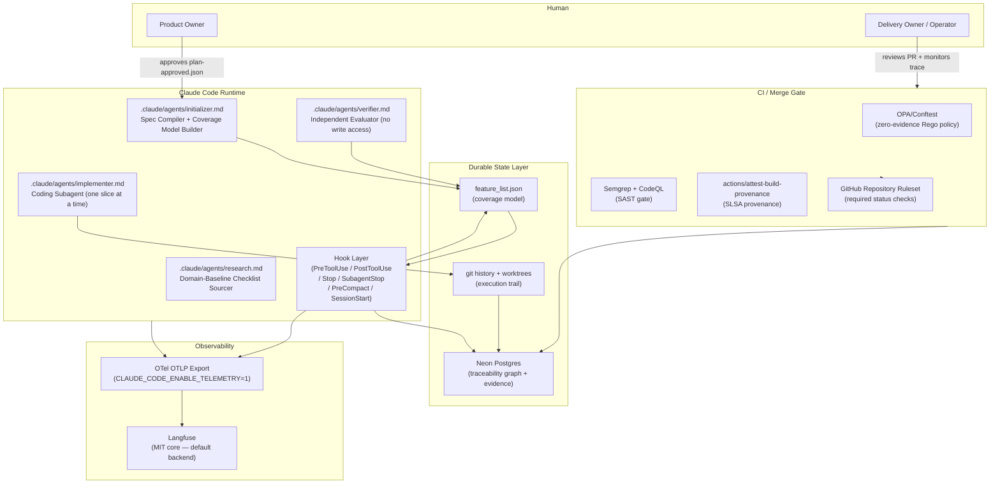
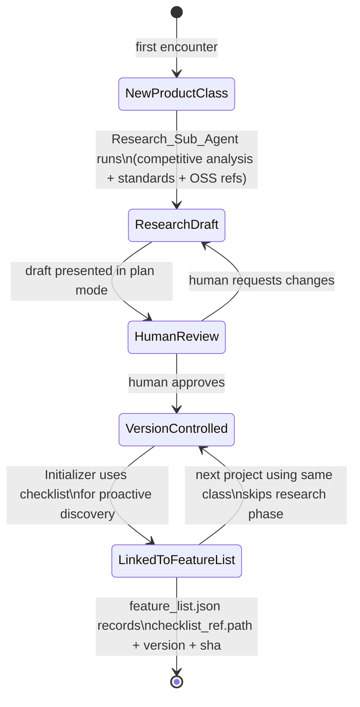

# Design Document — Spec-to-Evidence Coverage Control System

## Overview

The Spec-to-Evidence Coverage Control System is an autonomous agentic software-delivery control plane running on the Claude Code substrate. It converts product intent into a traceable, machine-verifiable coverage model and governs agent execution until every in-scope requirement is proven with captured evidence.

The governing invariant that shapes every design decision: **deterministic gates — Claude Code hooks, CI, OPA — decide whether delivery is complete, computed solely from verifiable facts. Model self-assessment and probabilistic predictions only inform; they never gate.**

The system is organized into five required phases (0–4) plus two optional phases (5–6) *(Reconciliation 2026-06-15: phrasing fixed from plain "five build phases")*:

| Phase | What gets built |
|-------|----------------|
| **Phase 0 (spine)** | `feature_list.json` + Stop hook + independent verifier subagent + git worktrees + GitHub required status check + Playwright CLI |
| **Phase 1 (verification depth)** | Semgrep + CodeQL + SonarQube + OPA/Conftest + PostToolUse hooks + schema validation |
| **Phase 2 (durable state)** | Postgres traceability graph + SLSA attestations *(Reconciliation 2026-06-16: PreCompact checkpoints moved out — `pre_compact_hook.py` is a Phase-1 component, see Component Inventory)* |
| **Phase 3 (observability)** | OTel + Langfuse + `requirement.id` Baggage + hook decision forwarding + `REASONING`-span loop detection (REQ-OBS-006) |
| **Phase 4 (property-based tests)** | Full hypothesis PBT suite — all correctness properties as required CI |
| **Phase 5 (optional)** | Temporal/Inngest durable outer loop (only when multi-hour crash pain is felt) |
| **Phase 6 (optional)** | Predictive next-step routing — read-only, off the gate (Speculative Actions / semantic-router / Claude memory tool) |

Phase 0 is the only phase with a hard build-first constraint. The spine must be runnable before any later phase begins.

---

## Architecture

### System Context



### Core Execution Loop

```mermaid
sequenceDiagram
    participant H as Human
    participant I as Initializer Agent
    participant Hook as Hook Layer
    participant Impl as Implementer Agent
    participant Ver as Verifier Agent
    participant CI as CI / OPA Gate

    H->>I: product intent
    I->>I: EARS → SMT-lib → Z3 validation
    I->>I: domain-baseline checklist expansion
    I->>I: emit feature_list.json (all unproven)
    I->>H: plan mode — present spec + coverage model
    H->>I: write plan-approved.json

    loop For each unproven item (highest priority first)
        Hook->>Impl: SessionStart — load git status + progress + coverage model
        Hook->>Hook: PreToolUse — check plan-approved.json exists
        Hook->>Hook: PreToolUse — check no prior slice item is unproven
        Impl->>Impl: implement one slice in dedicated git worktree
        Hook->>Hook: PostToolUse — lint + SAST + wiring check (next-turn feedback)
        Impl->>Impl: atomic commit with requirement ID in trailer
        Ver->>Ver: structural + semantic + behavioral + security verification
        Ver->>Ver: capture Evidence_Record (test_file, test_name, output_hash, collected_at)
        Hook->>Hook: SubagentStop — validate evidence schema
        Ver->>Hook: flip item unproven → proven in feature_list.json
        Hook->>Hook: Stop — check all items proven; block if any unproven remain
    end

    CI->>CI: OPA/Conftest — zero-evidence query on all requirements
    CI->>H: merge allowed only when all requirements have passing evidence
```

---

## Components and Interfaces

### Component Inventory

| Component | File path | Phase | Description |
|-----------|-----------|-------|-------------|
| `feature_list.json` | `/feature_list.json` | 0 | The canonical coverage model. Never deleted or reordered. |
| `stop_hook.py` | `.claude/hooks/stop_hook.py` | 0 | Stop hook — coverage validator; blocks if any item unproven. |
| `pre_tool_use_hook.py` | `.claude/hooks/pre_tool_use_hook.py` | 0 | Pre-execution gate — plan approval, scope sequencing, artifact protection. |
| `session_start_hook.py` | `.claude/hooks/session_start_hook.py` | 0 | Loads git status, progress file, and coverage model on session start. *(Reconciliation 2026-06-16: the Phase-0 deliverable is the load/inject half ONLY; the resumed-state integrity compute + `resume_integrity_ok` write via `state_integrity.py` is a PHASE-2 augmentation.)* |
| `subagent_stop_hook.py` | `.claude/hooks/subagent_stop_hook.py` | 0/2/3 | Validates Evidence_Record schema before accepting a subagent result. *(Reconciliation 2026-06-16: a genuinely multi-phase component — Phase 0: base evidence-schema validator (task 8); Phase 2/3: `audit_log.append` wiring (task 52.3); task 54 (wave 45): `omission_guard`; Phase 3: the OTel `hook.decision` span (task 36.1). The single `0/1` label understated this.)* |
| `post_tool_use_hook.py` | `.claude/hooks/post_tool_use_hook.py` | 1 | Runs lint + SAST + wiring checks after each file edit; returns errors as next-turn feedback. *(Reconciliation 2026-06-16: intentionally NOT a gate-audit-log producer — it issues no allow/block gate decision, so it is deliberately excluded from the `audit_log.append` producer set (only Stop, PreToolUse, SubagentStop produce, per REQ-27.4 / task 52.3). Its task-36.1 OTel forwarding is informational feedback telemetry — the `hook.feedback` span (OBS-003) — NOT a gate-decision audit entry; the audit log and the OTel trace do not disagree.)* |
| `pre_compact_hook.py` | `.claude/hooks/pre_compact_hook.py` | 1 | Checkpoints progress and evidence before context compaction. *(Reconciliation 2026-06-16: phase corrected `2` → `1` — the build task (task 25) sits under Phase 1, the Notes bound it to Phase-1 tasks 18-26, and the wave graph schedules 25.1 in wave 17 (Phase 1); PreCompact depends only on file+git artifacts, no Postgres.)* |
| `spec_validator.py` | `tools/spec_validator.py` | 0 | Non-LLM Z3-backed EARS validator returning `{contradictions, ambiguities, uncovered, violation_count}`. |
| `evidence_collector.py` | `tools/evidence_collector.py` | 0 | Assembles and validates Evidence_Record; computes output_hash. |
| `wiring_checker.py` | `tools/wiring_checker.py` | 1 | Static call-graph / dead-code analysis; emits WIRING coverage items. |
| `orphan_detector.py` | `tools/orphan_detector.py` | 1 | Detects implementation units with no requirement ref and vice versa. |
| `coverage_query.rego` | `.github/policies/coverage_query.rego` | 1 | OPA/Conftest policy; denies merge if any requirement has zero passing evidence. |
| `schema/` | `schema/feature_list.schema.json` | 0 | JSON Schema for feature_list.json. PreToolUse validates against this. |
| `schema/subagent_output.schema.json` | `schema/subagent_output.schema.json` | 0 | JSON Schema for the subagent-result ENVELOPE (`evidence[]`, `omission_declaration`, `actor_agent`, `requirement_id`, `agent_role`). Declares `omission_declaration` as a REQUIRED, non-nullable field per REQ-SPEC-018 (29.3); the SAME envelope is validated for all roles (the optional `evidence[]` is present only for the verifier role). Both the SubagentStop evidence-schema gate and the omission_guard validate against it. *(Reconciliation 2026-06-16: closes the gap that 29.3 mandates a schema field with no schema artifact to validate against; authored by the new subtask under task 54.)* |
| `schema/checklist_item.schema.json` | `schema/checklist_item.schema.json` | 1 | JSON Schema for a domain-baseline checklist item (`baselines/*.md` entries): `claim`, `source_url`, `authority_tier` enum, `fact_checked` boolean. The target `research_claim_validator.py` validates against (REQ-SPEC-017 / REQ-SPEC-014). *(Reconciliation 2026-06-16: defines the previously-undefined checklist file-format so REQ-SPEC-014/017 are machine-validatable.)* |
| `plan-approved.json` | `/plan-approved.json` | 0 | Approval marker written by human after plan mode review. |
| `db/migrations/` | `db/migrations/*.sql` | 2 | Postgres schema migrations for all eight tables (001–008). *(Reconciliation 2026-06-15: was "six tables"; migrations now include `007_requirement_versions.sql` and `008_gate_audit_log.sql`.)* |
| `db/migrations/006_domain_baseline_checklists.sql` | `db/migrations/006_domain_baseline_checklists.sql` | 2 | Creates `domain_baseline_checklists` product-class checklist version-history table (REQ-SPEC-016 lifecycle). *(Reconciliation 2026-06-16: 006 row made canonical in design.md, previously only in tasks.md task 28.6.)* |
| `db/migrations/007_requirement_versions.sql` | `db/migrations/007_requirement_versions.sql` | 2 | Creates `requirement_versions` amendment-history table (REQ-COV-007). |
| `db/migrations/008_gate_audit_log.sql` | `db/migrations/008_gate_audit_log.sql` | 2 | Creates hash-chained `gate_audit_log` table (REQ-AUDIT-001/002). |
| `state_integrity.py` | `tools/state_integrity.py` | 2 | Recomputes the resumed-state hash on `SessionStart` and writes the `run_state.resume_integrity_ok` flag — computes the hash and records the flag, NON-BLOCKING in itself. The block is owned by the separate PreToolUse integrity-guard row, which blocks when `resume_integrity_ok == false` (a flag read, not a live recompare). *(Reconciliation 2026-06-16: scoped to `state_integrity.py` only and de-conflated from the PreToolUse guard. Validation basis: REQ-STATE-005 is LOGIC-validated by CHECK-11a/11b — a 2-Boolean abstraction over `resumeHashMismatch`/`runProceeds` proving `Implies(mismatch, ¬proceeds)`, which never references `state_integrity.py`, `resume_integrity_ok`, or the hash inputs — while the IMPLEMENTATION/wiring is validated by the Property 26 PBT (tasks.md task 39.16). Stated honestly, mirroring the Property 28 "no Z3 check — runtime/CI verified" caption, rather than implying CHECK-11 machine-checks this component.)* |
| `audit_log.py` | `tools/audit_log.py` | 2 | Audit-log PRODUCER: `append(event, tool, decision, reason, requirement_id, actor_agent)`; called by `stop_hook.py`, `pre_tool_use_hook.py`, and `subagent_stop_hook.py` on every allow/block decision (REQ-AUDIT-001). |
| `audit_verify.py` | `tools/audit_verify.py` | 3 | Recomputes the `gate_audit_log` hash chain; on-demand verifier plus the merge-time CI required check (REQ-AUDIT-002/003). |
| `perf_a11y_verifier` | (capability within `.claude/agents/verifier.md`) | 1 | Verifier capability: k6/Lighthouse performance + axe-core accessibility checks for NFR items and UI-screen render assertions (REQ-VERIFY-007/008). *(Reconciliation 2026-06-16: phase pinned `1/3` → `1` — its host Verifier is a Phase-0 spine component and its only build task (51) sits in dependency-graph wave 41 / Phase 1, depending on task 10.3 (the verifier.md author); the self-contradictory `1/3` tag is resolved to `1`.)* |
| `secrets-scan.yml` | `.github/workflows/secrets-scan.yml` | 1 | CI secrets-scanning workflow using **gitleaks** (the canonical default scanner; trufflehog is an acceptable alternative, not the default); fails the build on a secret detected in the PR diff (REQ-17.2 / REQ-SEC-002). *(Reconciliation 2026-06-16: REQ-ID corrected `17.5` → `17.2`. REQ-17.5 is the distinct PreToolUse commit-side / pre-emission prevention gate (`check_secret_block`, validated by Property 20); this CI workflow is the MERGE-side diff-scan obligation of REQ-17.2 ("IF a secret is detected in a diff, THEN block the commit or merge"), matching task 40.2 / task 45. The two halves of "block the commit or merge" are split: merge-side = 17.2/secrets-scan, commit-side = 17.5/PreToolUse.)* |
| `omission_guard` | (capability within `.claude/hooks/subagent_stop_hook.py`) | task 54 (wave 45, post-Phase-4) | Omission-declaration gate: SubagentStop rejects any subagent result whose `omission_declaration` field is null or absent (exit 2); enforces Property 30, Z3 CHECK-13. *(P3 market-research 2026-06-15: Spec-Kit `[Gap]` pattern, REQ-SPEC-018. Reconciliation 2026-06-16: phase corrected from `0` to the phase of task 54 — scheduled in dependency-graph wave 45 (effectively post-Phase-4), NOT Phase 0; the Phase-0 SubagentStop deliverable is the base evidence-schema validator only.)* |
| `deepeval_gate.py` | `tools/deepeval_gate.py` | 3 | DeepEval pytest-native eval step; calls `assert_test()` on configured metric thresholds (faithfulness ≥ 0.8, answer relevancy ≥ 0.7); runs as REQUIRED CI status check `deepeval-gate` at merge (REQ-EVAL-001). *(P3 market-research 2026-06-15.)* |
| `zap-baseline.yml` | `.github/workflows/zap-baseline.yml` | 2 | OWASP ZAP baseline passive scan (`zaproxy/action-baseline@v0.12.0`, `fail_action: true`); registered as REQUIRED CI status check `zap-baseline`; baseline only — active/full scan out of v1 scope (REQ-SEC-008). *(P3 market-research 2026-06-15. Reconciliation 2026-06-16: v1 scan TARGET pinned — the workflow STANDS UP the app in CI against a known `http://localhost:<port>` URL (a CI job step boots the app/service before the scan), and the action's `target` input is populated with that localhost URL. The v1 baseline is the UNAUTHENTICATED localhost target; an authenticated/active scan is added post-v1 when an authenticated target exists (requirements.md). Without a defined target the baseline scan could not run / task 56 was not implementable.)* |
| `flagd` | `flagd/` (self-hosted service, Apache 2.0, CNCF Incubating) | 2 | OpenFeature + flagd agent kill-switch; near-real-time flag updates (≤ 30 s polling) without process restart; self-hosted, no SaaS dependency (REQ-CTRL-001). *(P3 market-research 2026-06-15.)* |
| `initializer.md` | `.claude/agents/initializer.md` | 0 | Spec compiler + coverage model builder subagent definition. |
| `implementer.md` | `.claude/agents/implementer.md` | 0 | Coding subagent definition. Single slice, single worktree. |
| `verifier.md` | `.claude/agents/verifier.md` | 0 | Independent evaluator subagent. No write access to implementation. |
| `research.md` | `.claude/agents/research.md` | 0 | Domain-baseline checklist sourcing subagent. |
| `research_claim_validator.py` | `tools/research_claim_validator.py` | 1 | The concrete executable OWNER of REQ-SPEC-017's "independent fact-check pass" + authority-tier labeling: validates that every external claim in a draft checklist carries a source URL + authority-tier label and passes the fact-check before human review; rejects unlabeled/unverified claims. *(Reconciliation 2026-06-16: REQ-SPEC-017 previously had an enforcing PBT (39.19) + a prose behavior but NO named runtime mechanism; cited from Property 29 and task 50.)* |

### Hook Configuration (`settings.json`)

```json
{
  "hooks": {
    "Stop": [
      {
        "type": "command",
        "command": "python3 .claude/hooks/stop_hook.py"
      }
    ],
    "PreToolUse": [
      {
        "type": "command",
        "command": "python3 .claude/hooks/pre_tool_use_hook.py"
      }
    ],
    "PostToolUse": [
      {
        "type": "command",
        "command": "python3 .claude/hooks/post_tool_use_hook.py",
        "matcher": "Write|Edit|MultiEdit"
      }
    ],
    "SubagentStop": [
      {
        "type": "command",
        "command": "python3 .claude/hooks/subagent_stop_hook.py"
      }
    ],
    "SessionStart": [
      {
        "type": "command",
        "command": "python3 .claude/hooks/session_start_hook.py"
      }
    ],
    "PreCompact": [
      {
        "type": "command",
        "command": "python3 .claude/hooks/pre_compact_hook.py"
      }
    ]
  }
}
```

All hooks are `command` type (not HTTP or MCP) so they fail closed. Exit code semantics: `0` = proceed, `2` = blocking error written to stderr and fed back to the model, any other non-zero = non-blocking feedback only.

**Plugin-shadowing disable (`enabledPlugins`) — load-bearing anti-loop fix *(Reconciliation 2026-06-18, audit C-LOOP-04/C-HOOK-01)*.** The governed `settings.json` MUST ALSO carry a project-scoped `enabledPlugins` block that DISABLES the `ralph-loop` plugin for governed sessions:

```json
  "enabledPlugins": {
    "ralph-loop@ralph-loop": false
  }
```

Rationale: Claude Code merges ALL registered Stop hooks and runs them in parallel. With the governance spine unregistered, the globally-installed `ralph-loop` plugin's `stop-hook.sh` silently OWNED the Stop event and re-injected a byte-for-byte identical mega-prompt 49 times (forensics C-LOOP-04) with no reentrancy guard. Registering `stop_hook.py` alone does NOT evict the plugin — both fire. The project-scoped `false` MUST out-rank the user-level enable; if at runtime `stop-hook.sh` still appears in hook telemetry, the operator runs with the plugin off / removes it from `~/.claude/settings.json → enabledPlugins` rather than relying on out-voting it (apply-step-5 verification, remediation §6). The governance `Stop` hook is the sole owner of the Stop event in a governed session.

**Subagent registration / discovery *(Reconciliation 2026-06-16)*:** the `settings.json` block above registers only HOOKS; the four subagents are NOT registered here. Claude Code auto-discovers subagent definitions by convention — every `.claude/agents/*.md` file is loaded and invocable by its frontmatter `name` (no explicit registration entry is needed). The `tests/smoke/test_hook_config.py` smoke test (task 9.2) is extended with a row asserting that the four agents (`initializer`, `implementer`, `verifier`, `research`) are discoverable/registered, so the discovery binding is testably pinned rather than implicit.

### Hook Wiring Table

| Hook event | Trigger | What it does | What it blocks | Requirement enforced |
|------------|---------|--------------|----------------|---------------------|
| `Stop` | Agent attempts to end its turn | Reads `feature_list.json`; counts `unproven` items; reads `violation_count` from spec-completion state; calls `audit_log.append(...)` on the allow/block decision *(Reconciliation 2026-06-15: an audit-log producer, REQ-AUDIT-001 — but the `audit_log.append` wiring is a PHASE-2 addition: `audit_log.py` is Phase 2 and is wired into this hook by task 52.3; the call is absent/no-op in the Phase-0 hook)* | Termination while any in-scope item is `unproven` (or `failed`) or `violation_count > 0`, AND no HANDOFF trigger (cap/budget/no-progress) is active *(Reconciliation 2026-06-16: HANDOFF carve-out made explicit — at HANDOFF in-scope items are EXPECTED unproven and the hook ALLOWS, exit 0; the load-bearing infinite-block fix)* | REQ-GATE-002, REQ-SPEC-021, REQ-AUDIT-001 |
| `PreToolUse` — plan gate | Any `Write` or `Edit` tool call | Checks `plan-approved.json` exists; calls `audit_log.append(...)` on the decision *(Reconciliation 2026-06-15: audit-log producer, REQ-AUDIT-001 — the `audit_log.append` wiring is a PHASE-2 addition via task 52.3; absent/no-op in the Phase-0 hook)* | All implementation writes until plan is approved | REQ-HITL-001, REQ-EXEC-004, REQ-AUDIT-001 |
| `PreToolUse` — scope gate | `Bash` with worktree create / slice assign | Reads `feature_list.json`; checks all prior-slice items are `proven` | New worktree or slice start when any prior item is `unproven` | REQ-EXEC-005 |
| `PreToolUse` — integrity guard | First `Write`/`Edit` of a resumed session — keyed on `(run_state.is_resume AND NOT run_state.first_write_done)` so it fires on exactly that moment and nowhere else *(Reconciliation 2026-06-16: the PreToolUse hook is registered with NO matcher (fires on every tool), so the "first write of a resumed session" scope is realized by these run_state fields — `is_resume` set by SessionStart when a prior run_state row exists, `first_write_done` set true once this guard passes; task 49.1)* | Reads `run_state.resume_integrity_ok` (computed by the SessionStart hook via `state_integrity.py`); exits 2 when it is `false`; treats a NULL/absent baseline (`resume_state_hash IS NULL`, i.e. a fresh non-resumed session) as ALLOW so a first run is never blocked *(Reconciliation 2026-06-15: SessionStart cannot block, so the REQ-STATE-005 gate moves to PreToolUse. Reconciliation 2026-06-16: blocks when `resume_integrity_ok == false` (a flag read), not on a live recompare; no-baseline → allow)* | The first write of a resumed session whose recorded baseline state hash does not match the SessionStart recomputation (`resume_integrity_ok == false`) | REQ-STATE-005 |
| `PreToolUse` — checklist-approval guard | Initializer/discovery `Write` using a domain-baseline checklist | Confirms the referenced checklist has a non-null `approved_at` (not `DRAFT`) in `domain_baseline_checklists` | Discovery that uses a `DRAFT` (unapproved) checklist | REQ-SPEC-016 (CHECK-12) |
| `PreToolUse` — artifact guard | Any tool targeting `feature_list.json` schema, `tests/`, CI config, or destructive Bash (`rm -rf`, `DROP TABLE`), OR a **Bash command that WRITES a protected path** (`>`/`>>`/`tee`/`sed -i`/`cp`/`mv`/`python -c` into `tests/`, schema, or CI) | Checks tool target against protected-artifact list AND parses `Bash` `tool_input.command` for protected-path write forms (PreToolUse is registered with no matcher, so it sees `Bash`); keys the `tests/` carve-out on `actor_agent` *(Reconciliation: a Write|Edit|MultiEdit-only target check is bypassed by shell writes — HGD-2, #63787; the content-level Bash-write detection closes the `tee`/`sed -i`/`echo >` bypass)* *(Reconciliation 2026-06-16: the Verifier (`verifier.md`) is the ONE actor permitted to write `tests/` — the guard allows a `tests/` write when `actor_agent == verifier.md` and still BLOCKS the Implementer and all destructive ops; this is the exception path that lets the Verifier write through the guard while keeping `tests/` protected from the Implementer, reconciling the artifact-guard `tests/` protection with the Verifier's read/write-`tests/` permission)* | Edits to protected files or destructive operations; any `tests/` write whose `actor_agent` is NOT the Verifier | REQ-STEER-003, REQ-COV-002 |
| `PreToolUse` — status guard | Any write to `feature_list.json` | Validates proposed status transition; checks evidence schema completeness; diffs the incoming `items[]` id-sequence and length against the prior committed `feature_list.json` (`check_append_only`) *(Reconciliation 2026-06-15: `unproven→failed` and `failed→unproven` are now allowed; only `*→proven` requires a complete Evidence_Record. Reconciliation 2026-06-16: also blocks any deletion, truncation, or reorder of existing items even when surviving ids/types/AC are intact — append-only ordering/length preservation, Property 3. Reconciliation 2026-06-16: `proven → unproven` is ALSO permitted, but ONLY on a requirement-amendment event — the guard allows it solely when the write is accompanied by a corresponding `requirement_versions` insert (Req 22 / Property 25 amendment re-entry); a `proven → unproven` flip with no amendment is still blocked)* | Transitions into `proven` without a complete Evidence_Record; any transition not in {`unproven→proven`, `unproven→failed`, `failed→unproven`, `proven→unproven` (amendment-gated only)}; any deletion, truncation, or reorder of the existing item id-sequence | REQ-COV-002, REQ-COV-003, REQ-COV-006, REQ-COV-007 |
| `PreToolUse` — secret-block guard | Any tool call carrying a prompt / span-attribute / URL / Bash-arg | Scans args + prompt against secret regexes (API keys, tokens, passwords, connection strings) *(Reconciliation 2026-06-16: live prevention gate mandated by 17.5 — NOT only an offline test)* | Any call that would carry a secret (exit 2) | REQ-SEC-005 (17.5), Property 20 |
| `PostToolUse` | `Write`, `Edit`, `MultiEdit` completion | Runs lint, type check, SAST (Semgrep only at edit time; CodeQL runs in CI per REQ-SEC-001), wiring check on changed files; returns specific errors via stdout *(Reconciliation 2026-06-16: the in-loop hook runs Semgrep ONLY for SAST — CodeQL is the CI gate (task 23), NOT run at edit time; the glossary `Semgrep_CodeQL` term and REQ-VERIFY-001 must not be misread as requiring the hook to run CodeQL)* | Nothing (exit 1 = non-blocking); errors returned as next-turn feedback only. *(Reconciliation 2026-06-16: PostToolUse SURFACES SAST findings as feedback only — it does NOT enforce/block on the 0-HIGH/CRITICAL threshold (Req 20.1); that threshold is enforced at the CI SAST gate (REQ-SEC-001, CodeQL/Semgrep workflows, task 23), not at edit time)* | REQ-VERIFY-004, REQ-STEER-002, REQ-EXEC-010 *(Reconciliation 2026-06-16: Req 8.1 added — PostToolUse is the TRIGGER that invokes `wiring_checker.py` on changed files (task 18.1); `wiring_checker` is the ENGINE that performs the static call-graph/dead-code analysis and emits WIRING coverage-item candidates (task 19). Integration test 26.1 exercises the hook+checker path together under Req 8.1/8.2)* |
| `SubagentStop` | Subagent result returned | Locates `evidence` field(s) in the result; when present (verifier results) validates the Evidence_Record schema (all four fields present and non-empty); when ABSENT (initializer/research results, which produce specs/checklists not Evidence_Records) SKIPS the four-field validation rather than failing closed; calls `audit_log.append(...)` on the decision *(Reconciliation 2026-06-15: audit-log producer, REQ-AUDIT-001 — the `audit_log.append` wiring is a PHASE-2 addition via task 52.3; absent/no-op in the Phase-0 hook. Reconciliation 2026-06-16: the four-field gate is verifier-only / skip-when-no-evidence — REQ-VERIFY-005's "required evidence markers" for NON-verifier subagents are enforced by the omission-declaration guard (the `omission_declaration` field), not the four-field schema. Reconciliation 2026-06-16: also enforces Property 24 at this runtime choke point — BLOCKS (exit 2) any evidence-bearing result whose `actor_agent` is `implementer.md`, so the implementer cannot self-verify; this is the natural runtime enforcement point, complementing the DB `actor_agent` column and PBT 39.13)* | Acceptance of a verifier (evidence-bearing) subagent result without complete evidence markers, OR whose `actor_agent` is the Implementer (Property 24) | REQ-VERIFY-005, REQ-COV-006, REQ-AUDIT-001 |
| `SubagentStop` — omission-declaration guard | Subagent result (initializer, research, verifier) returned | Checks `omission_declaration` field in the subagent output; calls `audit_log.append(...)` on the allow/block decision *(P3 market-research 2026-06-15: Spec-Kit `[Gap]` pattern; the `audit_log.append` wiring is a PHASE-2 addition via task 52.3 — the omission check itself ships with the guard, only the audit-log call is staged. Reconciliation 2026-06-16: audit fires on the ALLOW path too, not only on block — matching REQ-AUDIT-001 "every gate decision" and task 52.3 "on every allow/block decision"; the allow path of the omission guard previously skipped the append)* | Acceptance of any subagent result whose `omission_declaration` is null or absent | REQ-SPEC-018 (Property 30, CHECK-13a/13b) |
| `SessionStart` | Session begins / resumes / post-compaction | load (git status, `claude-progress.txt`, `feature_list.json`) + inject summary into context: **Phase 0**. **Spine-registration canary** (A5): assert the registered hook events == `SPINE_REQUIRED_EVENTS` (the 5 A1 events; PreCompact excluded until it is registered in settings.json, COH-2), inject green `Spine wired: N event(s) registered` when wired-as-scoped else a LOUD `GOVERNANCE SPINE UNWIRED/PARTIAL` warning, plus a re-orientation block (branch, in-scope unproven/proven counts, last HANDOFF reason): **Phase 0**. Integrity compute + `resume_integrity_ok` write via `state_integrity.py`: **Phase 2** *(Reconciliation 2026-06-16: the hash-compute half is a PHASE-2 augmentation. Reconciliation: the canary + re-orientation is the A5 silent-unwiring fix, scoped to the 5 A1 events per COH-2; it fails OPEN and cannot block)* | Nothing (informational load + canary + flag write; cannot block, fails open) | REQ-STATE-003, REQ-STATE-005 |
| `PreCompact` | Context compaction imminent | Checkpoints `claude-progress.txt`, current evidence state, and `feature_list.json` to git (MAIN worktree); ALSO writes the durable baseline `run_state.resume_state_hash` over the now-checkpointed state *(Reconciliation 2026-06-16: PreCompact is a PRODUCER of the resume-state baseline hash — alongside each per-Slice commit — so the durable "recorded hash" that SessionStart compares against on resume actually exists; without an assigned producer the comparison input would never be created)* | Nothing (checkpoint write; non-blocking) | REQ-STATE-002 (contributing writer for REQ-STATE-001) *(Reconciliation 2026-06-16: REQ-STATE-002 is verified by unit + integration test (task 25.2), NOT by Z3 and by no Correctness Property — a non-blocking checkpoint write has no SAT/UNSAT gating invariant; the absence is intentional, not an oversight. PreCompact also partially realizes REQ-STATE-001 as the file+git persistence write-side; the Postgres half of REQ-STATE-001 is Phase-2 tasks 31.x)* |

**Audit-log producer rule *(Reconciliation 2026-06-16, REQ-AUDIT-001)*:** EVERY gate that returns an allow/block decision calls `audit_log.append(...)` on its decision — this includes the `Stop` hook, `SubagentStop` (both the evidence gate and the omission guard), and EVERY blocking `PreToolUse` sub-gate (plan / scope / integrity / checklist-approval / artifact / status / secret-block), not only the plan-gate row that names it inline. The integrity guard (REQ-STATE-005) and the checklist-approval guard (REQ-SPEC-016) are exit-2 BLOCKING gates and are audited under this rule. `PostToolUse` is EXEMPT because it never gates (exit 1, non-blocking) — its OTel `hook.feedback` span is informational telemetry, not a gate-decision audit entry. (The `audit_log.append` wiring itself is the Phase-2 addition via task 52.3; the gate decisions exist from Phase 0, the audit call is staged.)

### Subagent Definitions

Each subagent is a Markdown file in `.claude/agents/` following the Claude Code agent spec.

#### `.claude/agents/initializer.md` — Spec Compiler + Coverage Model Builder

**Role:** Transforms product intent into an EARS-compliant spec, validates it with Z3, builds `feature_list.json`, and presents the plan for human approval.

**Key behaviors:**
- Runs `spec_validator.py` after every elaboration pass; never accepts its own completion claim
- After each pass, PERSISTS the validator's result into run state: `save_run_state(run_state with violation_count = validate_spec(...)['violation_count'])` — copying the validator's `violation_count` (including the `-1` Z3-timeout sentinel) into `run_state.violation_count`. *(Reconciliation 2026-06-16: this is the specified PRODUCER for `run_state.violation_count`; the Stop hook is the CONSUMER that reads it and blocks termination while `> 0` (REQ-SPEC-021). `validate_spec` returns `violation_count`, this step writes it, the Stop hook reads it — the producer→consumer wiring previously had no step. Mirrored in tasks.md task 10.1.)*
- Before each pass beyond the first, copies the prior pass's value into `run_state.prev_violation_count`, then HANDOFFs immediately if the current `violation_count` does not STRICTLY decrease against `prev_violation_count` (Property 15 strict-decrease-or-HANDOFF, Req 4.3). *(Reconciliation 2026-06-16: `run_state.prev_violation_count` is the prior-pass store the convergence comparison needs — see the run_state DDL; mirrored in tasks.md task 10.1 and migration `005_run_state.sql` (task 28.5).)*
- Loops (bounded to DEFAULT=7 passes, the `spec_pass_count` counter capped at `SPEC_COMPLETION_HARD_CAP`) until `violation_count == 0` or no-progress triggers HANDOFF *(Reconciliation 2026-06-16: the spec-phase pass counter is `run_state.spec_pass_count`, distinct from the 25-turn `iteration_count`; see the run_state DDL and the lex-specialis tiebreak in "Spec-Completion Loop Error Handling")*
- **[Req 1.3]** Persists the compiled requirements as version-controlled artifacts, NOT model context alone: it WRITES the human-readable spec prose to `.kiro/specs/<feature>/requirements.md` AND a machine-readable `specs/<feature>/spec.json` (the named on-disk "spec artifact"), distinct from `feature_list.json` (which is the coverage model, not the requirements prose). This `spec.json` is the "spec artifact" input contract consumed by `spec_validator.py`. *(Reconciliation 2026-06-16: Req 1.3 previously had no named on-disk target — `feature_list.json` is the coverage model, not the compiled-requirements artifact; this pins the path/format and binds it to the validator's "spec artifact" input.)*
- Expands intent against the domain-baseline checklist; flags any UNMAPPED items
- **[Req 24.2 epistemic precondition]** Runs proactive discovery ONLY against a checklist that is BOTH human-approved (non-null `approved_at` — already gated by the PreToolUse checklist-approval guard / CHECK-12) AND whose sourced claims carry source-URL + authority-tier labels and have passed the independent fact-check pass (`research_claim_validator.py`); an approved-but-unlabeled/unverified checklist is NOT usable for discovery *(Reconciliation 2026-06-16: makes the Req 24.2 / Property 29 epistemic gate an explicit precondition on the Initializer (the CONSUMER of the checklist), beyond the bare DRAFT/approved bit)*
- Writes `feature_list.json` with all items defaulting to `unproven` *(Reconciliation 2026-06-16: ownership split made explicit — the Initializer CALLS `tools/feature_list_init.py` (task 12) to SEED an empty, schema-valid file (`schema_version`, `product_class`, `checklist_ref`, empty `items[]`) and then POPULATES the items. The initial seed/creation write is EXEMPT from the PreToolUse artifact + status guards — those guards protect the schema and block identity-mutation/destructive ops on an EXISTING `feature_list.json`, not the initial creation; so the producer is not blocked by its own gate. Subsequent writes (status flips, append) go through the guards normally.)*
- Enters plan mode to present the validated spec + coverage model for human sign-off
- Does NOT write `plan-approved.json` — only the human does

**Permissions:** Read/write to spec artifacts, `feature_list.json`, domain-baseline checklists. No access to `tests/`, CI config, or implementation source.

#### `.claude/agents/implementer.md` — Coding Subagent

**Role:** Implements exactly one highest-priority `unproven` item per session in an isolated git worktree.

**Key behaviors:**
- Reads `feature_list.json` to identify the single highest-priority `unproven` item — by the explicit predicate: **select the LOWEST `priority` integer (1 = highest) among `unproven` items whose `dependencies` are ALL `proven`; break ties among equal-priority eligible items by item `id` lexical order** *(Reconciliation 2026-06-16: "highest-priority unproven item" was ambiguous — `priority` had no tie-break and `dependencies` were ignored, so an item could be highest-priority yet have unproven dependencies. The dependency-respecting, deterministically-tie-broken predicate is now explicit; mirrored in tasks.md task 10.2)*
- Creates a dedicated git worktree (`git worktree add`)
- Targets ≤15 minutes / ≤1 feature per session
- Produces exactly one atomic commit with the requirement ID in the git trailer
- **[Req 14.1/14.3 / REQ-LOOP-001/002/003]** Increments `run_state.retry_count` on a failed slice; on `retry_count >= 3` (DEFAULT) stops and routes to HANDOFF (REQ-LOOP-003); the per-slice token/cost budget (REQ-LOOP-001, DEFAULT 1,000,000 tokens) and its REQ-LOOP-002 HANDOFF trigger are enforced for the slice this loop owns *(Reconciliation 2026-06-16: the implementer loop is the OWNER of the retry budget (`run_state.retry_count`) and the per-slice token/cost budget per requirements.md, but implementer.md key behaviors previously mentioned neither; mirrored in tasks.md task 10.2 citing 14.1/14.3)*
- Does NOT run verification — verification is the Verifier's exclusive domain

**Permissions:** Write to implementation source files in its assigned worktree only. No write access to `tests/`, `feature_list.json` schema, CI config, or other worktrees. *(Reconciliation 2026-06-16: the "worktree only" confinement is ENFORCED by the existing Sandbox & Worktree Isolation mechanism (REQ-17.4, task 46) — that subsection confines filesystem writes to the per-slice git worktree mounted into the sandbox and explicitly ties this to the one-slice/one-worktree Implementer discipline. This Permissions line names its enforcer rather than asserting confinement with no mechanism.)*

**Agent-spec frontmatter *(Reconciliation 2026-06-16: load-bearing spine component previously given as ~prose only; the `tools` allowlist is what actually realizes "worktree only" / "no tests" in Claude Code. Mirrored into tasks.md task 10.2, with a smoke test under task 10.2 that parses the agent markdown and asserts its permission scope, analogous to `tests/smoke/test_hook_config.py`)*:**
```yaml
---
name: implementer
description: Implements exactly one highest-priority unproven slice in an isolated git worktree; returns with NO Evidence_Record — the Verifier is invoked separately.
model: claude-opus-4-8
tools: [Read, Grep, Glob, Edit, Write, Bash]  # Bash for `git worktree add`; Write/Edit CONFINED to the slice worktree by the sandbox (REQ-17.4); NO tests/, schema/, CI, or other-worktree access.
---
```
**Handoff to the Verifier:** the Implementer returns with NO Evidence_Record (it does not self-verify, Property 24); the Verifier is invoked as a separate subagent to evaluate the slice and capture evidence.

#### `.claude/agents/verifier.md` — Independent Evaluator

**Role:** Independently verifies each completed slice across all five layers without any write access to implementation. *(Reconciliation 2026-06-15: was "all four layers"; the fifth layer is the performance/accessibility verifier — REQ-VERIFY-007/008.)*

**Key behaviors:**
- Runs structural checks (lint, type check, AST analysis)
- Runs semantic checks (unit + integration tests)
- Runs behavioral checks via Playwright CLI — captures trace / screenshot as evidence artifact
- Runs security checks (Semgrep + CodeQL)
- Runs performance (k6/Lighthouse) + accessibility (axe-core) checks for NFR items and UI-screen render assertions, via the `perf_a11y_verifier` capability (REQ-VERIFY-007/008) *(Reconciliation 2026-06-15: fifth verification layer)* — routes each NFR item to its evidence tool by reading the item's `nfr_subtype` (`performance` → k6/Lighthouse, `accessibility` → axe-core) rather than guessing from text *(Reconciliation 2026-06-16: deterministic subtype routing, Req 25.1/25.2)*
- Consumes `wiring_checker.py` findings (or re-runs it) on each slice; for any `WIRING`-type item whose symbol is reported unreachable from a real execution path, performs the `unproven → failed` transition (permitted by the PreToolUse status guard) rather than emitting `proven` *(Reconciliation 2026-06-16: closes criterion 8.2 / REQ-EXEC-011 — previously the Verifier never read `wiring_checker` output, never mentioned WIRING items, and no task connected an unreachable-symbol finding to a `failed` transition; mirrored by a new tasks.md subtask under the wiring-check wiring)*
- When proving a `WIRING`-type item, REQUIRES and attaches an integration-test Evidence_Record that exercises the real execution path (not a unit test) — the attached Evidence_Record's `evidence_kind` MUST be `integration` (enforced by the CoverageItem `allOf` and at the SubagentStop acceptance gate) *(Reconciliation 2026-06-16: closes criterion 8.3 / REQ-EXEC-012 — the Verifier's behaviors previously never described the WIRING-integration-test special case; cross-references task 47 which adds this evidence requirement)*
- Assembles a complete Evidence_Record for each proven item using `evidence_collector.py`
- Flips item status `unproven → proven` in `feature_list.json` only when all checks pass and Evidence_Record is complete
- Enforces line-coverage threshold ≥ 85% on touched files, reading the per-touched-file figure from `coverage.json` produced by **pytest-cov** (coverage.py)

**Permissions:** Read-only on implementation source. Read/write on `tests/`, and on the `feature_list.json` status field AND its attached `evidence` sub-object (a `status → proven` flip requires writing the Evidence_Record per the schema, so the Verifier writes both the status field and the evidence sub-object — never any other coverage-item field). No write to implementation source. *(Reconciliation 2026-06-16: reconciles the "status field only" wording here with the Phase-0 spine acceptance test (Phase 0 Component List row 7) which says the Verifier "can write Evidence_Records to `feature_list.json`"; the scope is status field + attached evidence sub-object. Aligned with tasks.md task 10.3.)* *(Reconciliation 2026-06-16: the Verifier's `tests/` write is realized through the PreToolUse artifact-guard carve-out keyed on `actor_agent == verifier.md` — see the artifact-guard wiring row; the guard still blocks the Implementer from `tests/` and blocks all destructive ops.)*

**Agent-spec frontmatter *(Reconciliation 2026-06-16: each subagent "follows the Claude Code agent spec" (which requires `name`/`description`/`tools`/`model` frontmatter), but this section previously gave only prose permissions. Permission scoping in Claude Code is enforced via the `tools` allowlist, not prose, so "no write access to implementation" is unenforceable as prose alone. The concrete frontmatter — mirrored into tasks.md task 10.3)*:**
```yaml
---
name: verifier
description: Independent evaluator. Runs all five verification layers and captures Evidence_Records; never writes implementation source.
model: claude-opus-4-8
tools: [Read, Grep, Glob, Bash]   # Bash for test runners + evidence_collector; NO Write/Edit/MultiEdit on src/. The tests/ + feature_list.json-status writes go through the artifact-guard verifier carve-out, not a broad Write grant.
---
```

#### `.claude/agents/research.md` — Domain-Baseline Checklist Sourcer

**Role:** When a new product class is encountered, researches competitive analysis, industry standards, and open-source reference implementations to draft a domain-baseline checklist.

**Key behaviors:**
- Triggered by the Initializer when a product class has no existing checklist *(Reconciliation 2026-06-16: "new product class / first encounter" is DETECTED by the Initializer via a lookup against `domain_baseline_checklists` keyed by `product_class` — if there is NO approved (non-null `approved_at`) row for that class, the class is new and research is triggered; the Initializer is the deciding component. This defines the otherwise-undefined newness test of Req 3.1 / the "only once per product class" lifecycle rule)*
- Queries web sources (competitive analysis, standards, OSS reference implementations)
- Produces a draft checklist named by product class (e.g., `baselines/saas-auth.md`)
- **[REQ-SPEC-017 / Req 24.2]** Every external claim in a draft checklist carries a **source URL** and an **authority-tier label** (primary-standard / peer-reviewed vs vendor-doc / OSS-reference vs blog / social), and passes an **independent fact-check pass** BEFORE the draft is presented for human review; unlabeled or unverified claims are rejected before presentation *(Reconciliation 2026-06-16: research.md is the named subject of REQ-SPEC-016/017/018; these obligations were previously omitted from its key behaviors — mirrored in tasks.md task 10.4)*
- **[REQ-SPEC-016 / Req 24.1]** Does NOT use a checklist for discovery until its `approved_at` (in `domain_baseline_checklists`) is non-null — a `DRAFT` checklist is unusable (the `approved_at` linkage made explicit, enforced by the PreToolUse checklist-approval guard / CHECK-12)
- **[REQ-SPEC-018 / Req 29.1/29.3]** The research output includes a non-null `omission_declaration` field enumerating, by EARS scenario category (Primary / Alternate / Exception / Recovery / Non-Functional / Edge-Case), every scenario class NOT covered, using `[Gap]` markers (validated against `schema/subagent_output.schema.json`; rejected by the SubagentStop omission_guard if null/absent)
- Presents draft for human review; does NOT use the checklist until it is approved
- Persists approved checklist as a version-controlled artifact linked to `feature_list.json`

**Permissions:** Read/write to `baselines/` directory. No access to implementation source, tests, or CI config.

---

## Data Models

### `feature_list.json` Schema

Full JSON Schema for the coverage model. This file is append-only (items are never removed or reordered). The only permitted mutation after creation is a status flip from `unproven` to `proven` (and the `failed` transitions noted in the status guard). *(Reconciliation 2026-06-15: items are not deleted to leave scope — instead a boolean `in_scope` field (default `true`) is toggled by a human-authored transition; all completion/Stop gates count ONLY `in_scope` items.)*

```json
{
  "$schema": "http://json-schema.org/draft-07/schema#",
  "title": "FeatureList",
  "type": "object",
  "required": ["schema_version", "product_class", "checklist_ref", "items"],
  "properties": {
    "schema_version": {
      "type": "string",
      "description": "Semver of this schema (e.g. '1.0.0')"
    },
    "product_class": {
      "type": "string",
      "description": "Detected product class (e.g. 'agentic-sdlc-control-plane')"
    },
    "checklist_ref": {
      "type": "object",
      "description": "Which domain-baseline checklist and version was used",
      "required": ["path", "version", "sha"],
      "properties": {
        "path": { "type": "string" },
        "version": { "type": "string" },
        "sha": { "type": "string" }
      }
    },
    "items": {
      "type": "array",
      "items": { "$ref": "#/definitions/CoverageItem" },
      "description": "Append-only ordered list of coverage items"
    }
  },
  "definitions": {
    "CoverageItem": {
      "type": "object",
      "required": ["id", "type", "priority", "dependencies", "acceptance_criteria", "status", "in_scope"],
      "properties": {
        "id": {
          "type": "string",
          "pattern": "^[A-Z]+-[A-Z]+-[0-9]{3}$",
          "description": "Unique requirement ID (e.g. REQ-SPEC-001)"
        },
        "type": {
          "type": "string",
          "enum": ["functional", "NFR", "WIRING"],
          "description": "Coverage item type. WIRING items require integration-test evidence."
        },
        "nfr_subtype": {
          "type": "string",
          "enum": ["performance", "accessibility", "reliability", "security"],
          "description": "Machine-readable NFR routing subtype; required when type=='NFR' (see allOf below). Lets perf_a11y_verifier select its evidence tool (k6/Lighthouse for performance, axe-core for accessibility) from the coverage model rather than guessing. (Reconciliation 2026-06-16: closes Req 25.1/25.2 routing gap.)"
        },
        "subtype": {
          "type": "string",
          "enum": ["performance", "accessibility", "ui-screen"],
          "description": "Reconciliation 2026-06-16: the Verifier-dispatch discriminator on which the FIFTH verification layer routes (REQ-VERIFY-007/008). `performance`/`accessibility` mirror `nfr_subtype` for an NFR item; `ui-screen` marks a declared-screen/state render obligation (REQ-VERIFY-008) — its render assertion is a BEHAVIORAL test routed through the existing Playwright behavioral layer (task 15) plus the WIRING integration-test-evidence obligation (Req 8.3 / task 47), NOT a perf/a11y tool. Mirrored as a `subtype TEXT` column on the coverage_items Postgres table. Without this field the REQ-VERIFY-008 render branch has no representable discriminator (`type` and `nfr_subtype` alone cannot mark a ui-screen item)."
        },
        "declared_states": {
          "type": "array",
          "items": { "type": "string" },
          "description": "Reconciliation 2026-06-16: for a `subtype=='ui-screen'` item, the enumerable set of declared screen/states (at least `empty`, `loading`, `error`, `ready`) each of which SHALL have a behavioral test asserting it renders (REQ-VERIFY-008, Ubiquitous). This makes 'every declared screen/state' an enumerable source so the render obligation is checkable against a defined declaration set; the render evidence is routed through Playwright/WIRING, not k6/Lighthouse/axe."
        },
        "priority": {
          "type": "integer",
          "minimum": 1,
          "description": "Implementation priority (1 = highest). Determines scheduling order."
        },
        "title": {
          "type": "string",
          "description": "Short human-readable title"
        },
        "ears_pattern": {
          "type": "string",
          "enum": ["ubiquitous", "event-driven", "state-driven", "unwanted", "optional"],
          "description": "Assigned EARS pattern. Schema-OPTIONAL by design; the 'exactly one EARS pattern per item' guarantee (Req 1.4 / Property 16) is enforced by spec_validator.py at authoring time, NOT by the file schema. (Reconciliation 2026-06-16)"
        },
        "ears_statement": {
          "type": "string",
          "description": "Full EARS requirement statement"
        },
        "dependencies": {
          "type": "array",
          "items": { "type": "string", "pattern": "^[A-Z]+-[A-Z]+-[0-9]{3}$" },
          "description": "IDs of coverage items that must be proven before this one. (Reconciliation 2026-06-16: items now carry the same ID pattern as `id`, so a dependency must at least be a well-formed requirement ID. Referential integrity — that the referenced ID actually EXISTS in this file and is proven — is intentionally NOT schema-enforceable and is delegated to the PreToolUse scope gate / Verifier, which read the full item set.)"
        },
        "acceptance_criteria": {
          "type": "array",
          "items": { "type": "string" },
          "minItems": 1,
          "description": "Machine-checkable acceptance criteria (≥1 required)"
        },
        "provenance": {
          "type": "string",
          "enum": ["stated", "inferred"],
          "description": "Whether the requirement was explicitly stated or inferred by discovery. Schema-OPTIONAL by design; the 'every inferred requirement carries provenance' guarantee (Req 2.3, governing requirement — NOT Req 4.3) is enforced by spec_validator.py at authoring time (it rejects any inferred requirement lacking a provenance tag), NOT by the file schema. (Reconciliation 2026-06-16: this DELIBERATELY diverges from the Postgres `requirements.provenance TEXT NOT NULL` column — the file leaves provenance optional and authoring-time-enforced, while the DB mandates it. The divergence is intentional and documented here rather than reconciled by adding `provenance` to CoverageItem.required: the file is the Phase-0 source of truth and the validator is its single enforcement point.)"
        },
        "status": {
          "type": "string",
          "enum": ["unproven", "proven", "failed"],
          "default": "unproven",
          "description": "Coverage status. Permitted transitions: unproven → proven (requires a complete Evidence_Record), unproven → failed (Verifier on a dead check), failed → unproven (on retry/amendment), and proven → unproven (amendment re-entry ONLY — gated on a corresponding requirement_versions insert, Req 22 / Property 25; a proven → unproven flip with no amendment is blocked). Only *→proven requires a complete Evidence_Record. NOTE (Reconciliation 2026-06-16): because `status` is in the `required` list, the JSON-Schema `default` here is documentation-only — it does NOT auto-populate an omitted value, so a hand/tool-written file that omits `status` is schema-INVALID. The Initializer always WRITES status=unproven at creation (Req 5.1 / Property 1). This diverges from the equivalent Postgres `coverage_items.status` column, which carries a real `DEFAULT 'unproven'` (a DB row may omit status and be valid-and-defaulted); the conservative-merge rule (tasks.md) treats the file as authoritative when present."
        },
        "in_scope": {
          "type": "boolean",
          "default": true,
          "description": "Whether this item counts toward completion/Stop gates. An item leaves scope only via a human-authored transition; gates count ONLY in_scope items. (Reconciliation 2026-06-15) NOTE (Reconciliation 2026-06-16): `in_scope` is `required`, so this `default` is documentation-only and does NOT auto-populate — the Initializer always WRITES in_scope=true at creation (Req 5.7). This diverges from the Postgres `coverage_items.in_scope` column, which carries a real `DEFAULT TRUE`; a DB row may omit in_scope and default, a file may not."
        },
        "evidence": {
          "$ref": "#/definitions/EvidenceRecord",
          "description": "Required when status = proven. Must have all four fields."
        }
      },
      "allOf": [
        {
          "comment": "Reconciliation 2026-06-16: a schema-valid item cannot be status=proven with no evidence object — the four-field gate (Req 5.3/5.6, Property 2) is jointly schema- AND hook-enforced.",
          "if": {
            "properties": { "status": { "const": "proven" } },
            "required": ["status"]
          },
          "then": { "required": ["evidence"] }
        },
        {
          "comment": "Reconciliation 2026-06-16: an NFR item must declare its routing subtype so perf_a11y_verifier can select its evidence tool deterministically (Req 25.1/25.2).",
          "if": {
            "properties": { "type": { "const": "NFR" } },
            "required": ["type"]
          },
          "then": { "required": ["nfr_subtype"] }
        },
        {
          "comment": "Reconciliation 2026-06-16: a proven WIRING item must carry integration-test evidence — its Evidence_Record.evidence_kind must be 'integration' (Req 8.3 / Property 2). A unit-test Evidence_Record cannot prove a WIRING item.",
          "if": {
            "properties": {
              "type": { "const": "WIRING" },
              "status": { "const": "proven" }
            },
            "required": ["type", "status"]
          },
          "then": {
            "properties": {
              "evidence": {
                "required": ["evidence_kind"],
                "properties": { "evidence_kind": { "const": "integration" } }
              }
            },
            "required": ["evidence"]
          }
        }
      ]
    },
    "EvidenceRecord": {
      "type": "object",
      "comment": "Reconciliation 2026-06-16: the FOUR-FIELD proven-transition gate is still the four required fields below (test_file, test_name, output_hash, collected_at); actor_agent is provenance, not part of the four-field gate. The record now declares 5 properties total. additionalProperties:false now permits actor_agent + evidence_kind explicitly so the JSON schema, the Postgres evidence_records.actor_agent NOT NULL column, and Property 24 agree — previously additionalProperties:false REJECTED any record carrying actor_agent, a schema/DB/Property-24 three-way divergence.",
      "required": ["test_file", "test_name", "output_hash", "collected_at"],
      "additionalProperties": false,
      "properties": {
        "test_file": {
          "type": "string",
          "minLength": 1,
          "description": "Path to the test file that produced the proof (non-empty; Reconciliation 2026-06-16: minLength:1 enforces Property 2 / Req 5.6 'present AND non-empty' at the schema layer — required+type:string alone would accept the empty string)"
        },
        "test_name": {
          "type": "string",
          "minLength": 1,
          "description": "Unique test identifier within the test file (non-empty; minLength:1 per Property 2 / Req 5.6, Reconciliation 2026-06-16)"
        },
        "output_hash": {
          "type": "string",
          "pattern": "^sha256:[a-f0-9]{64}$",
          "description": "SHA-256 content-addressed hash of the test output artifact"
        },
        "collected_at": {
          "type": "string",
          "format": "date-time",
          "minLength": 1,
          "description": "ISO-8601 timestamp when the evidence was collected (non-empty; minLength:1 per Property 2 / Req 5.6, Reconciliation 2026-06-16)"
        },
        "actor_agent": {
          "type": "string",
          "minLength": 1,
          "description": "Reconciliation 2026-06-16: the agent that captured this record. MUST be the Verifier (`verifier.md`), never the Implementer (`implementer.md`) — Property 24 / Req 9.2. Provenance field, NOT part of the four-field proven-transition gate; mirrors the Postgres evidence_records.actor_agent NOT NULL column so schema and DB agree."
        },
        "evidence_kind": {
          "type": "string",
          "enum": ["unit", "integration", "behavioral", "perf", "a11y"],
          "description": "Kind of test that produced this evidence. Required to be 'integration' for a WIRING item transitioning to proven — see the CoverageItem allOf (Reconciliation 2026-06-16, Req 8.3 / Property 2). Optional for non-WIRING items."
        }
      }
    }
  }
}
```

**Evidence_Record** has exactly four required fields with no additional properties allowed:

| Field | Type | Description |
|-------|------|-------------|
| `test_file` | `string` | Path to the test file |
| `test_name` | `string` | Unique test identifier |
| `output_hash` | `string` (sha256:...) | Content-addressed hash of test output |
| `collected_at` | `string` (ISO-8601) | Timestamp of evidence collection |

#### `evidence_collector.py` — Evidence Hashing Semantics

*(Reconciliation 2026-06-16: narrative for the load-bearing `output_hash` semantics, previously present only in inventory cells + one test line. Without a defined byte-source and canonicalization rule, `output_hash` is not reproducibly verifiable and the OPA zero-evidence query cannot detect a fabricated hash.)*

1. **Byte source.** `output_hash` is `sha256` over the **canonicalized verification artifact** for the proof — NOT raw process output. For a unit/integration test the artifact is the test's captured stdout+stderr; for a Playwright behavioral proof it is the trace/screenshot file bytes; for a perf/a11y proof it is the tool's structured report (k6/Lighthouse/axe JSON). `evidence_collector.py` selects the artifact by `evidence_kind`.
2. **Canonicalization (so non-deterministic output rehashes identically).** Before hashing, the collector normalizes the artifact: strip/zero volatile fields (wall-clock timestamps, absolute temp paths, PIDs, run durations, ANSI color codes), sort any unordered collections, and normalize line endings. For JSON artifacts this means deterministic serialization (sorted keys, fixed separators) after dropping the documented volatile-field set; for binary trace artifacts the byte stream is hashed as-is (Playwright traces are already content-stable for a fixed input). The normalization rule set is versioned with the collector so a re-run on the same code produces the same `output_hash`.
3. **Artifact retention.** The raw artifact is retained as a **content-addressed blob** keyed by `output_hash` (the durable evidence store), with the four-field Evidence_Record holding only the `sha256:` reference — satisfying requirements.md's "artifact OR content-addressed reference" by storing the reference in the record and the blob out-of-band. Hash-only retention (no blob) is permitted ONLY in DB-down fallback and is flagged as degraded evidence.

The `output_hash` format is always `sha256:<64-hex>` (matching the JSON-Schema `pattern`), so a re-verification recomputes the canonical artifact, re-hashes, and asserts equality against the stored reference.

### Subagent-Result Envelope

*(Reconciliation 2026-06-16: the canonical subagent-result envelope, defined once so BOTH the SubagentStop evidence-schema gate and the omission_guard read the same documented JSON path from the stdin payload. Validated against `schema/subagent_output.schema.json`. Closes the field-location drift between task 8.1 and task 54 — `omission_declaration` has ONE canonical home, the envelope top level.)*

Every subagent (initializer, research, verifier) returns a result with these documented top-level keys:

| Key | Type | Required | Description |
|-----|------|----------|-------------|
| `actor_agent` | `string` | yes | The agent that produced the result (e.g. `verifier.md`); MUST NOT be `implementer.md` for an evidence-bearing result (Property 24). |
| `requirement_id` | `string` | yes | The requirement this result pertains to (pattern `^[A-Z]+-[A-Z]+-[0-9]{3}$`). |
| `omission_declaration` | `object` | yes (non-nullable) | Per-scenario-category `[Gap]` declaration (REQ-SPEC-018 / Property 30). The SubagentStop omission_guard rejects (exit 2) any result whose `omission_declaration` is null or absent. |
| `evidence` | `array` of Evidence_Record | no | Present only for verifier results. When present, each entry is validated against the four-field Evidence_Record schema; when absent (initializer/research), the four-field gate is SKIPPED (see SubagentStop wiring row). |

The four-field evidence-schema gate reads `evidence[]`; the omission_guard reads `omission_declaration`; the role-separation check (Property 24) reads `actor_agent` — all from this single envelope.

**Per-role output schema and checklist file-format schema *(Reconciliation 2026-06-16, REQ-SPEC-018.3 / REQ-SPEC-014/017)*.** `schema/subagent_output.schema.json` is the canonical envelope schema for ALL subagent roles (initializer / research / verifier), and is the concrete target that makes `omission_declaration` REQUIRED + non-nullable per Req 29.3 — the per-role validation is the SAME envelope schema with an `agent_role` discriminator (the optional `evidence[]` is present only for `verifier`). Separately, the research checklist file (`baselines/*.md`) has a defined **checklist-item file-format schema** (`schema/checklist_item.schema.json`): each item carries `claim`, `source_url`, `authority_tier` (`primary-standard` / `peer-reviewed` / `vendor-doc` / `oss-reference` / `blog`), and a `fact_checked` boolean — the structure `research_claim_validator.py` validates against (REQ-SPEC-017). Both schemas are cited from tasks.md task 10.4 and task 54. Without these defined output formats, REQ-SPEC-014/017/018.3 could not be machine-validated.

### Postgres Schema

Eight tables (six original + `requirement_versions` + `gate_audit_log`; migrations `001`–`008`). Managed on Neon (serverless Postgres with per-PR branching). *(Reconciliation 2026-06-15: was "Six tables"; the two new tables are defined in the Merge Reconciliation Addendum below.)*

```sql
-- requirements: the authoritative spec record per project run
CREATE TABLE requirements (
    id           TEXT PRIMARY KEY,         -- REQ-SPEC-001 etc.
    project_id   TEXT NOT NULL,
    type         TEXT NOT NULL CHECK (type IN ('functional', 'NFR', 'WIRING')),
    nfr_subtype  TEXT CHECK (nfr_subtype IN ('performance', 'accessibility', 'reliability', 'security')),
                 -- Reconciliation 2026-06-16: routing subtype, mirrors feature_list.json CoverageItem.nfr_subtype;
                 -- NOT NULL when type='NFR' is enforced by the writer (and the file-schema allOf), letting
                 -- perf_a11y_verifier pick k6/Lighthouse vs axe-core deterministically (Req 25.1/25.2)
    priority     INTEGER NOT NULL,
    ears_pattern TEXT NOT NULL,
    ears_stmt    TEXT NOT NULL,
    provenance   TEXT NOT NULL CHECK (provenance IN ('stated', 'inferred')),
    created_at   TIMESTAMPTZ NOT NULL DEFAULT now()
);

-- coverage_items: mutable status view per requirement
CREATE TABLE coverage_items (
    id             SERIAL PRIMARY KEY,
    requirement_id TEXT NOT NULL REFERENCES requirements(id),
    status         TEXT NOT NULL CHECK (status IN ('unproven', 'proven', 'failed'))
                   DEFAULT 'unproven',
    subtype        TEXT CHECK (subtype IN ('performance', 'accessibility', 'ui-screen')),  -- Reconciliation 2026-06-16: mirrors feature_list.json CoverageItem.subtype; the Verifier-dispatch discriminator for the fifth (perf/a11y/ui-screen-render) verification layer (REQ-VERIFY-007/008)
    in_scope       BOOLEAN NOT NULL DEFAULT TRUE,  -- Reconciliation 2026-06-15: gates count ONLY in_scope items; leaves scope only via a human-authored transition
                   -- Reconciliation 2026-06-16: ENFORCEMENT of the "human-authored only" rule —
                   --   because gates count only in_scope items, an unguarded flip to in_scope=FALSE
                   --   silently drops a requirement from every completion/Stop gate. The hook/audit
                   --   layer captures every in_scope flip into gate_audit_log (actor_agent +
                   --   justification reason) so the scope-narrowing transition is tamper-evidently
                   --   logged; AND a BEFORE UPDATE trigger requires a non-empty actor + justification
                   --   on any UPDATE that sets in_scope=FALSE (the DB rejects an unattributed flip).
                   --   See REQ-COV / requirements.md:128 (human-authored only).
    slice_id       TEXT,
    updated_at     TIMESTAMPTZ NOT NULL DEFAULT now()
);

-- traceability_links: bidirectional requirement↔code↔test↔commit↔owner graph
CREATE TABLE traceability_links (
    id              SERIAL PRIMARY KEY,
    requirement_id  TEXT NOT NULL REFERENCES requirements(id),
    link_type       TEXT NOT NULL CHECK (link_type IN
                      ('implementation', 'test', 'evidence', 'commit', 'owner')),
    target_ref      TEXT NOT NULL,   -- file path, commit SHA, owner name, etc.
    direction       TEXT NOT NULL CHECK (direction IN ('forward', 'backward')),
    created_at      TIMESTAMPTZ NOT NULL DEFAULT now()
);

-- evidence_records: the four-field Evidence_Record per proven item
CREATE TABLE evidence_records (
    id              SERIAL PRIMARY KEY,
    requirement_id  TEXT NOT NULL REFERENCES requirements(id),
    commit_sha      TEXT NOT NULL,
    test_file       TEXT NOT NULL,
    test_name       TEXT NOT NULL,
    output_hash     TEXT NOT NULL,   -- sha256:<hex>
    collected_at    TIMESTAMPTZ NOT NULL,
    actor_agent     TEXT NOT NULL,   -- Reconciliation 2026-06-15: the agent that captured this record (MUST be the Verifier, never the Implementer — Property 24). Canonical name is actor_agent everywhere (no acting_agent).
    CONSTRAINT evidence_complete CHECK (
        test_file <> '' AND test_name <> '' AND
        output_hash <> '' AND collected_at IS NOT NULL AND
        -- Reconciliation 2026-06-16: enforce the SAME sha256 format the JSON Schema enforces
        --   (pattern ^sha256:[a-f0-9]{64}$), closing the DB/JSON enforcement asymmetry where a
        --   malformed hash passed the DB CHECK (non-empty only) but failed JSON-schema validation.
        --   Added to migration task 28.4.
        output_hash ~ '^sha256:[a-f0-9]{64}$'
    )
);

-- run_state: per-session execution state for resumption
CREATE TABLE run_state (
    session_id        TEXT PRIMARY KEY,
    project_id        TEXT NOT NULL,
    current_item_id   TEXT REFERENCES requirements(id),
    status            TEXT NOT NULL CHECK (status IN
                        ('running', 'complete', 'handoff', 'blocked')),
    phase             TEXT NOT NULL DEFAULT 'spec' CHECK (phase IN ('spec', 'implementation')),
                      -- Reconciliation 2026-06-16: discriminates the two loops the Stop hook serves.
                      -- 'spec' (Req 4): SPEC_COMPLETION_HARD_CAP=7 passes + pass-level strict-decrease no-progress.
                      -- 'implementation' (Req 10/14): MAX_TURNS_PER_SLICE=25 + slice-level N=3 check_no_progress.
                      -- The two loops have different caps and different no-progress semantics; evaluate_stop branches on this.
    iteration_count   INTEGER NOT NULL DEFAULT 0,  -- the 25-turn MAX_TURNS_PER_SLICE counter (implementation phase); NOT the spec-pass counter
    spec_pass_count   INTEGER NOT NULL DEFAULT 0,  -- Reconciliation 2026-06-16: the spec-phase elaboration-pass counter, capped at SPEC_COMPLETION_HARD_CAP=7; DISTINCT from iteration_count (the 25-turn slice counter). The lex-specialis HANDOFF tiebreak keys on spec_pass_count >= SPEC_COMPLETION_HARD_CAP, NOT on iteration_count (added by task 28.5)
    token_cost_usd    NUMERIC(10,4) NOT NULL DEFAULT 0,  -- Reconciliation 2026-06-16: the budget THRESHOLD is the config constant TOKEN_BUDGET (task 44 / Req 20), NOT a column; the Stop hook computes budget_exceeded := token_cost_usd >= TOKEN_BUDGET. There is intentionally no token_budget_usd / budget_exceeded column.
    no_progress_n     INTEGER NOT NULL DEFAULT 0,  -- consecutive no-progress slices
    violation_count   INTEGER NOT NULL DEFAULT 0,  -- Reconciliation 2026-06-15: outstanding spec-completion violations; the Stop hook (evaluate_stop) reads this and blocks termination while > 0
    prev_violation_count INTEGER,                  -- Reconciliation 2026-06-16: the PRIOR spec-completion pass's violation_count; the Initializer loop compares current vs prev to enforce Property 15 strict-decrease-or-HANDOFF (Req 4.3). NULL before the first pass; added by migration 005_run_state.sql (task 28.5)
    retry_count       INTEGER NOT NULL DEFAULT 0,  -- Reconciliation 2026-06-15: implementer-loop retry budget counter (DEFAULT cap 3/slice)
    resume_integrity_ok BOOLEAN,                   -- Reconciliation 2026-06-15: written by SessionStart via state_integrity.py; PreToolUse integrity guard blocks the first write when FALSE (REQ-STATE-005).
                       -- Reconciliation 2026-06-16: FIRST-RUN / NO-BASELINE behavior (plain BOOLEAN, no SQL DEFAULT, so a fresh session has no recorded baseline and the comparison is undefined). On a session with NO prior durable resume_state_hash, state_integrity.py sets resume_integrity_ok=TRUE (and the PreToolUse integrity guard treats a NULL/absent baseline as ALLOW), so ONLY an actual recorded-vs-recomputed MISMATCH blocks — a fresh, non-resumed run is NEVER blocked by the integrity guard (asserted by task 39.16).
    is_resume         BOOLEAN NOT NULL DEFAULT FALSE, -- Reconciliation 2026-06-16: set TRUE by SessionStart when a prior run_state row for this session already exists (the session is a RESUME, not a fresh start). The PreToolUse integrity guard is scoped to (is_resume AND NOT first_write_done) so it fires ONLY on the first implementation write of a RESUMED session (Property 26 / Req 23.2 scope).
    first_write_done  BOOLEAN NOT NULL DEFAULT FALSE, -- Reconciliation 2026-06-16: set TRUE after the integrity guard passes the first Write/Edit of a resumed session, so the guard does not re-fire on every subsequent write. (is_resume AND NOT first_write_done) is the exact "first write of a resumed session" predicate the guard keys on (task 49.1).
    resume_state_hash TEXT,                        -- Reconciliation 2026-06-16: the durable BASELINE resumed-state hash that state_integrity.py compares its SessionStart recomputation against (requirements.md:437 "the durable store's recorded hash" had no column to live in). sha256 over the canonical projection of in-scope feature_list.json items + named run_state fields (full spec at Property 26). PRODUCER: written by the PreCompact hook checkpoint AND by each per-Slice commit (the moments the durable state is known-good); SessionStart RECOMPUTES and compares, equality → resume_integrity_ok=true, mismatch → false. NULL = no recorded baseline yet (fresh/non-resumed session). Added by state_integrity.py's migration / migration 005_run_state.sql (task 28.5).
    stop_hook_active  BOOLEAN NOT NULL DEFAULT FALSE,
    last_commit_sha   TEXT,
    updated_at        TIMESTAMPTZ NOT NULL DEFAULT now()
);

-- domain_baseline_checklists: version history of product-class checklists
-- Reconciliation 2026-06-16: migration file `006_domain_baseline_checklists.sql` (task 28.6).
--   The 006 index was canonical only in tasks.md; named here so it is canonical in design too.
--   Numbering is consistent across files: 006=domain_baseline_checklists, 007=requirement_versions,
--   008=gate_audit_log — no collision; this is a documentation-completeness fix only.
CREATE TABLE domain_baseline_checklists (
    id              SERIAL PRIMARY KEY,
    product_class   TEXT NOT NULL,
    version         TEXT NOT NULL,
    sha             TEXT NOT NULL,    -- git blob SHA of the checklist file
    file_path       TEXT NOT NULL,    -- repo path (e.g. baselines/saas-auth.md)
    approved_at     TIMESTAMPTZ,      -- null = draft, non-null = human-approved
    approved_by     TEXT,
    created_at      TIMESTAMPTZ NOT NULL DEFAULT now(),
    UNIQUE (product_class, version)
);
```

### Migrations & Indexes

*(Reconciliation 2026-06-16: the schema previously carried zero `CREATE INDEX` statements and no apply-order/role narrative. This subsection pins both; the index DDL is added to the relevant `28.x` migration tasks.)*

- **Apply order & owning role.** Migrations apply in numeric order `001`–`008`; all objects are owned by the migration role, and the runtime `app_role` is granted only the privileges each gate needs (notably NOT `UPDATE`/`DELETE` on `gate_audit_log`, see the addendum).
- **Required indexes.** At minimum:
  ```sql
  CREATE INDEX idx_evidence_records_requirement_id   ON evidence_records (requirement_id);   -- Property 22 per-requirement COUNT
  CREATE INDEX idx_traceability_links_requirement_id ON traceability_links (requirement_id); -- bidirectional, queried both ways
  CREATE INDEX idx_coverage_items_requirement_id     ON coverage_items (requirement_id);     -- status view per requirement
  ```

**Source-of-truth fidelity (REQ-16.3) *(Reconciliation 2026-06-16)*.** The Postgres `requirements` / `coverage_items` tables intentionally do NOT store `acceptance_criteria`, `dependencies`, or (on `coverage_items`) `priority`. This is a deliberate scoping of REQ-16.3, NOT a fidelity bug: **`feature_list.json` is canonical** for `acceptance_criteria`, `dependencies`, and `priority` (the full required set `[id, type, priority, dependencies, acceptance_criteria, status, in_scope]`), and Postgres MIRRORS only the coverage-status subset (`requirements` identity/EARS/provenance + `coverage_items` status/in_scope/slice) needed for the durable traceability graph and the OPA/evidence queries. Property 1's "≥1 acceptance criterion" and Property 7's prior-slice ordering (priority/dependencies) are evaluated against the file, the canonical store. (The alternative — adding `TEXT[]`/`JSONB` or child tables to reconstruct these from the DB alone — is explicitly out of v1 scope; design, tasks, and requirements all reflect the file-canonical choice.)

---

## Sandbox & Worktree Isolation (REQ-17.4)

*(Reconciliation 2026-06-15: this subsection authored from the decision sheet to close the REQ-17.4 design gap.)*

All agent-executed code runs inside a sandbox. The sandbox is the security boundary; the per-slice git worktree is the unit of isolation mounted into it.

| Concern | Design decision |
|---------|----------------|
| **Default sandbox** | **devcontainer** locally; **E2B** for ephemeral CI runs. |
| **Network** | Egress **DENIED by default**; any required egress is an explicit, audited allowlist exception. |
| **Filesystem** | Writes confined to the **per-slice git worktree mounted into the sandbox**; the rest of the host FS is read-only or absent. |
| **Composition** | The worktree (created by the Implementer via `git worktree add`) is mounted in as the writable working tree; the sandbox wraps it as the security boundary. One worktree per active slice, one sandbox per slice execution. |

This means an agent can only modify files in its own slice's worktree, and cannot reach the network unless an exception is granted — satisfying REQ-17.4's isolation requirement while preserving the one-slice/one-worktree discipline from the Implementer subagent definition.

---

## Agent Kill-Switch (REQ-CTRL-001)

*(Reconciliation 2026-06-16: dedicated subsection for the `flagd` kill-switch — previously only the one-line Component-Inventory row, with no enforcement point, flag schema, provider choice, fail-closed behavior, or audit wiring. Modeled on the "Sandbox & Worktree Isolation" subsection.)*

The kill-switch lets an operator DISABLE an agent capability near-real-time (≤ 30 s) without a process restart, via OpenFeature + a self-hosted `flagd` (no SaaS dependency).

| Concern | Design decision |
|---------|----------------|
| **(a) Enforcement point** | Each agent entry point (`initializer` / `implementer` / `verifier` / `research` subagents) QUERIES the OpenFeature client at **start-of-turn**. A set kill flag makes the gated capability HARD-REFUSE — operationally "disabled" means the agent refuses the gated tool call / skips the capability, analogous to a PreToolUse exit-2 block. |
| **(b) Flag schema** | Boolean kill flags, one per gated capability, named `kill.<capability>` (e.g. `kill.implementer`, `kill.verifier`, `kill.research`, `kill.initializer`, plus a global `kill.all`). A flag set `true` disables exactly the capability it names. |
| **(c) Provider choice** | DEFAULT = the `flagd` **gRPC streaming** provider (true near-real-time push) for the ≤ 30 s propagation guarantee; the file-based provider with an explicit poll interval `≤ 30 s` is the documented fallback. The ≤ 30 s guarantee is tied to the chosen provider's mechanism (streaming push, or `≤ 30 s` poll). |
| **(d) Unreachable `flagd` → FAIL-CLOSED** | When the self-hosted `flagd` server / flag source is UNAVAILABLE, the gated capability defaults to **DISABLED** (NOT enabled) — fail-closed, consistent with REQ-GATE-005 ("ambiguous states SHALL resolve to blocked, not passed"). The kill-switch never fails open. *(This closes the unreachable-`flagd` behavior gap; the matching acceptance criterion is added on the requirements side.)* |
| **(e) Audit / OTel on toggle** | Every flag toggle (and every start-of-turn kill-refusal) emits an OTel event and is recorded so the disable decision is observable; a kill-refusal is logged like a gate decision. |

A Hook-Wiring-equivalent check exists at each agent's start-of-turn: read `kill.<capability>` (and `kill.all`); if either is `true` (or the source is unreachable → treated as `true`), refuse the gated capability.

---

## Performance / Accessibility / UI-Screen Verifier (`perf_a11y_verifier`)

*(Reconciliation 2026-06-16: dedicated subsection for the `perf_a11y_verifier` capability (REQ-VERIFY-007/008), modeled on the "Sandbox & Worktree Isolation" subsection. Previously the capability appeared in only a handful of inventory/addendum lines with no interface, dispatch logic, threshold ownership, Evidence_Record mapping, CI step, or test. This is the umbrella home; the subtype/declared-states schema fields, Property 31, and the Evidence_Record mapping below all live under it.)*

**(1) Subtype dispatch.** The capability is the Verifier's FIFTH layer. It dispatches on the coverage item's `subtype` discriminator (`feature_list.json` CoverageItem.subtype, mirrored on `coverage_items.subtype`):
- `performance` → run **k6** (load/latency) and/or **Lighthouse** (Core Web Vitals).
- `accessibility` → run **axe-core** (WCAG-A/AA).
- `ui-screen` → run **Playwright** render assertions over the item's `declared_states` (`empty`/`loading`/`error`/`ready`) — the render obligation is a BEHAVIORAL test, NOT a perf/a11y tool (it routes through the existing Playwright behavioral layer, task 15, plus the WIRING integration-test-evidence obligation, Req 8.3 / task 47).

**(2) Evidence_Record mapping (k6 / Lighthouse / axe / Playwright outputs → the four-field schema).** These tools emit reports, not pytest results, yet `Evidence_Record` requires `test_file`/`test_name`/`output_hash`/`collected_at` with `additionalProperties:false`. The canonical mapping (so perf/a11y/render evidence stays conformant):
- `test_file` = path to the k6/Lighthouse/axe runner script (or the Playwright spec for ui-screen).
- `test_name` = the budget id (perf/a11y) or the `screen/state` id (ui-screen render).
- `output_hash` = `sha256:<hex>` of the canonicalized report artifact (k6/Lighthouse/axe JSON, or the Playwright trace) — produced by `evidence_collector.py` selecting the artifact by `evidence_kind` (`perf`/`a11y`/`behavioral`/`integration`).
- `collected_at` = the run timestamp (ISO-8601).
This keeps perf/a11y/render evidence inside the four-field, `additionalProperties:false` shape.

**(3) Declared-screen/state enumeration (REQ-VERIFY-008).** A `ui-screen` item carries a `declared_states` array (at least `empty`/`loading`/`error`/`ready`); each declared state SHALL have an attached render-assertion Evidence_Record. This makes "every declared screen/state" an enumerable, checkable set rather than an open obligation.

**(4) Threshold registry + owner.** The perf budgets (p95 latency / Core Web Vitals) and the a11y bar (zero WCAG-A/AA violations) live in the execution-bounds / NFR-threshold config registry (Requirement 20, task 44), which is the threshold OWNER; the verifier reads them and asserts against them.

**(5) CI wiring + property/test.** The capability runs within the Verifier (Phase 1, task 51); its correctness is pinned by **Property 31** and the Hypothesis test `tests/property/test_perf_a11y.py` (task 39.21). Task 51 expands into subtasks 51.1 (perf), 51.2 (a11y), 51.3 (ui-screen render), 51.4 (property test).

---

## EARS → SMT-lib Translation Approach

The spec validator (`tools/spec_validator.py`) encodes EARS statements as Z3 Boolean formulas. The translation follows these rules.

### Pattern Encodings

Each EARS pattern maps to an implication or assertion in SMT-lib:

| EARS pattern | Natural form | SMT-lib encoding |
|-------------|--------------|-----------------|
| **Ubiquitous** | The system SHALL P | `(assert P)` — always holds |
| **Event-driven** | WHEN T THEN the system SHALL P | `(assert (=> T P))` |
| **State-driven** | WHILE S the system SHALL P | `(assert (=> S P))` |
| **Unwanted** | IF C THEN the system SHALL NOT Q | `(assert (=> C (not Q)))` |
| **Optional** | WHERE F the system SHALL P | `(assert (=> F P))` |

### Variable Extraction

The validator NLP-parses each EARS statement to extract:
1. **Trigger / condition variables** (T, S, C, F) — mapped to fresh Boolean variables
2. **Outcome variables** (P, Q) — mapped to Boolean variables representing the required system behavior
3. **Numeric constraints** — extracted as integer variables with comparison predicates

### Consistency Checks Run Per Spec

**Validator signature *(Reconciliation 2026-06-16)*:** because the Completeness check below is computed "for each domain-baseline item", the baseline set must be an INPUT — the signature is `validate_spec(requirements: list[dict], baseline_items: list[dict]) -> dict`. The caller (the Initializer loop) loads `baseline_items` from the approved domain-baseline checklist referenced by `feature_list.json.checklist_ref` and passes it alongside `requirements`; without this parameter the validator could not compute `uncovered`/`UNMAPPED` from its inputs. Task 4.1, Property 14, and the Phase-0 row-10 fixture are updated to the two-argument signature.

After encoding all requirements, `spec_validator.py` runs:

1. **Consistency** — `check-sat` on the full axiom set. UNSAT means a contradiction exists somewhere; the solver produces a minimal unsatisfiable core identifying the conflicting pair.
2. **Completeness** — for each `baseline_items` entry, check that at least one formula asserts its corresponding outcome variable. Items with no asserting formula are flagged `UNMAPPED`.
3. **Vacuity** — for each conditional assertion `(=> C P)`, verify both `C ∧ P` (fires and passes) and `¬C` (does not fire) are SAT. A vacuous rule whose condition can never be true is a dead requirement.
4. **Independence** — confirms gate decisions are independent of prediction variables by asserting `predA ≠ predB ∧ gateA = gateB` is SAT (gates ignore predictions). *(Reconciliation 2026-06-16: a plain `requirements: list[dict]` carries no gate/prediction variables, so this check is NOT computed over arbitrary `validate_spec` input — it is the STATIC design-time harness assertion `CHECK-5` in `verification/formal_verification_merged.py`, which fixes the completion-gate variables `gateA/gateB/predA/predB` and proves prediction-independence once for the gate model. It is listed here as the fourth analysis to keep the conceptual four-pass grouping, but its realized form is the harness check / Property 4 (tested via `test_completion_gate.py`), NOT a per-spec pass inside `validate_spec`. The frozen 34-check count is unchanged.)*

**Analysis-pass → four-return-field mapping *(Reconciliation 2026-06-16, fully defining the `{contradictions, ambiguities, uncovered, violation_count}` contract of Property 14 / Req 4.1)*:**
- `contradictions` = unsat-core count from the **Consistency** pass.
- `uncovered` = `UNMAPPED` count from the **Completeness** pass.
- `ambiguities` = **Vacuity** hits (dead/never-firing conditionals) + vague-adjective hits (Property 17 scanner).
- `violation_count` = `contradictions + uncovered + ambiguities` (always `>= 0`), OR the sentinel `-1` on a Z3 timeout (per the Error Handling table). The Independence result does NOT contribute to `violation_count` — it is the static harness/Property-4 check above, not a per-spec field.

**Vague-adjective bound-detection predicate *(Reconciliation 2026-06-16, so the accept/reject decision of Property 17 / Req 1.2 / task 4.4 is reproducible rather than implementation-defined)*:** the scanner flags a vague adjective (from the closed set `{fast, secure, scalable, optimized, efficient, reliable, performant}`) as a violation ONLY when NO numeric bound is present in its clause. A numeric bound is detected as a **numeric literal (integer or decimal) with an optional adjacent unit token** (e.g. `ms`, `s`, `%`, `rps`, `MB`, `req/s`) occurring **within the same EARS clause AND within a ±6-token proximity window of the flagged adjective**. A numeric literal in an unrelated clause does not clear the flag; an adjective with a bound inside its window is accepted as quantified.

In addition to the four SMT analyses above, `spec_validator.py` runs two **authoring-time structural checks** (non-Z3, no SMT solve — they do NOT count toward the frozen 34-check harness): *(Reconciliation 2026-06-16, closing the schema-optional `ears_pattern`/`provenance` enforcement gap.)*
- **EARS-pattern uniqueness** — every requirement is tagged with exactly one `ears_pattern` from the five-pattern enum; zero or multiple tags are rejected (Req 1.4 / Property 16).
- **Provenance presence** — every requirement whose `provenance` is `inferred` carries a non-empty provenance tag; an inferred requirement missing provenance is rejected (Req 2.3). These are file-schema-optional fields enforced here at authoring time rather than by the JSON Schema.

### Example Translation

```
REQ-GATE-002: IF the agent attempts COMPLETE WHILE any item is unproven
              THEN the Stop_Hook SHALL block termination.
```

Translates to:
```smt2
; Variables
(declare-const complete Bool)
(declare-const unproven Bool)
(declare-const gateBlock Bool)

; REQ-GATE-001: gate is a pure function of unproven state
(assert (= gateBlock unproven))

; REQ-GATE-002: COMPLETE implies nothing is unproven (contrapositive of block)
(assert (=> complete (not gateBlock)))

; Check: complete ∧ unproven is UNSAT
(push)
(assert complete)
(assert unproven)
(check-sat) ; expected: unsat
(pop)
```

The unified harness in `formal_verification_merged.py` (the old `formal_verification.py` is DEPRECATED) self-counts and encodes **34** such checks (14 core + 12 Kiro reproduced + 8 new); `spec_validator.py` extends this pattern dynamically as new requirements are added.

### What is and is NOT Z3-checked (scope of the 34 checks)

*(Reconciliation 2026-06-16: the harness self-count is frozen at **34**. This note states precisely what the 34 machine-checked invariants cover and what is enforced at runtime instead — so "machine-checked" is not overstated. No check is added or removed; the count stays 34.)*

The harness machine-checks the **completion / HANDOFF / exit-code invariants** (the 34 checks — e.g. `complete ∧ unproven` is UNSAT, block-on-cap / block-on-no-progress is UNSAT (CHECK-5b/5c/8a/8b/8c), prediction-independence (CHECK-5), amendment monotonicity (CHECK-10a/10b), resumed-state integrity logic (CHECK-11a/11b), checklist-approval-before-use (CHECK-12), omission-declaration gate (CHECK-13a/13b)). Two mechanisms are explicitly **NOT separately encoded as Z3 checks** and are instead enforced at runtime:

- **The three-state status-transition edge set** `{unproven→proven, unproven→failed, failed→unproven, proven→unproven(amendment-gated)}` (including the `failed` state) is enforced at runtime by the **PreToolUse status guard** (and the `feature_list.json` schema), NOT by a standalone Z3 edge-set check. The harness reasons over the completion gate's `unproven` vs `proven` distinction, not the full three-state graph.
- **The standalone budget-exit-0 routing** (`token_cost_usd >= TOKEN_BUDGET → HANDOFF / allow, exit 0`) is enforced at runtime by `evaluate_stop` (the HANDOFF-before-block gate ordering), NOT by a separate Z3 "budget block is UNSAT" check. The cap/no-progress HANDOFF family IS modeled (CHECK-5b/5c/8c); the standalone budget routing is the runtime mirror of that family, not its own encoded check.

### Recommended harness extensions (deferred)

*(Reconciliation 2026-06-16: candidate FUTURE Z3 checks that would tighten coverage of the above runtime-enforced invariants. These are RECOMMENDED, NOT YET ENCODED — the harness self-count stays **34** until they are added. Listed one per line so the deferral is explicit rather than a silent gap.)*

- **Status-transition three-state edge set** (incl. `failed`) — encode the permitted-edge set as UNSAT for any non-member transition.
- **Standalone budget blocking-UNSAT + routing-SAT** — `block-on-budget` is UNSAT and `budget → HANDOFF/exit-0` is SAT, as its own check distinct from the cap/no-progress family.
- **CHECK-7d evidence-at-SubagentStop-acceptance** — a `proven` acceptance with an incomplete four-field Evidence_Record is UNSAT at the SubagentStop gate.
- **PostToolUse never-blocks (exit-1) invariant** — the PostToolUse hook can never return a blocking (exit-2) decision.
- **`feature_list_sha`-mismatch block path** — a write under a mismatched `feature_list_sha` is UNSAT (always blocked) at the plan gate.
- **OpenFeature kill-switch (REQ-CTRL-001) invariant** — a set/unreachable `kill.<capability>` flag implies the gated capability is refused (fail-closed).

---

## Domain-Baseline Checklist Lifecycle



**Lifecycle rules:**
1. A checklist in `DRAFT` state (no `approved_at` in `domain_baseline_checklists`) MUST NOT be used for discovery.
2. The `checklist_ref` object in `feature_list.json` records the exact `path`, `version`, and git blob `sha` — making derivation auditable even if the file is later updated.
3. A checklist update (new version) requires a new human review cycle; the prior version remains valid for any `feature_list.json` already linked to it.
4. The Research_Sub_Agent is triggered only once per product class, then the approved checklist is reused. Re-research is triggered only by an explicit operator request. *(Reconciliation 2026-06-16: "once per product class" is realized by the Initializer's first-encounter detection — a `domain_baseline_checklists` lookup by `product_class`; the presence of an approved row for the class means research is SKIPPED, its absence means the class is new and research runs.)*
5. **`domain_baseline_checklists` DB-row producer *(Reconciliation 2026-06-16)*:** the Research subagent has `baselines/`-only filesystem scope and NO Postgres write, so it does not INSERT the `domain_baseline_checklists` row itself. The row (carrying `sha`/`version`/`file_path`/`approved_at`/`approved_by`) is written by the **human-approval action**, recorded by the PostToolUse/SessionStart hook that observes the approval: when the operator approves the checklist, the hook INSERTs the row with `approved_at`/`approved_by` set. This reconciles the producer against research.md's `baselines/`-only scope — research drafts the file, the approval hook persists the DB record. (See also the PreToolUse checklist-approval guard, which reads this row's `approved_at`.)

---

## Phase 0 Component List (Spine)

These are the exact components that must be built and wired before any other work begins. The spine must be runnable end-to-end on a trivial test case before Phase 1 starts.

| # | Component | File | What it does | Test to pass |
|---|-----------|------|--------------|--------------|
| 1 | `feature_list.json` schema | `schema/feature_list.schema.json` | JSON Schema that PreToolUse validates writes against | Schema validates a hand-written valid example; rejects an example missing `output_hash` inside an existing evidence object; AND rejects a `status=proven` item with NO `evidence` object at all (the `allOf`/if-then guard, Reconciliation 2026-06-16) |
| 2 | Stop hook | `.claude/hooks/stop_hook.py` | Reads `feature_list.json`; exits 2 if any item `unproven` and no HANDOFF trigger active; sets `stop_hook_active` flag | With one unproven item AND no HANDOFF trigger → blocks. With all proven items → proceeds. With one unproven item but a HANDOFF trigger (cap/budget/no-progress) active → ALLOWS, exit 0 (Reconciliation 2026-06-16). With an empty file (`items: []`) → blocks (valid INIT, not COMPLETE; Reconciliation 2026-06-16). |
| 3 | PreToolUse hook | `.claude/hooks/pre_tool_use_hook.py` | Checks plan approval, scope sequencing, artifact protection, status-transition validity | No `plan-approved.json` + Write tool → blocks. Prior item unproven + worktree create → blocks. |
| 4 | SessionStart hook | `.claude/hooks/session_start_hook.py` | Loads git status + progress file + coverage model (Phase-0 deliverable); on resume, ALSO computes the resumed-state hash via `state_integrity.py` and writes `run_state.resume_integrity_ok` (non-blocking — Phase-2 augmentation) *(Reconciliation 2026-06-16: spine row reconciled with the hook-wiring row (design.md SessionStart) and Property 26, which credit SessionStart with the integrity compute; the base load is Phase 0, the hash compute is Phase 2)* | On mock session start → context injection contains all three sources; on a resumed session the integrity flag is written |
| 5 | SubagentStop hook | `.claude/hooks/subagent_stop_hook.py` | Validates Evidence_Record has all four fields (verifier results only; skips when the result carries no `evidence` field) | Missing `output_hash` → blocks. All four fields present → proceeds. Result with NO `evidence` field (initializer/research) → SKIPS four-field validation, proceeds (Reconciliation 2026-06-16). |
| 6 | Initializer subagent | `.claude/agents/initializer.md` | Spec compilation + Z3 validation + feature_list.json builder | Hand-run: produces valid `feature_list.json` from sample intent |
| 7 | Verifier subagent | `.claude/agents/verifier.md` | Independent evaluator; no write access to implementation | Has no write permission on `src/`; can write Evidence_Records to `feature_list.json` |
| 8 | Implementer subagent | `.claude/agents/implementer.md` | One-slice coder; creates worktree; produces one commit | Creates worktree; commits with requirement ID in trailer |
| 9 | Research subagent | `.claude/agents/research.md` | Domain-baseline checklist sourcer | Produces draft checklist artifact for a known product class |
| 10 | `spec_validator.py` | `tools/spec_validator.py` | Z3-backed EARS validator returning `{contradictions, ambiguities, uncovered, violation_count}` | **Direct fixture assertion (Reconciliation 2026-06-16):** invoke `validate_spec(...)` on a fixture spec containing a known contradiction, a known UNMAPPED domain-baseline item, and a vague adjective without a numeric bound; assert the returned `{contradictions, ambiguities, uncovered, violation_count}` matches the expected counts (this exercises the NLP parse, EARS encoding, the four consistency/completeness/vacuity/independence passes, and the four-field return — which the static harness does NOT). SEPARATELY, `python3 verification/formal_verification_merged.py` exits 0 (all 34 checks pass) is kept as its own check *(path corrected `verification/…`; the harness lives at `verification/formal_verification_merged.py`, not repo root)* |
| 11 | `evidence_collector.py` | `tools/evidence_collector.py` | Assembles Evidence_Record; computes SHA-256 `output_hash` | Round-trip: collect → validate → assert all four fields present and hash matches |
| 12 | Git worktree wiring | (shell scripts / Implementer agent) | Creates and removes dedicated worktrees per slice | `git worktree list` shows exactly one worktree per active slice |
| 13 | GitHub required status check | `.github/workflows/coverage-gate.yml` | OPA/Conftest zero-evidence check | Workflow fails when any requirement has zero evidence; passes when all have evidence |
| 14 | Playwright CLI | (CI workflow step) | Behavioral E2E proof captured as artifact | `playwright test` produces trace file at expected path |

---

## No-Progress Watchdog

The no-progress predicate is operationalized in `stop_hook.py` and `run_state` Postgres table:

**Definition (from REQ-LOOP-002):** No-progress fires when BOTH of the following are simultaneously true across the last N=3 consecutive slices:
- Zero coverage items flipped from `unproven` to `proven`
- Zero commits produced

**Implementation:**

# Reconciliation 2026-06-15: N_PROGRESS_WINDOW is now defined as a module
# constant (was an undefined NameError) and is used consistently as the
# slice-lookback window. run_state.no_progress_n is the *counter* of how many
# consecutive no-progress slices have been observed — it is NOT the window.
N_PROGRESS_WINDOW = 3  # DEFAULT: evaluate across the last N=3 consecutive slices

# Reconciliation 2026-06-16: module constants used by evaluate_stop, previously
# referenced but never defined. All three are DEFAULTs bound to the task-44
# Execution-bounds config module (Requirement 20 NFR-threshold registry); the
# operator may override them there.
MAX_TURNS_PER_SLICE = 25       # DEFAULT iteration cap per slice (matches --max-turns 25)
SPEC_COMPLETION_HARD_CAP = 7   # DEFAULT spec-completion HARD pass cap (lex-specialis HANDOFF)
TOKEN_BUDGET = None            # DEFAULT operator-set USD budget; None = unbounded.
                               # When set, the budget predicate is
                               # run_state.token_cost_usd >= TOKEN_BUDGET.

def check_no_progress(run_state: RunState, feature_list: FeatureList) -> bool:
    """
    Returns True iff the no-progress predicate fires across the last
    N_PROGRESS_WINDOW (=3) consecutive slices. Both conditions must be
    simultaneously true.
    """
    # Condition A: no items proven across the last N=3 consecutive slices
    proven_in_window = count_items_proven_since(
        run_state.session_id,
        slices_back=N_PROGRESS_WINDOW  # DEFAULT = 3
    )

    # Condition B: no commits produced across the last N=3 consecutive slices
    commits_in_window = count_commits_since(
        run_state.last_commit_sha,
        slices_back=N_PROGRESS_WINDOW
    )

    no_progress = (proven_in_window == 0) and (commits_in_window == 0)

    if no_progress:
        run_state.no_progress_n += 1  # advance the consecutive-slice counter
    else:
        run_state.no_progress_n = 0   # reset on any progress

    # The predicate fires only once N=3 consecutive no-progress slices accrue.
    return no_progress and run_state.no_progress_n >= N_PROGRESS_WINDOW

# In stop_hook.py
def evaluate_stop(event: StopEvent) -> HookDecision:
    run_state = load_run_state()
    feature_list = load_feature_list()

    # Reconciliation 2026-06-15: gates count ONLY in_scope items.
    in_scope_items = [i for i in feature_list.items if i.in_scope]

    # ── HANDOFF triggers take precedence and ALLOW termination (exit 0).
    #    Requirement 21 / REQ-LOOP-005: iteration cap, cost budget, and no-progress
    #    route to HANDOFF and MUST NOT block (exit 2). They are evaluated BEFORE the
    #    unproven-items gate ON PURPOSE: at HANDOFF the in-scope items are EXPECTED to
    #    remain unproven, so checking unproven first and returning block() would force
    #    the agent to keep working past its cap — the infinite-block defect.
    #    (Z3 CHECK-5b/5c/8c: block-on-cap / block-on-no-progress is UNSAT.)
    #
    #    Reconciliation 2026-06-16: the cap is PHASE-DISCRIMINATED via run_state.phase,
    #    and EACH PHASE KEYS ON ITS OWN COUNTER (they are different fields):
    #      * phase == 'spec'           → SPEC_COMPLETION_HARD_CAP (7 passes); the counter is
    #                                    run_state.spec_pass_count (the elaboration-pass count).
    #      * phase == 'implementation' → MAX_TURNS_PER_SLICE (25 turns/slice); the counter is
    #                                    run_state.iteration_count (the per-slice turn count).
    #    Keying the spec-phase cap on iteration_count (the 25-turn slice counter) would make the
    #    7-pass lex-specialis tiebreak unrealizable — so the spec branch checks spec_pass_count.
    #    See design.md "Spec-Completion Loop Error Handling" — the spec-phase no-progress is
    #    pass-level strict-decrease (handled by the violation_count gate below), while the
    #    implementation-phase no-progress is the slice-level N=3 check_no_progress.
    if run_state.phase == "spec":
        cap, cap_counter = SPEC_COMPLETION_HARD_CAP, run_state.spec_pass_count
    else:
        cap, cap_counter = MAX_TURNS_PER_SLICE, run_state.iteration_count
    if cap_counter >= cap:
        write_run_state(status="handoff", reason="cap-reached")
        emit_handoff_summary(reason="cap-reached", cap=cap, phase=run_state.phase)
        return allow()  # HANDOFF: let the run stop; a human picks it up

    # Reconciliation 2026-06-16: budget is a COMPUTED predicate, not a stored column.
    #   The run_state DDL has only token_cost_usd; TOKEN_BUDGET is the config constant
    #   (task 44 / Requirement 20). No `budget_exceeded` / `token_budget_usd` column exists.
    if TOKEN_BUDGET is not None and run_state.token_cost_usd >= TOKEN_BUDGET:
        write_run_state(status="handoff", reason="budget-exceeded")
        emit_handoff_summary(reason="budget-exceeded")
        return allow()  # HANDOFF

    # Reconciliation 2026-06-16: the slice-level N=3 watchdog is the IMPLEMENTATION-phase
    #   no-progress check. In the SPEC phase, no-progress is the pass-level strict-decrease
    #   of violation_count (Property 15), evaluated by the Initializer loop / the
    #   violation_count gate below — not by this slice watchdog.
    if run_state.phase == "implementation" and check_no_progress(run_state, feature_list):
        write_run_state(status="handoff", reason="no-progress")
        emit_handoff_summary(reason="no-progress",
                             window=N_PROGRESS_WINDOW,
                             unproven=[i.id for i in in_scope_items if i.status == "unproven"])
        return allow()  # HANDOFF

    # ── Spec-completion gate (blocking, exit 2) — reached only when NOT in HANDOFF.
    #    violation_count lives on run_state and blocks termination while > 0
    #    (REQ-SPEC-021). Lex specialis (Requirement 4.6 / REQ-SPEC-021): once the
    #    spec-completion HARD pass cap (7) is reached the cap-HANDOFF above has
    #    already won, so the violation block never fires under that condition.
    #    A validator error (< 0) fails closed.
    if run_state.violation_count < 0:
        return block("Stop blocked: spec validator error (violation_count < 0). Fail closed.")
    if run_state.violation_count > 0:
        return block(f"Stop blocked: {run_state.violation_count} spec-completion "
                     f"violation(s) remain (REQ-SPEC-021).")

    # ── Empty-coverage-model gate (blocking, exit 2) — Reconciliation 2026-06-16.
    #    `items: []` is a valid INIT state (tools/feature_list_init.py writes it) but
    #    NEVER a valid COMPLETE state: an all-empty model trivially satisfies the
    #    not_proven check below (the list is empty → allow), reading as COMPLETE before
    #    discovery has even run. Require that discovery has run — feature_list.json has
    #    at least one in-scope item AND no domain-baseline item is left UNMAPPED — before
    #    any COMPLETE verdict. (The OPA zero-evidence merge policy enforces the mirror
    #    precondition at the merge gate.)
    if not in_scope_items:
        return block("Stop blocked: feature_list.json has zero in-scope items "
                     "(items: []). This is a valid INIT state, not COMPLETE — run "
                     "discovery before termination.")

    # ── Completion gate (blocking, exit 2): ANY in-scope item not EXACTLY 'proven'
    #    blocks (fail-closed; ambiguous → blocked, Req 10.5). This is the ONLY
    #    legitimate exit-2 path — here continuation is actually desired.
    not_proven = [i for i in in_scope_items if i.status != "proven"]
    if not_proven:
        return block(f"Stop blocked: {len(not_proven)} items not proven: "
                     f"{[i.id for i in not_proven]}")

    return allow()  # all in-scope items proven, no violations, no HANDOFF → COMPLETE
```

The `stop_hook_active` flag prevents the hook from re-triggering itself during the blocking cycle:

```python
def with_reentrancy_guard(event, fn):
    """Allow on re-entry. Keyed on the Claude Code hook-INPUT payload flag
    `event.stop_hook_active` read from stdin — NOT a self-authored run_state
    mutex (which races the loop and can never reliably clear). Per Claude Code
    semantics the runtime sets `stop_hook_active: true` on the stdin payload of
    exactly the Stop invocation that a prior block caused, so this is the
    authoritative, race-free re-entry signal."""
    if event.stop_hook_active:        # runtime-set payload flag (stdin)
        return allow()                # re-entry → 0 tokens, do not cascade
    return fn()

# Reconciliation 2026-06-18 (audit TWL-02/BP-2): the prior version keyed the
# guard on a SELF-AUTHORED `run_state.stop_hook_active` that the hook set/cleared
# itself — a mutex that races the loop (a crash or non-allow path leaves it stuck
# true, wedging the gate) and is NOT the signal the platform provides. The
# correct signal is the hook-input `stop_hook_active` boolean on the Stop event
# payload (forensics fix #3(a): 'read stop_hook_active from stdin and ALLOW on
# re-entry'). `run_state.block_streak` (loop-driver-populated) still drives the
# escalation ladder (Req 14.5); it is distinct from the re-entry guard. The
# durable `run_state.stop_hook_active` column is kept as an observability mirror
# (REQ-GATE-004 / Req 10.4), NOT the re-entry decision signal.


# Reconciliation 2026-06-16: the module entrypoint composes the reentrancy guard with
# evaluate_stop, wiring REQ-GATE-004 (REQ-LOOP-005 reentrancy) into the component. Without
# this composition with_reentrancy_guard is dead code — it is defined but never called.
# Mirrors tasks.md task 5.1 (names with_reentrancy_guard) and task 5.5 (reentrancy unit test).
def main() -> None:
    event = read_stop_event_from_stdin()
    result = with_reentrancy_guard(event, lambda: evaluate_stop(event))
    # evaluate_stop / the guard persist run_state internally; persist any final state here too.
    save_run_state(load_run_state())
    sys.exit(0 if result.decision == "allow" else 2)


if __name__ == "__main__":
    main()
```

---

## Wiring / Dead-Code Analysis (`wiring_checker.py`)

*(Reconciliation 2026-06-16: dedicated subsection for `wiring_checker.py` (Requirement 8 / REQ-EXEC-010..012), previously only a single inventory line with zero narrative/interface/algorithm. Parallel to the No-Progress Watchdog narration.)*

**Definition of "real execution path".** A symbol is *reachable* iff there exists a static call/usage chain from a seeded ENTRY POINT to it. Entry points are seeded from: CLI `main`/`__main__` blocks, route/handler decorators (e.g. framework `@app.route`, registered hook commands in `settings.json`), and explicitly registered callbacks/event handlers. **Test files are excluded from entry-point seeding** (a symbol reachable only from a test is NOT "wired into a real execution path").

**Reachability scope (whole-repo, not per-file).** The analysis builds a **repo-wide** call/usage graph and computes reachability across files. A purely per-file AST graph cannot distinguish "defined-but-never-called-in-this-file" from "called-from-another-file", so per-file scope would false-positive on every public/exported symbol. *(Reconciliation 2026-06-16: this reconciles the tasks.md "build a call graph for each file" wording — the per-file graphs are MERGED into one repo-wide graph before reachability is computed; alternatively a per-file analysis MUST carry an explicit exported-symbol exemption. The merged repo-wide graph is canonical.)*

**Emission.** For any defined-but-unreachable NON-test symbol, the checker emits exactly ONE WIRING coverage-item candidate naming that symbol; for any reachable handler it emits zero candidates. The Verifier consumes these findings and transitions the corresponding `WIRING` item `unproven → failed` when its symbol is unreachable (see the Verifier key-behaviors).

**Assurance level (no Z3 model — deliberately stated).** Wiring/dead-code detection has **no Z3 CHECK and no Correctness Property** — it is verified at runtime by example/integration tests (tests 19.2 and 26.1), mirroring the audit-log note ("no Z3 check — runtime/CI verified"). This is a deliberate assurance choice, not an oversight: call-graph reachability over an arbitrary codebase is a runtime program analysis with no closed SAT/UNSAT gating invariant the harness could encode. The absence is documented here so it is not read as a silent gap; the frozen 34-check harness count is unchanged.

---

## Orphan Detection (`orphan_detector.py`)

*(Reconciliation 2026-06-16: dedicated subsection for `orphan_detector.py`, previously one inventory line plus Property 11 — no CLI signature, output schema, caller, data source, or blocking semantics. Peer to the No-Progress Watchdog / plan-approved.json subsections.)*

**Contract.**
- **CLI signature:** `orphan_detector.py --feature-list feature_list.json [--links traceability_links] -> exit 0|1` plus a structured JSON report on stdout.
- **Report schema:** `{ "forward_orphans": [<impl unit refs>], "backward_orphans": [<requirement ids>] }`. A `forward_orphan` is an implementation unit (file/function) carrying no requirement-ID reference; a `backward_orphan` is a requirement ID mapping to no verification artifact.
- **Data source per class:** forward orphans are computed from the implementation source against `feature_list.json` item IDs; backward orphans are computed from `feature_list.json` requirement IDs against `traceability_links` / `evidence_records` (the canonical link/evidence store).
- **Caller & blocking semantics:** invoked by the traceability-gate CI check; a non-empty `forward_orphans` OR `backward_orphans` yields exit 1 (gate failure). It is NOT in the Phase-0 spine list — it is a Phase-1 traceability-gate component.
- **Run scope & excludes:** runs repo-wide; test files and generated/vendored code are excluded from the forward-orphan scan.

**Assurance level (no Z3 — deliberately stated).** Orphan detection has **zero Z3 coverage**; its deliberate assurance level is the runtime Hypothesis Property 11 (weaker than the Z3-backed gates, by design — bidirectional link resolution over an arbitrary repo has no closed gating invariant). Because the detector currently runs as a CI gate and not through a hook, it produces **no `gate_audit_log` entry** (audit producers are the Stop / PreToolUse / SubagentStop hooks only). *(Reconciliation 2026-06-16: IF orphan detection is later promoted to a blocking gate routed through a hook, its allow/block decision MUST be sent through `audit_log.append(...)` like the other gate producers so the block is tamper-evidently logged; until then the runtime Property-11 assurance level is the documented, intentional choice.)*

---

## SubagentStop Acceptance Hook

*(Reconciliation 2026-06-16: dedicated subsection assembling the full `subagent_stop_hook.py` obligation set, previously scattered across tasks 8, 52.3, and 54 with no single assembling task. Parallel to the No-Progress Watchdog narration of `stop_hook.py`.)*

The SubagentStop hook is the runtime acceptance choke point for every subagent result. Its obligations, in evaluation order:

1. **Stdin parse contract.** Read the subagent result as JSON from stdin and parse it into the canonical Subagent-Result Envelope (`actor_agent`, `requirement_id`, `omission_declaration`, optional `evidence[]`). A malformed/unparseable payload fails closed (exit 2).
2. **Omission-declaration guard (`omission_guard`, task 54).** Reject (exit 2) any result whose `omission_declaration` is null or absent (Property 30 / REQ-SPEC-018). This runs FIRST among the content checks — a result that does not even declare its gaps is rejected before its evidence is inspected.
3. **Role-separation check (Property 24 / REQ-VERIFY).** For an evidence-bearing result, block (exit 2) when `actor_agent` is `implementer.md` — the implementer may not self-verify.
4. **Evidence-schema gate (skip-when-no-evidence, task 8).** Locate `evidence[]`. When present (verifier results), validate every Evidence_Record against the four-field schema (all four present and non-empty; and the WIRING→`integration` `evidence_kind` rule). When ABSENT (initializer/research results), SKIP the four-field validation rather than failing closed — those subagents produce specs/checklists, not Evidence_Records; their required markers are the `omission_declaration` enforced in step 2.
5. **Audit-log append (PHASE-2 addition, task 52.3).** After the allow/block decision is computed, call `audit_log.append(event, tool, decision, reason, requirement_id, actor_agent)`. This call is absent/no-op in the Phase-0 hook and is wired in Phase 2.
6. **Exception handling.** Any unhandled exception emits to stderr and exits 2 (fail closed), consistent with the command-hook contract.

Tasks 8 (base validator), 52.3 (audit_log wiring), and 54 (omission_guard) together complete this one component; task 8.1 references REQ-VERIFY-005, REQ-COV-006, REQ-SPEC-018, and REQ-AUDIT-001.

---

## `plan-approved.json` Gate

**Generation:** When the Initializer has driven `violation_count` to zero, it enters plan mode and presents the validated spec + `feature_list.json`. The human reviews and writes `plan-approved.json`:

```json
{
  "approved_by": "daniel@example.com",
  "approved_at": "2026-06-15T10:30:00Z",
  "feature_list_sha": "sha256:abc123...",
  "spec_version": "1.0.0",
  "notes": "Optional operator context injected here"
}
```

**Enforcement in `pre_tool_use_hook.py`:**

```python
PROTECTED_TOOL_NAMES = {"Write", "Edit", "MultiEdit"}

def check_plan_approval(event: PreToolUseEvent) -> Optional[HookDecision]:
    if event.tool_name not in PROTECTED_TOOL_NAMES:
        return None  # not a write — skip this check

    # Reconciliation 2026-06-16: resolve BOTH markers against the REPO ROOT, not cwd.
    # Agents run inside per-slice git worktrees whose cwd is NOT the repo root, so a
    # cwd-relative Path("plan-approved.json") would miss the root-level marker and the
    # gate would mis-fire (the inventory notation `/plan-approved.json` means repo-root).
    repo_root = Path(
        subprocess.check_output(
            ["git", "rev-parse", "--show-toplevel"]
        ).decode().strip()
    )
    plan_path = repo_root / "plan-approved.json"
    feature_list_path = repo_root / "feature_list.json"

    if not plan_path.exists():
        return block(
            "PreToolUse blocked: plan-approved.json not found. "
            "Run the Initializer agent, review the spec in plan mode, "
            "and write plan-approved.json before implementation can start."
        )

    # Reconciliation 2026-06-16: an operator REVOKES an approval by deleting (or emptying)
    # plan-approved.json at the repo root — the missing-marker branch above then re-blocks
    # all writes. This is the documented operator revoke path (see prose below), distinct
    # from the de-facto coverage-model-mutation revocation the SHA bind provides.

    # Verify the approval file's feature_list_sha matches current feature_list.json.
    # Reconciliation 2026-06-16: bind to a CANONICAL PROJECTION of the item set, NOT the
    # literal file bytes. Hashing read_bytes() would re-block after the FIRST legitimate
    # status flip (unproven→proven changes the bytes — the expected mutation), forcing a
    # fresh human approval on every slice, and would also re-block on whitespace/key-reorder
    # churn. The projection excludes the mutable status/evidence fields so status flips do
    # NOT invalidate approval, while id/type/AC/scope changes DO.
    approval = json.loads(plan_path.read_text())
    current_sha = compute_feature_list_sha(feature_list_path)
    if approval["feature_list_sha"] != f"sha256:{current_sha}":
        return block(
            "PreToolUse blocked: feature_list.json coverage model has changed since plan "
            "was approved (id/type/priority/dependencies/acceptance_criteria/in_scope). "
            "Re-run the Initializer and get a fresh approval."
        )

    # Reconciliation 2026-06-16: spec_version is ADVISORY metadata only — it is NOT a gate
    # input (it is recorded for human/audit context and does not unlock or block writes).
    # The cryptographic bind is feature_list_sha over the canonical projection; spec_version
    # is intentionally not compared. (If a future revision wants it load-bearing, compare
    # approval["spec_version"] against the durable spec header here and block on mismatch.)

    return None  # allow


def compute_feature_list_sha(path: Path) -> str:
    """
    Reconciliation 2026-06-16: canonical projection hash bound by the plan-approval gate.
    Hashes ONLY the immutable coverage-model shape, so the expected status/evidence
    mutations do not invalidate a human approval.
      * For each item, project the tuple (id, type, priority, sorted(dependencies),
        acceptance_criteria, in_scope) — EXCLUDING the mutable `status` and `evidence`
        fields.
      * Sort the projected items by `id` (canonical, order-insensitive) and serialize as
        deterministic JSON (sorted keys, no insignificant whitespace).
      * Return sha256(canonical_projection). Whitespace/key-reorder churn and status flips
        therefore do NOT change the hash; id/type/priority/dependencies/AC/in_scope changes DO.
    """
    ...
```

The `feature_list_sha` field ensures the approval is cryptographically bound to the exact coverage model the human reviewed. If the coverage MODEL (any item's `id`, `type`, `priority`, `dependencies`, `acceptance_criteria`, or `in_scope`) is modified after approval, the gate re-blocks. *(Reconciliation 2026-06-16: `feature_list_sha` is computed over the canonical projection — sorted-by-id, status/evidence fields excluded, deterministic JSON — NOT over raw file bytes. This is the load-bearing fix for the expected in-place status-flip mutation: a legitimate `unproven → proven` flip (or whitespace/key-reorder churn) leaves the projection hash unchanged, so it does NOT force a fresh human approval; only a change to the immutable coverage-model shape does.)*

**Path resolution *(Reconciliation 2026-06-16)*:** both `plan-approved.json` and `feature_list.json` are resolved against the **repo root** (`git rev-parse --show-toplevel`), never cwd — because agents execute inside per-slice git worktrees whose cwd is not the repo root. The inventory's `/plan-approved.json` notation denotes this repo-root path.

**`spec_version` is advisory *(Reconciliation 2026-06-16)*:** `plan-approved.json.spec_version` is recorded for human/audit context and is NOT read by `check_plan_approval` — it neither unlocks nor blocks. The sole cryptographic bind is `feature_list_sha` over the canonical projection. (To make `spec_version` load-bearing, the gate would additionally compare it against the durable spec header and block on mismatch; that is intentionally not done in v1.)

**Revocation & staleness *(Reconciliation 2026-06-16)*:** the documented operator REVOKE path is **deleting (or emptying) `plan-approved.json` at the repo root** — the missing-marker branch then re-blocks all implementation writes. This is now a first-class operator action, not only the de-facto "mutate `feature_list.json` to force a SHA mismatch" path. (An optional `expires_at` / `approved_for_session` nonce MAY be added so a stale approval cannot silently authorize a much later run for the same coverage model; v1 relies on the explicit operator revoke.)

**Amendment interaction (closes the stale-approval hole) *(Reconciliation 2026-06-16)*:** a Req 22 / Property 25 amendment that re-enters a coverage item to `unproven` by mutating ONLY the Postgres `requirement_versions` / `coverage_items` tables would leave the `feature_list.json` projection unchanged, so the existing `plan-approved.json` would keep unlocking writes against a now-stale model. This is closed by requiring the amendment writer (task 48) to ALSO flip the corresponding `feature_list.json` item to `unproven` (clearing its evidence). Because an amendment that changes the requirement's `id`/`type`/`acceptance_criteria` changes the canonical projection, the `feature_list_sha` bind then re-blocks and forces a fresh approval; a pure status re-entry (no shape change) is re-blocked instead by the Stop/OPA completion gates, which now see an `unproven` item. Either way no amended-but-unproven item can be implemented under a stale approval. (Postgres-down amendment path tested under task 39.15.)

---

## PostToolUse Feedback Hook

*(Reconciliation 2026-06-16: dedicated subsection (parallel to the Stop-hook and `plan-approved.json` sections) — every sibling hook documents its input parsing, but task 18.1 uniquely said only "on changed files" with no stdin-parse step. This pins the contract.)*

The PostToolUse hook is non-blocking feedback (exit 1) that runs after `Write`/`Edit`/`MultiEdit` and surfaces findings to the agent on its next turn.

- **(a) Changed-file path parsing.** The hook parses the changed-file path(s) from the PostToolUse event payload on stdin (JSON). For `Write`/`Edit` the payload carries one target path (`tool_input.file_path`); for `MultiEdit` it carries a batch (`tool_input.edits[*].file_path` / `tool_input.file_path`). The hook collects the DISTINCT set of changed file paths.
- **(b) Structured-feedback schema (stdout).** The hook emits a JSON object the agent consumes next turn:
  ```json
  {
    "hook": "post_tool_use",
    "findings": [
      { "file": "<path>", "tool": "lint|typecheck|semgrep|wiring", "severity": "info|warn|high|critical", "message": "<text>", "line": 0 }
    ],
    "timed_out": false
  }
  ```
  An empty `findings` array means clean. `severity` `high`/`critical` SAST findings are surfaced as feedback only (see (d)).
- **(c) MultiEdit fan-out.** A `MultiEdit` batch (multiple files in one event) is fanned out: the per-file lint / type-check / SAST (Semgrep) / wiring runs execute once per DISTINCT changed file, and all findings are merged into the single structured-feedback object above.
- **(d) Non-blocking contract.** The hook NEVER blocks — it exits 1 (or 0 when clean). SAST findings are reported, not enforced; the 0-HIGH/CRITICAL threshold (Req 20.1) is enforced at the CI SAST gate, not at edit time.

The matching stdin-parse step is added to task 18.1.

---

## Coverage Merge Policy (`coverage_query.rego`)

*(Reconciliation 2026-06-16: dedicated subsection bringing `coverage_query.rego` to parity with the `stop_hook.py` / `plan-approved.json` code-bearing subsections — previously only a single Component-Inventory line. Consolidates the canonical input model, the deny rules, the in-scope filter, the four-field evidence rule, and the fail-closed semantics into one authoritative home; the tasks.md edits remain the task-level mirrors.)*

**(1) Canonical input model.** The single canonical input is the **`feature_list.json` document evaluated by Conftest** (`conftest test feature_list.json`), NOT a live Postgres table — matching the realized invocation and every integration test. The policy reads `input.items`.

**(2) Policy body (two deny rules over `input.items`).**
```rego
package coverage

# Reconciliation 2026-06-16: deny rules over the feature_list.json Conftest document.

# Deny if any in_scope item is not proven (covers BOTH failed and unproven).
deny[msg] {
    some i
    item := input.items[i]
    item.in_scope == true
    item.status != "proven"
    msg := sprintf("item %s is not proven (status=%s)", [item.id, item.status])
}

# Deny if any in_scope proven item lacks a complete four-field Evidence_Record.
deny[msg] {
    some i
    item := input.items[i]
    item.in_scope == true
    item.status == "proven"
    not complete_evidence(item)
    msg := sprintf("item %s proven without complete Evidence_Record", [item.id])
}

complete_evidence(item) {
    item.evidence.test_file != ""
    item.evidence.test_name != ""
    item.evidence.output_hash != ""
    item.evidence.collected_at != ""
}

# Default-deny: an empty or absent items array is INIT, never COMPLETE.
deny[msg] {
    count([i | i := input.items[_]; i.in_scope == true]) == 0
    msg := "feature_list.json has zero in-scope items (INIT state, not COMPLETE)"
}
```

**(3) In-scope filter.** Every deny rule filters on `item.in_scope == true`, honoring Req 5.7 ("gates count ONLY in_scope items"). An out-of-scope item never blocks merge and never needs evidence.

**(4) Fail-closed / default-deny error semantics (REQ-GATE-005).** The gate is default-deny, matching the fail-closed posture already specified for `stop_hook.py` / `pre_tool_use_hook.py`: an empty `input.items` array, a parse failure, or a missing/malformed `feature_list.json` MUST produce a deny / non-zero Conftest exit. The `coverage-gate.yml` CI step MUST treat ANY Conftest non-zero exit (for reasons other than a clean pass) as a merge BLOCK — never default-allow. This closes REQ-GATE-005 (criterion 10.5) for the OPA leg.

**(5) Workflow wiring.** `coverage-gate.yml` runs `conftest test feature_list.json` against `.github/policies/coverage_query.rego` and is registered as a REQUIRED status check; the merge is blocked on any deny.

---

## CI Secrets Scan (`secrets-scan.yml`)

*(Reconciliation 2026-06-16: dedicated subsection for `secrets-scan.yml`, which previously had only the one-sentence Component-Inventory row. The CI architecture subgraph draws only OPA/SAST/SLSA and equally omits zap-baseline / deepeval-gate / audit-chain-verify, so that subgraph is illustrative; this inventory row + subsection is the canonical home for the gate.)*

- **(a) Trigger.** `on: pull_request` (every PR). Pushes to protected branches are also scanned so a direct protected-branch push cannot bypass the gate.
- **(b) Scanner + version.** **gitleaks** is the canonical default (pinned action/version, e.g. `gitleaks/gitleaks-action@v2`); **trufflehog** is an explicitly acceptable alternative, NOT the default. design.md and tasks.md name the same default.
- **(c) Config / allowlist.** A repo-root `.gitleaks.toml` holds the ruleset and the allowlist for known false positives (e.g. example/test fixtures); the allowlist is the documented false-positive strategy.
- **(d) Report artifact.** The job emits a **SARIF** report uploaded as a build artifact (and to code-scanning where available) so findings are reviewable.
- **(e) Scope.** Scans the **PR diff** (not whole git history) for a normal PR run; a scheduled full-history scan MAY be added separately.
- **(f) "Block the commit" clause.** REQ-17.2's "block the commit or merge" is satisfied at MERGE in CI — a CI workflow cannot block a local commit. The commit-side / pre-emission half is delegated to the PreToolUse secret-block guard (REQ-17.5), so the two halves are split and neither is dropped.

---

## DeepEval Quality Gate (`deepeval_gate.py`)

*(Reconciliation 2026-06-16: dedicated subsection for `deepeval_gate.py`, previously only the one-line Component-Inventory row — the evaluator (judge) model was unnamed and the LLM-as-judge merge gate was not reconciled against the governing "predictions never gate" invariant.)*

- **(a) Evaluator (judge) model.** The DeepEval metrics (faithfulness, answer relevancy) are LLM-as-judge metrics; the judge is pinned to a **named model + provider with a FIXED temperature (0) and seed** for reproducibility, so the same input yields the same score across runs (the gate must be deterministic, not flaky). The DEFAULT judge is `claude-opus-4-8` served via **Anthropic on Vertex AI** (the same model/provider the agent subagents pin in their frontmatter), `temperature=0`, a fixed `seed`, and a pinned model snapshot — recorded in the gate config (task 44 threshold registry / the workflow file) so the judge identity is version-controlled rather than implicit. *(Reconciliation 2026-06-16: the concrete judge model + provider is named here — previously the subsection said "a named model + provider" without naming one.)*
- **(b) Reconciliation with the governing invariant.** The top-level invariant (Overview / requirements.md) is **"Model self-assessment and probabilistic predictions only inform; they never gate."** An LLM-judge metric as a REQUIRED merge gate appears to contradict this — so it is RECLASSIFIED explicitly: `deepeval_gate` does NOT assess the AGENT'S OWN output as a self-grade, and it is NOT a probabilistic prediction about whether work is complete. It is a DETERMINISTIC (temperature-0, seeded, fixed-judge) acceptance check on a fixed eval dataset, scoped to product-output QUALITY (faithfulness/relevancy of generated artifacts against reference answers), NOT to the deterministic completion gates (coverage/evidence/OPA) that decide delivery completeness. The completion verdict remains computed solely from verifiable facts; `deepeval_gate` is an additional, independent quality bar — never the gate that decides "delivery is complete." This split keeps the invariant intact.

---

## Resumed-State Integrity (`state_integrity.py`)

*(Reconciliation 2026-06-16: dedicated subsection for `state_integrity.py` — the sole guard against a corrupted resume — which previously had only three table rows + Property 26 + one addendum bullet and no narrative; failure modes were discussed nowhere. Peer to the "No-Progress Watchdog" / "plan-approved.json Gate" / "Coverage Merge Policy" subsections.)*

- **Hash inputs.** The resumed-state hash is `sha256` over the canonical JSON projection of the in-scope `feature_list.json` items concatenated with the named `run_state` fields — the exact byte-set, serialization, and algorithm are pinned in **Property 26** (single source of truth; not duplicated here).
- **Where / when the baseline is stored.** The durable baseline lives in `run_state.resume_state_hash` (run_state DDL). It is WRITTEN by the PreCompact checkpoint and by each per-Slice commit (the moments the durable state is known-good), and RECOMPUTED + compared by SessionStart on resume.
- **First-run / no-baseline behavior.** A fresh, non-resumed session has no recorded `resume_state_hash` (NULL). In that case `state_integrity.py` sets `resume_integrity_ok=TRUE` and the PreToolUse integrity guard treats the absent baseline as ALLOW — so a first run is NEVER blocked; only an actual recorded-vs-recomputed MISMATCH blocks (task 39.16 asserts this).
- **Scope of the block.** The guard fires only on the first implementation write of a RESUMED session, keyed on `(run_state.is_resume AND NOT run_state.first_write_done)`. `state_integrity.py` itself is non-blocking — it computes the hash and writes the flag; the PreToolUse integrity guard owns the exit-2 block.
- **SessionStart-time DB unavailable.** If Postgres is down at SessionStart, fall back to the file-backed hash (per the N-25 "never fail-open" rule in the Error Handling table) — recompute over `feature_list.json` and the file-backed run-state mirror, and record the flag there; the gate reaches the same conservative decision it would from the DB.
- **Operator reconciliation (unblock).** A blocked resume is released ONLY by `python3 tools/state_integrity.py --reconcile --session <id>`, which re-records the baseline `resume_state_hash` from the current accepted state and flips `resume_integrity_ok=true` (see the Error Handling row).

---

## Audit-Chain Verifier (`audit_verify.py`)

*(Reconciliation 2026-06-16: dedicated subsection for `audit_verify.py`, which previously had only the one-line Component-Inventory row, the New-components bullet, and the Property 28 statement — no algorithm, interface, edge cases, or error-handling, unlike `stop_hook.py` / `pre_tool_use_hook.py` which carry full pseudocode.)*

- **Signature.** `verify_chain(rows) -> Result` — takes the `gate_audit_log` rows ordered by `seq` and returns a pass/fail Result with the first broken link (if any).
- **Recomputation (mirrors the `audit_log.py` canonical form).** For each row, recompute `entry_hash = sha256(canonical_row || prev_hash)`, where `canonical_row` is the deterministic JSON of `(seq, event_name, tool_name, decision, reason, requirement_id, actor_agent, created_at)` using the SHARED canonicalizer (same NULL=`null`-literal, `sort_keys=true`, compact-separator rule as the producer). The genesis row uses `prev_hash = sha256("")`. Verification FAILS at the first row whose stored `entry_hash` ≠ recompute OR whose `prev_hash` ≠ the prior row's recomputed `entry_hash`.

```python
def verify_chain(rows) -> "Result":
    prev = sha256(b"")                       # genesis sentinel
    for row in sorted(rows, key=lambda r: r.seq):
        expected = sha256(canonical_row(row) + prev.encode())
        if row.prev_hash != prev:            # chain link broken
            return Result.fail(at=row.seq, why="prev_hash mismatch")
        if row.entry_hash != expected:       # row tampered
            return Result.fail(at=row.seq, why="entry_hash mismatch")
        prev = row.entry_hash
    return Result.ok()                       # empty chain and genesis-only both reach here → PASS
```

- **Edge cases.** An EMPTY chain (zero rows) PASSES (a no-decision log is trivially consistent). A GENESIS-ONLY chain (one row, `prev_hash == sha256("")`) PASSES. Only a broken link, a tampered row, or an unreadable/uncomputable chain FAILS.
- **Error handling / fail-closed.** If `gate_audit_log` is unreadable, or Postgres is down with no file-backed segment to verify, `audit_verify.py` FAILS verification with a non-zero exit (fail CLOSED) — an unverifiable chain is never reported as passing. See the matching Error Handling row.
- **Callers.** On-demand (`python3 tools/audit_verify.py`) and the merge-time REQUIRED CI status check (REQ-AUDIT-002/003).

---

## Error Handling

### Hook Failure Modes

| Failure | Behavior |
|---------|----------|
| `stop_hook.py` crashes | Exit non-zero (treated as non-blocking by Claude Code exit-code contract). **Mitigation:** wrap in try/except; on unhandled exception, emit error to stderr and exit 2 to fail closed. |
| `pre_tool_use_hook.py` crashes | Same: try/except; exit 2 on unhandled exception (fail closed). |
| `post_tool_use_hook.py` crashes | Exit 1 (non-blocking) — post-hook failure must not block work, only provide feedback. |
| `post_tool_use_hook.py` timeout | Reconciliation 2026-06-16: apply the 60s validator-timeout DEFAULT (Req 20.1) per external tool (`semgrep --config auto` on a large changeset can exceed 60s). On timeout, still exit 1 with a `"timed_out": true` flag and a "post-hook timeout" finding in the structured feedback — NEVER exit 2, never block. This is also the "never fail-open" site: when telemetry/DB is down (task 36.1 OTel forwarding), the hook MUST still exit 1 and not crash the edit loop. |
| `spec_validator.py` Z3 timeout | Returns `{violation_count: -1, error: "validator_timeout"}`. Stop hook treats `violation_count < 0` as a blocking error. DEFAULT timeout: 60 seconds. |
| `deepeval-gate` evaluator-LLM failure (API timeout / rate-limit / unavailability / non-determinism flake) | Reconciliation 2026-06-16: FAIL-CLOSED — on judge-LLM timeout/rate-limit/unavailability the `deepeval-gate` REQUIRED CI check reports FAILURE (merge blocked), consistent with the fail-closed posture of every other gate. Flake mitigation: the judge is pinned to temperature 0 + a fixed seed + a fixed model (see the DeepEval Quality Gate subsection) so scores are reproducible; a bounded retry (e.g. up to 2 retries on a transient API error) precedes the fail. A judge that cannot produce a deterministic score is treated as a blocking error, never as a silent pass. |
| Postgres unavailable | Fall back to `feature_list.json` as sole source of truth for gate decisions. Log warning to OTel. *(Reconciliation 2026-06-16: the FULL fallback contract (the N-25 "never fail-open" rule captured in tasks.md) — every gate MUST reach the SAME allow/block decision computed from file-backed state that it would compute from the DB; it NEVER fails open. DB and file are maintained as duplicates of the gate-relevant state, and on any divergence the MORE CONSERVATIVE (blocking) result wins. The `gate_audit_log` producer appends to a file-backed log segment while the DB is down and RECONCILES (replays + re-chains) on reconnect, so no gate decision goes unlogged. This is the design mirror of the requirement-level contract; it is not merely "use the file".)* |
| `plan-approved.json` missing or corrupt | PreToolUse blocks (fail closed). Error message instructs operator to re-run Initializer. |
| `pre_compact_hook.py` crashes | Reconciliation 2026-06-16: on any exception (git index lock, detached HEAD, mid-rebase, unreadable `feature_list.json`), log to stderr and exit 0 — a failed checkpoint must NEVER block the run (non-blocking by REQ-STATE-002). The checkpoint commits to the MAIN worktree, never a per-slice worktree, so the `chore: PreCompact checkpoint [skip ci]` commit cannot collide mid-slice with the one-atomic-commit-per-slice invariant (REQ-EXEC-003) or the implementer's "exactly one atomic commit" rule. The checkpoint commit carries no requirement-ID trailer and is EXEMPT from the REQ-TRACE-002 commit-trailer gate (it is a chore, not a slice commit). |
| Resumed-state integrity mismatch / operator reconciliation | Reconciliation 2026-06-16: requirements.md:438 releases the integrity guard "only after operator reconciliation flips it true", but the unblock path was undefined. The concrete reconciliation entry point is `python3 tools/state_integrity.py --reconcile --session <id>`: it re-records `run_state.resume_state_hash` from the CURRENT accepted/inspected state, sets `resume_integrity_ok=true` and `first_write_done=false`, and emits an audit entry. Reconciliation means "the operator has reviewed the resumed state and re-baselined the durable hash" — after it the PreToolUse integrity guard allows the next write. (This is the sole release path; the guard otherwise stays blocked.) |
| `audit_log.append` fails (DB write error / hash-compute error) | Reconciliation 2026-06-16: append to the file-backed fallback log (per N-25 / tasks.md) and DO NOT block the originating gate decision — audit is a durable side-record, not a new availability gate, so a failed append must not turn an `allow` into a `block`. Emit an OTel warning and mark the chain as needing reconciliation (replay + re-chain) on reconnect. This is the explicit fail-open-FOR-AVAILABILITY policy for the audit side-record (distinct from the gates, which fail closed). |
| `audit_verify.py` chain unreadable / Postgres down with no file segment | Reconciliation 2026-06-16: FAIL verification with a non-zero exit (fail CLOSED) — a chain that cannot be read/recomputed is treated as unverifiable, not as passing, consistent with the never-fail-open rule. An EMPTY chain and a GENESIS-ONLY chain both PASS (a zero/one-row append-only log is trivially consistent); only an unreadable/uncomputable chain or a broken link fails. |

### Anti-Loopmaxxing Circuit Breakers

Three independent circuit breakers, any of which routes to HANDOFF:

1. **Iteration cap** — `--max-turns 25` per slice invocation of `claude -p`
2. **Cost/token budget** — checked per turn; configurable DEFAULT (operator-set)
3. **No-progress predicate** — zero proven items AND zero commits across last 3 consecutive slices (Z3 CHECK-8a/8b verified)

On HANDOFF:
- `run_state.status` is set to `"handoff"` in Postgres
- The Stop hook emits a structured summary: remaining unproven items, last N slice outputs, reason for HANDOFF
- `feature_list.json` is NOT modified — items remain `unproven`
- The run is not retried automatically — requires explicit operator restart

### Spec-Completion Loop Error Handling

```
pass 1: violation_count = 12
pass 2: violation_count = 8   (progress: -4 → continue)
pass 3: violation_count = 8   (no progress → HANDOFF immediately, do NOT retry)
```

No-progress at the spec level (count does not strictly decrease) triggers immediate HANDOFF. This is separate from the no-progress watchdog at the implementation level (which requires N=3 slices).

**Exit-code collision — lex specialis *(Reconciliation 2026-06-15)*:** REQ-SPEC-021 says the Stop hook blocks (exit 2) while `violation_count > 0`, while REQ-LOOP-005 says reaching a cap routes to HANDOFF (exit 0). These collide at the spec-completion HARD pass cap. Resolution by *lex specialis*: at the spec-completion HARD pass cap (`SPEC_COMPLETION_HARD_CAP = 7`) with violations still remaining, **REQ-LOOP-005 HANDOFF (exit 0) WINS** — the run stops and escalates to a human. The REQ-SPEC-021 exit-2 block applies ONLY on passes *before* the cap (`spec_pass_count < SPEC_COMPLETION_HARD_CAP`); forcing continuation at the cap would risk an infinite block. *(Reconciliation 2026-06-16: the tiebreak keys on `run_state.spec_pass_count` — the spec-phase elaboration-pass counter — NOT on `iteration_count` (which is the 25-turn MAX_TURNS_PER_SLICE implementation counter); the spec-phase cap-HANDOFF branch in `evaluate_stop` checks the SAME `spec_pass_count`, so the 7-pass tiebreak is realizable. Req 4.6 in requirements.md is corrected to match.)*

---

## Testing Strategy

### Dual Testing Approach

Both unit/example tests and property-based tests are used. Unit tests cover concrete integration points and specific examples; property tests verify universal invariants across the input space.

**Property-based testing library:** `hypothesis` (Python, Apache 2.0, 14k+ stars). Each property test runs a minimum of 100 examples (configured via `@settings(max_examples=100)`).

**Tag format for property tests:** `# Feature: spec-to-evidence-control, Property N: <property_text>`

### Unit / Integration Tests

- `tests/unit/test_spec_validator.py` — EARS schema validation, Z3 encoding correctness (reproduces all 34 machine-checked assertions from `formal_verification_merged.py`)
- `tests/unit/test_evidence_collector.py` — Evidence_Record assembly, SHA-256 hashing
- `tests/unit/test_hooks.py` — Hook exit-code contract, reentrancy guard
- `tests/integration/test_postgres_schema.py` — Table creation, constraint enforcement, evidence_complete CHECK
- `tests/integration/test_github_actions.py` — OPA/Conftest policy evaluation with known fixtures
- `tests/integration/test_worktrees.py` — Worktree creation / isolation / cleanup
- `tests/smoke/test_hook_config.py` — Verify all hooks are command-type, not HTTP/MCP
- `tests/smoke/test_repo_ruleset.py` — Verify GitHub repository ruleset requires a reviewer

### Property Tests

- `tests/property/test_coverage_model.py` — feature_list.json schema invariants, status-transition gate, evidence schema enforcement
- `tests/property/test_spec_validator.py` — EARS validator returns structured output for any input; vague-adjective rejection
- `tests/property/test_hooks.py` — Plan gate, scope gate, artifact guard, no-progress watchdog
- `tests/property/test_traceability.py` — Bidirectional link resolution, commit trailer requirement ID presence
- `tests/property/test_evidence.py` — Evidence round-trips; content-addressed hash consistency
- `tests/property/test_completion_gate.py` — Prediction independence; unproven-blocks-complete invariant

---

## Correctness Properties

*A property is a characteristic or behavior that should hold true across all valid executions of a system — essentially, a formal statement about what the system should do. Properties serve as the bridge between human-readable specifications and machine-verifiable correctness guarantees.*

### Property 1: Coverage Item Schema Invariant

*For any* `feature_list.json` generated by the system, every item in the `items` array shall have a non-empty `id`, a `type` from `{functional, NFR, WIRING}`, at least one acceptance criterion, and a `status` that the Initializer WRITES as `unproven` at creation. *(Reconciliation 2026-06-16: phrased as "written with status=unproven by the Initializer" rather than "defaulting to unproven" — `status` is a `required` schema property, so the JSON-Schema `default` keyword annotates but never populates; the unproven-at-creation guarantee is realized by the Initializer writing the value, and by the Postgres `DEFAULT 'unproven'` on the DB side. Same reasoning applies to `in_scope`=true under Req 5.7.)*

**Validates: Requirements 5.1, 5.7** *(Reconciliation 2026-06-16: dangling `5.4` dropped — Req 5.4 is the WIRING/NFR-first-class requirement, which Property 1's body (non-empty id, type enum, ≥1 acceptance criterion, status-unproven-at-creation) does NOT assert. Added `5.7` for the `in_scope`=true-at-creation guarantee this property also covers.)*

---

### Property 2: Evidence Schema Enforcement (Four-Field Gate)

*For any* attempt to transition a coverage item's status to `proven`, the transition shall be rejected if any of the four Evidence_Record fields (`test_file`, `test_name`, `output_hash`, `collected_at`) is absent or empty. The transition shall succeed only when all four fields are present and non-empty. *(Reconciliation 2026-06-16: the four-field gate is jointly schema- AND hook-enforced — the CoverageItem `allOf`/if-then makes a `status=proven` item with no `evidence` object schema-INVALID, and the PreToolUse status guard independently rejects an incomplete Evidence_Record at write time. Req 5.3/5.6 are satisfied at both layers.)* *(Reconciliation 2026-06-16: additionally, for a `WIRING`-type item transitioning to `proven`, the Evidence_Record's `evidence_kind` MUST be `integration` (a unit-test Evidence_Record cannot prove a WIRING item) — enforced by the CoverageItem `allOf` and validated at the SubagentStop acceptance gate; Req 8.3, wired to task 47.)*

**Validates: Requirements 5.3, 5.6, 8.3**

---

### Property 3: Identity-Mutation Blockade

*For any* tool action that would delete, reorder, or change the `id`, `type`, or `acceptance_criteria` of an existing coverage item, the PreToolUse hook shall block it. The permitted status transitions after item creation are `unproven → proven` (which requires a complete Evidence_Record), `unproven → failed` (Verifier on a dead check), `failed → unproven` (on retry/amendment), and `proven → unproven` (amendment re-entry ONLY — gated on a corresponding `requirement_versions` insert, Req 22 / Property 25); only a transition *into* `proven` requires a complete Evidence_Record. *(Reconciliation 2026-06-15: the `failed` transitions are now explicitly permitted; previously only `unproven → proven` was stated.)* *(Reconciliation 2026-06-16: `proven → unproven` is added as an amendment-gated transition so the Req 22 / Property 25 amendment status-reset is not blocked by the permitted-edge set; it is allowed ONLY when accompanied by a `requirement_versions` amendment row, never as a bare flip.)* *(Reconciliation 2026-06-16: append-only ordering/length preservation is also enforced — the guard diffs the incoming `items[]` id-sequence and length against the prior committed version of `feature_list.json` and BLOCKS on any deletion, truncation, or reorder, even when every surviving item's `id`/`type`/`acceptance_criteria` is left intact. The incoming id-sequence must be a length-preserving, order-preserving extension of the prior id-sequence — equal length and identical ordering for all pre-existing ids. This `check_append_only` assertion is wired in tasks.md task 6.1 alongside the artifact guard.)*

**Validates: Requirements 5.2, 13.3**

---

### Property 4: Completion Gate — Prediction Independence

*For any* completion check evaluation, the verdict (allow or block) shall be identical regardless of the value of any prediction variable. Two completion evaluations with identical coverage state but different model-predicted outputs must produce the same gate decision.

**Validates: Requirements 10.1, 13.6, 19.2**

---

### Property 5: Stop Hook — Unproven Blocks Termination

*For any* agent stop attempt where at least one in-scope coverage item has status `unproven` AND no HANDOFF trigger (cap / budget / no-progress) is active, the Stop hook shall block termination and return the enumerated list of unproven item IDs. Termination is permitted when every in-scope item's status is EXACTLY `proven`, OR when a HANDOFF trigger is active (in which case in-scope items are EXPECTED to remain `unproven` and the hook MUST allow, exit 0). *(Reconciliation 2026-06-16: any in-scope item whose status is not exactly `proven` — i.e. `unproven` OR `failed` (Req 5.8 / Property 3) — blocks termination; the completion gate is `i.status != "proven"`, so a `failed` in-scope item blocks exactly like an `unproven` one. The implementer must not special-case only `unproven`.)* *(Reconciliation 2026-06-16: the REQ-LOOP-005 HANDOFF carve-out is now stated in Property 5 — previously the bare "unproven blocks" rule omitted it; a naive implementer following the bare rule reproduces the infinite-block defect. This mirrors the same caveat already on Properties 8/9 and the HANDOFF-before-block gate ordering in evaluate_stop.)*

**Validates: Requirements 5.5, 10.2**

---

### Property 6: Plan Approval Gate

*For any* `Write`, `Edit`, or `MultiEdit` tool call, if `plan-approved.json` does not exist or its `feature_list_sha` does not match the current `feature_list.json` canonical projection, the PreToolUse hook shall block the call. Implementation may proceed only when a valid approval marker exists. *(Reconciliation 2026-06-16: `feature_list_sha` is computed over the canonical projection of the item set — `(id, type, priority, sorted(dependencies), acceptance_criteria, in_scope)`, sorted by id, EXCLUDING the mutable `status` and `evidence` fields, serialized as deterministic JSON. Consequently a legitimate `unproven → proven` status flip does NOT invalidate the approval, while any change to id/type/priority/dependencies/acceptance_criteria/in_scope does. This prevents the every-slice re-approval defect that a raw-byte hash would cause.)*

**Validates: Requirements 7.4, 18.1**

---

### Property 7: Scope Sequencing Gate

*For any* new worktree creation or new slice assignment attempt, if any prior-slice coverage item has status `unproven`, the PreToolUse hook shall block the attempt. A new slice may only start when all prior-slice items are `proven`.

**Validates: Requirements 7.5**

---

### Property 8: No-Progress → HANDOFF Only

*For any* run where zero coverage items are flipped from `unproven` to `proven` AND zero commits are produced, both conditions simultaneously true, across the last N=3 consecutive slices, the system shall terminate to `HANDOFF` status and shall never reach `COMPLETE` status under this condition.

**Validates: Requirements 14.2**

---

### Property 9: Cap and Budget → HANDOFF Only

*For any* run reaching the iteration cap (DEFAULT 25 turns/slice) OR the token/cost budget, the run shall terminate to `HANDOFF` status. The `COMPLETE` status is unreachable from these conditions. `COMPLETE` and `HANDOFF` are mutually exclusive terminal states.

**Validates: Requirements 14.1, 14.2**

---

### Property 10: Commit Trailer Requirement ID

*For any* commit created by the implementer subagent, the commit message trailer must contain at least one requirement ID matching the pattern `[A-Z]+-[A-Z]+-[0-9]{3}`. Commits without a requirement ID reference shall be rejected.

**Validates: Requirements 6.2**

---

### Property 11: Orphan Detection

*For any* implementation unit (file or function) that carries no requirement ID reference, and for any requirement ID that maps to no verification artifact, the orphan-detection check shall fail. Both conditions independently trigger failure.

**Validates: Requirements 6.3**

---

### Property 12: W3C Baggage Requirement ID Propagation

*For any* OTel span emitted during a run where an active requirement is being processed, the span's W3C Baggage shall contain the `requirement.id` key with a non-empty value. No span associated with requirement-processing shall be emitted without this Baggage entry.

**Validates: Requirements 6.4, 12.4**

---

### Property 13: UNMAPPED Blocks Advancement

*For any* domain-baseline checklist item that has zero proposed requirements after the proactive discovery pass, advancement to implementation shall be blocked. The `UNMAPPED` flag must be set on that item, and the system shall not reach implementation phase until the flag is cleared by a mapped requirement.

**Validates: Requirements 2.2**

---

### Property 14: Spec Validator Returns Structured Output

*For any* spec artifact passed to `spec_validator.py`, the validator shall return an object containing exactly the four fields `{contradictions, ambiguities, uncovered, violation_count}`. The authoring agent's own output is never consulted in computing this verdict.

**Validates: Requirements 4.1**

---

### Property 15: Spec-Completion Convergence Gate

*For any* two consecutive spec-completion passes where `violation_count` does not strictly decrease (remains equal or increases), the system shall immediately route to `HANDOFF` and shall not attempt another pass. Monotone decrease is required for continuation.

**Validates: Requirements 4.3**

---

### Property 16: EARS Pattern Assignment Uniqueness

*For any* requirement string validated by the Spec_Compiler, the output shall carry exactly one EARS pattern tag from `{ubiquitous, event-driven, state-driven, unwanted, optional}`. No requirement may be tagged with zero patterns or more than one pattern. *(Reconciliation 2026-06-16: this uniqueness guarantee is enforced by `spec_validator.py` at authoring time, not by the `feature_list.json` schema — `ears_pattern` is schema-optional, so the validator is the single enforcement point. Likewise the validator enforces Req 2.3's provenance-on-inferred rule.)*

**Validates: Requirements 1.4**

---

### Property 17: Vague-Adjective Rejection

*For any* candidate requirement string containing a non-deterministic adjective (from the set {fast, secure, scalable, optimized, efficient, reliable, performant}) without an associated numeric bound, the Spec_Compiler shall reject it and demand a quantified criterion. Rejection must occur for any member of that adjective set in any position in the string.

**Validates: Requirements 1.2**

---

### Property 18: Checklist Version Link Fidelity

*For any* use of a domain-baseline checklist during proactive discovery, the resulting `feature_list.json` shall record the exact `checklist_ref.path`, `checklist_ref.version`, and `checklist_ref.sha` that was used. The recorded SHA must match the actual git blob SHA of the checklist file at the time of use.

**Validates: Requirements 3.3**

---

### Property 19: Evidence Round-Trip (Store and Retrieve)

*For any* evidence capture event, the Evidence_Record stored in Postgres shall be exactly retrievable by `requirement_id` and `commit_sha`, and all four fields shall match the original capture values without loss or modification.

**Validates: Requirements 16.2**

---

### Property 20: Secret-Free Prompts, Spans, and URLs

*For any* prompt text, OTel span attribute, or URL constructed by the system, the content shall not match known secret patterns (regex for API keys, tokens, passwords, connection strings). Any construction containing a matching pattern shall be rejected before emission. *(Reconciliation 2026-06-16: REQ-SEC-005/17.5 mandates LIVE prevention, "NOT only via an offline test" — the enforcement point is the PreToolUse secret-block guard (`check_secret_block`, exit 2), wired in task 6.1. This offline Property 20 test (task 39.11) and the CI gitleaks gate (task 45 / 17.2) do NOT by themselves satisfy 17.5; the live PreToolUse gate does.)*

**Validates: Requirements 17.5**

---

### Property 21: Hook Exit-Code Contract

*For any* hook invocation returning exit code `0`, the associated tool call shall proceed. *For any* hook invocation returning exit code `2`, the tool call shall be blocked and the stderr output shall be fed to the agent as an error message. *For any* hook invocation returning exit code `1`, the tool call shall NOT be blocked (non-blocking feedback only).

**Validates: Requirements 13.5**

---

### Property 22: OPA Zero-Evidence Policy at Merge

*For any* merge attempt, the OPA/Conftest policy — evaluating `feature_list.json` as its Conftest document input — shall **deny the merge if ANY `in_scope` item in `input.items` is not `status == "proven"`, OR any such proven item lacks a complete four-field Evidence_Record**. The merge is permitted only when every in-scope item is proven with complete evidence. *(Reconciliation 2026-06-16: the canonical input is the `feature_list.json` Conftest DOCUMENT — matching the realized `conftest test feature_list.json` invocation and the integration tests — NOT a live Postgres `SELECT ... FROM evidence_records`. The earlier SQL `SELECT COUNT(*) FROM evidence_records WHERE requirement_id = ANY(approved_req_ids)` phrasing is retained only as an OPTIONAL secondary cross-check for deployments that export `evidence_records` into the Conftest input; no task wires Conftest to Postgres, so the document model is authoritative. The rule honors Req 5.7 by filtering to `in_scope` items — `evidence_records` itself has no `in_scope` column, so an evidence-only query could not express the in-scope filter; the document model can. The policy additionally denies merge when `input.items` is EMPTY (or has zero in-scope items): a zero-item coverage model is a valid INIT state but never a valid COMPLETE/merge state and must not vacuously satisfy the gate. The Stop completion gate enforces the mirror precondition at termination.)*

**Validates: Requirements 10.3**

---

### Property 23: Line Coverage Threshold on Touched Files

*For any* completed slice, if any file touched by the implementer subagent has line coverage below the configured threshold (DEFAULT 85%), the Verifier shall mark the slice as failed and shall not emit a `proven` status for the associated coverage item.

**Validates: Requirements 9.6**

---

### Property 24: Subagent Role Separation (Implementer Cannot Self-Verify)

*For any* verification action recorded in the evidence chain, the `actor_agent` identity shall be the Verifier subagent (`verifier.md`), not the Implementer subagent (`implementer.md`). No Evidence_Record may be created by an agent that also wrote the implementation being verified. *(Reconciliation 2026-06-16: this is ENFORCED at runtime, not only documented in the DB column — the SubagentStop acceptance hook BLOCKS (exit 2) any evidence-bearing subagent result whose `actor_agent` is `implementer.md` (SubagentStop wiring row / "SubagentStop Acceptance Hook" subsection step 3), complementing the `evidence_records.actor_agent` NOT NULL column and the Subagent-Result Envelope. The harness has no per-subagent `actor_agent`/role-separation assertion — CHECK-13 uses a generic `subagentAccepted` boolean with no per-agent identity — so role separation is validated at runtime, not by Z3.)*

**Validates: Requirements 9.2. Runtime mechanism: SubagentStop `actor_agent` role-separation check + PBT `tasks.md` task 39.13 (no Z3 check — runtime/test verified, mirroring Properties 28/29). The frozen 34-check harness count is unchanged.**

---

### Property 25: Amendment Monotonicity

*(Reconciliation 2026-06-15: new property closing the amendment-history gap.)*

*For any* amendment to a requirement, a new `requirement_versions` row shall be inserted (monotonically increasing `version`) AND the associated `coverage_items.status` shall be reset to `unproven` AND the corresponding `feature_list.json` item shall be flipped to `unproven` (its evidence cleared and its plan-approval binding re-blocked via `feature_list_sha`); the prior version text shall be retained and never overwritten. An amended requirement may not remain `proven` in EITHER the Postgres view OR the file source-of-truth until it is re-verified with fresh evidence. *(Reconciliation 2026-06-16: extended to flip the file item, not only the DB row, so a Postgres-down amendment cannot leave the file item `proven` while the model is logically unproven; Postgres-down amendment tested under task 39.15.)*

**Validates: Requirement 22 (REQ-COV-007). Machine-checked: CHECK-10a/10b (`formal_verification_merged.py`).** *(Reconciliation 2026-06-16: the canonical Z3 identifier is the CHECK-10a/10b pair (`formal_verification_merged.py`:422,430), not the bare `CHECK-10`; the bare requirement number is Requirement 22 per the requirements.md cross-reference table.)*

---

### Property 26: Resumed-State Integrity

*(Reconciliation 2026-06-15: new property closing the resume-integrity gap.)*

*For any* resumed session, the SessionStart hook shall recompute the resumed-state hash via `state_integrity.py` and write `run_state.resume_integrity_ok`; if that flag is `false`, the PreToolUse integrity guard shall block the first `Write`/`Edit` (exit 2). No write of a resumed session whose recomputed state hash mismatches the persisted hash shall proceed.

*Resumed-state hash spec (Reconciliation 2026-06-16, so SessionStart's compute is implementable from the spec alone):*
- **Byte-set hashed:** the canonical JSON projection of the in-scope `feature_list.json` items (the same `(id, type, priority, sorted(dependencies), acceptance_criteria, in_scope, status)` projection, sorted by `id`, deterministic JSON) CONCATENATED with the named `run_state` fields `(phase, current_item_id, iteration_count, violation_count, last_commit_sha)`. Volatile fields (`updated_at`, `token_cost_usd`, `stop_hook_active`) are EXCLUDED.
- **Algorithm:** `sha256` — consistent with the Evidence_Record `output_hash` and `gate_audit_log` hash-chain conventions.
- **Baseline store:** the `run_state.resume_state_hash` column (added by `state_integrity.py`'s migration) holds the durable recorded hash that SessionStart's recomputation is compared against; equality writes `resume_integrity_ok=true`, mismatch writes `false`.

**Validates: Requirement 23 (REQ-STATE-005). Machine-checked: CHECK-11 (`formal_verification_merged.py`).** *(Reconciliation 2026-06-16: bare requirement number corrected 27 → 23 per the requirements.md cross-reference table — REQ-STATE-005 is Requirement 23 (Resumed-State Integrity); Requirement 27 is the Tamper-Evident Audit Log.)*

*(Reconciliation 2026-06-16: this Property + CHECK-11 cover only the integrity HALF of the SessionStart hook. The component's PRIMARY purpose — REQ-STATE-003 base load (git status + progress file + coverage model so a session re-orients, criterion 11.3) — has NO correctness Property and NO Z3 CHECK by design; it is intentionally example-test-verified only (tests 7.2, 16.1, 17.1). The absence is documented, not an oversight — a context-injection load has no SAT/UNSAT gating invariant.)*

---

### Property 27: Checklist-Approval-Before-Use

*(Reconciliation 2026-06-15: new property closing the draft-checklist gap.)*

*For any* proactive-discovery pass that references a domain-baseline checklist, the checklist shall have a non-null `approved_at` in `domain_baseline_checklists` (i.e. not `DRAFT`); the PreToolUse checklist-approval guard shall block discovery that uses an unapproved checklist.

**Validates: Requirement 24.1 (REQ-SPEC-016). Machine-checked: CHECK-12a/12b (`formal_verification_merged.py`).** *(Reconciliation 2026-06-16: bare requirement number corrected 25 → 24.1 per the requirements.md cross-reference table (Property 27 → Requirement 24.1; REQ-SPEC-016 is the Checklist-Approval Gate, the `.1` sub-requirement of Requirement 24). Canonical Z3 identifier is the CHECK-12a/12b pair per the same matrix, not the bare `CHECK-12`.)*

---

### Property 28: Audit-Log Tamper Detection (Hash Chain)

*(Reconciliation 2026-06-15: new property closing the tamper-evidence gap.)*

*For any* `gate_audit_log` chain, recomputing each `entry_hash` as `sha256(canonical_row || prev_hash)` (genesis `prev_hash = sha256("")`) shall reproduce every stored `entry_hash`; any row whose `prev_hash` does not equal the recomputed digest of the prior row shall fail verification. The chain is verified by `tools/audit_verify.py` (on-demand) and by a required CI status check at merge.

**Validates: Requirement 27 (REQ-AUDIT-001/002). Runtime mechanism: `audit_verify.py` chain verifier (no Z3 check — runtime/CI verified).** *(Reconciliation 2026-06-16: bare requirement number corrected 28 → 27 per the requirements.md cross-reference table — REQ-AUDIT-001..003 is Requirement 27 (Tamper-Evident Gate-Decision Audit Log).)*

---

### Property 29: Research-Claim Authority Labeling

*(Reconciliation 2026-06-15: new property closing the research-provenance gap.)*

*For any* claim emitted by the Research subagent into a draft domain-baseline checklist, the claim shall carry an authority-tier label (e.g. standard / vendor-doc / OSS-reference / blog) and shall pass the fact-check pass before human review; unlabeled or unverified claims shall be rejected before the checklist is presented for approval.

**Validates: Requirements 24 (REQ-SPEC-017). Runtime owner: `tools/research_claim_validator.py` (task 50) — the executable fact-check / authority-tier-labeling pass; tested by the PBT (task 39.19), no Z3 check — test/runtime verified.** *(Reconciliation 2026-06-16: REQ-SPEC-017's "independent fact-check pass" + authority-tier labeling now have a NAMED enforcing component (`research_claim_validator.py`), not only a property test and prose; added to the Component Inventory and the "New / changed components" list.)*

---

### Property 30: Omission-Declaration Gate

*(P3 market-research 2026-06-15: Spec-Kit `[Gap]` pattern — closes the "silent gap" failure mode.)*

*For any* subagent result (initializer, research, verifier) returned to the SubagentStop hook, the result shall include a non-null `omission_declaration` field enumerating, by EARS scenario category (Primary / Alternate / Exception / Recovery / Non-Functional / Edge-Case), every scenario class the subagent did NOT cover — using `[Gap]` markers. The SubagentStop hook shall reject any result whose `omission_declaration` is absent or null with exit 2, ensuring that gaps are declared rather than silently dropped.

**Validates: Requirement 29 (REQ-SPEC-018). Machine-checked: CHECK-13a/13b (`formal_verification_merged.py`, new-8 group).**

---

### Property 31: Perf / A11y / UI-Screen Evidence Required

*(Reconciliation 2026-06-16: new property pinning REQ-VERIFY-007/008, which previously had neither a correctness Property nor a Z3 CHECK.)*

*For any* NFR item of `subtype` `performance` or `accessibility` marked `proven`, a perf/a11y Evidence_Record produced by the `perf_a11y_verifier` capability must be attached (`evidence_kind` `perf` or `a11y` respectively); AND *for any* declared `subtype=='ui-screen'` item, every state in its `declared_states` (at least `empty` / `loading` / `error` / `ready`) must have an attached render-assertion Evidence_Record produced by the Playwright behavioral layer (`evidence_kind` `behavioral`/`integration`, NOT a perf/a11y tool). An NFR-perf/NFR-a11y/ui-screen item may not be `proven` without the corresponding evidence.

**Validates: Requirement 25 (REQ-VERIFY-007/008). Test mechanism: Hypothesis property test `tests/property/test_perf_a11y.py` (task 39.21) — no Z3 check; runtime/test-verified, mirroring Properties 28/29. The frozen 34-check harness count is unchanged.**

---

### Property 32: CI Secrets Diff-Scan Blocks Merge

*(Reconciliation 2026-06-16: new property pinning REQ-17.2 / REQ-SEC-002 — the CI secrets diff-scan (`secrets-scan.yml`) previously had no correctness Property, no Z3 CHECK, and no documented no-formal-check rationale. Distinct from Property 20, which validates the PreToolUse commit-side gate REQ-17.5.)*

*For any* PR diff containing a known secret pattern (API key, token, password, connection string), the `secrets-scan` CI check shall FAIL and the merge shall be BLOCKED; for a clean diff it shall PASS. This is the merge-side half of "block the commit or merge"; the commit-side half is Property 20 (REQ-17.5).

**Validates: Requirement 17.2 (REQ-SEC-002). Test mechanism: fixture test (a diff with a planted secret fails the check; a clean diff passes) — no Z3 check; runtime/CI verified, mirroring Properties 28/29. The frozen 34-check harness count is unchanged.**

---

## Merge Reconciliation Addendum (canonical merge)

Corrections already applied inline above: the Stop-hook HANDOFF path now ALLOWS termination on cap/no-progress (REQ-LOOP-005); the Phase table now reads Phase 4 = PBT, Phase 5 = optional Temporal/Inngest, Phase 6 = optional predictive routing. Additional design deltas closing audited gaps:

### New data-model additions
```sql
-- requirement_versions: amendment history (REQ-COV-007)
CREATE TABLE requirement_versions (
    id             SERIAL PRIMARY KEY,
    requirement_id TEXT NOT NULL REFERENCES requirements(id) ON DELETE RESTRICT,  -- Reconciliation 2026-06-16: history must survive requirement deletion
    version        INTEGER NOT NULL,
    prior_text     TEXT,
    new_text       TEXT NOT NULL,
    author         TEXT NOT NULL,
    rationale      TEXT NOT NULL,
    created_at     TIMESTAMPTZ NOT NULL DEFAULT now(),
    UNIQUE (requirement_id, version)
);
-- Reconciliation 2026-06-16: VERSION MONOTONICITY mechanism (Property 25 requires a
--   "monotonically increasing version"; the bare UNIQUE (requirement_id, version) above
--   permits gapped/out-of-order sequences, e.g. inserting version=5 then version=3). The
--   amendment_handler (task 28.7 / task 48) computes the next version INSIDE its amendment
--   transaction as `version = COALESCE(MAX(version),0)+1` for the requirement_id (equivalently
--   a BEFORE INSERT trigger enforcing version = previous_max+1), so versions are dense and
--   strictly increasing with no gaps.
-- Reconciliation 2026-06-16: SEEDING semantics — the table holds AMENDMENTS only (no baseline
--   row): the FIRST amendment is version 1, and its `prior_text` is the original approved text
--   read from requirements.id, so `prior_text` is non-null from the first amendment onward.
--   `prior_text` is therefore NOT NULL in practice; a null `prior_text` is reserved for a future
--   optional seed/baseline row and is otherwise forbidden by the amendment_handler.
-- On amendment: insert a version row AND reset coverage_items.status to 'unproven'.
-- Reconciliation 2026-06-16: the amendment step MUST ALSO flip the corresponding
--   feature_list.json item to 'unproven' (clearing its evidence) and invalidate its
--   plan-approval binding (the changed bytes/projection re-block via feature_list_sha),
--   so that on a Postgres-DOWN amendment — when feature_list.json is the Phase-0 source
--   of truth and the DB-down fallback (see Error Handling) — the file item does NOT stay
--   'proven' while the model is logically unproven. The Postgres-down amendment path is
--   tested under task 39.15. Mechanism: the amendment writer (task 48, Req 22) performs
--   the file flip + DB reset atomically (or file-only when Postgres is unavailable).
-- Completion gate already blocks COMPLETE while any item is 'unproven' (CHECK-10a).
-- Reconciliation 2026-06-16: APPEND-ONLY enforcement for requirement_versions (Property 25 /
--   design says prior version text "shall be retained and never overwritten"). The table has no
--   in-place update path: REVOKE UPDATE/DELETE from the app role and back it with a trigger that
--   hard-fails any UPDATE or DELETE, mirroring gate_audit_log below. The amendment_handler is the
--   SOLE writer and only ever INSERTs (never UPDATEs/DELETEs). Added to migration task 28.7:
REVOKE UPDATE, DELETE ON requirement_versions FROM app_role;
CREATE OR REPLACE FUNCTION requirement_versions_no_mutation() RETURNS trigger AS $$
BEGIN
    RAISE EXCEPTION 'requirement_versions is append-only (Property 25): % forbidden', TG_OP;
END;
$$ LANGUAGE plpgsql;
CREATE TRIGGER requirement_versions_append_only
    BEFORE UPDATE OR DELETE ON requirement_versions
    FOR EACH ROW EXECUTE FUNCTION requirement_versions_no_mutation();
-- Reconciliation 2026-06-16: FK ON DELETE + reset mapping. The requirement_id FK above is declared
--   ON DELETE RESTRICT — amendment history must survive any attempt to delete its requirement (a
--   requirement with versioned history cannot be hard-deleted). The amendment's status reset
--   targets coverage_items, which the row references indirectly via requirement_id: the mapping is
--   requirement_id → coverage_item(s) (1:1 in the common case, 1:many tolerated), and
--   amendment_handler locates the coverage_item(s) to reset by `WHERE requirement_id = $1`. An index
--   on requirement_id (below) backs both the amendment-history lookup and that reset query:
CREATE INDEX idx_requirement_versions_requirement_id ON requirement_versions (requirement_id);

-- gate_audit_log: tamper-evident hash-chained gate-decision log (REQ-AUDIT-001/002)
CREATE TABLE gate_audit_log (
    seq            BIGSERIAL PRIMARY KEY,
    event_name     TEXT NOT NULL,
    tool_name      TEXT,
    decision       TEXT NOT NULL CHECK (decision IN ('allow','block')),
    reason         TEXT,
    requirement_id TEXT,                       -- Reconciliation 2026-06-16: INTENTIONALLY bare nullable TEXT with NO FK to requirements(id), unlike the sibling tables (coverage_items/traceability_links/evidence_records/run_state/requirement_versions all FK requirement_id). A gate decision may legitimately be logged BEFORE any requirement is active (e.g. a plan-gate allow/block, or a destructive-Bash artifact-guard block) — those rows carry a NULL or not-yet-persisted requirement_id, so an FK would reject a valid audit entry. The dangling/absent requirement_id is a documented choice for this append-only audit table, not drift.
    actor_agent    TEXT NOT NULL,
    created_at     TIMESTAMPTZ NOT NULL DEFAULT now(),
    prev_hash      TEXT NOT NULL,             -- sha256 of the prior row's canonical form; genesis row uses sha256("") as a documented sentinel
    entry_hash     TEXT NOT NULL              -- sha256(canonical_row || prev_hash); INCLUDES seq and created_at
);
-- Reconciliation 2026-06-16: DB-LEVEL append-only enforcement (added to migration 008 / task 28.8).
--   The hash chain only DETECTS tampering after the fact; REQ-AUDIT-001 intends append-only, so the
--   DB must also PREVENT row mutation. Revoke UPDATE/DELETE from the app role and back it with a
--   trigger that hard-fails any UPDATE or DELETE:
REVOKE UPDATE, DELETE ON gate_audit_log FROM app_role;
CREATE OR REPLACE FUNCTION gate_audit_log_no_mutation() RETURNS trigger AS $$
BEGIN
    RAISE EXCEPTION 'gate_audit_log is append-only (REQ-AUDIT-001): % forbidden', TG_OP;
END;
$$ LANGUAGE plpgsql;
CREATE TRIGGER gate_audit_log_append_only
    BEFORE UPDATE OR DELETE ON gate_audit_log
    FOR EACH ROW EXECUTE FUNCTION gate_audit_log_no_mutation();
-- Hash-chain spec (Reconciliation 2026-06-15, from the decision sheet):
--   * Genesis entry: prev_hash = sha256("") (the empty-string digest) as a documented sentinel.
--   * Canonical form = deterministic JSON of (seq, event_name, tool_name, decision,
--       reason, requirement_id, actor_agent, created_at).
--   * NULL canonicalization (Reconciliation 2026-06-16): tool_name, reason, requirement_id are
--       nullable. The canonical JSON ALWAYS emits ALL eight keys (never omits a key), serializes a
--       NULL as the JSON `null` literal (never "" and never key-omission), uses sort_keys=true,
--       UTF-8, and compact separators (no insignificant whitespace). audit_log.py (task 52.1) and
--       audit_verify.py (task 52.2) MUST import ONE shared canonicalizer function so producer and
--       verifier serialize NULL identically — otherwise a divergent serialization would yield a
--       different entry_hash and spuriously fail tamper verification.
--   * entry_hash = sha256(canonical_row || prev_hash), INCLUDING seq and created_at.
--   * seq/created_at write protocol (Reconciliation 2026-06-16): entry_hash INCLUDES seq (BIGSERIAL,
--       DB-assigned) and created_at (DEFAULT now()), but append(event,tool,decision,reason,
--       requirement_id,actor_agent) receives neither — a chicken-and-egg, since hashing-then-INSERT
--       cannot know the DB-assigned values, and INSERT-then-UPDATE would violate append-only. RESOLVED
--       by PRE-ASSIGNING both client-side: append() does `SELECT nextval('gate_audit_log_seq_seq')` to
--       claim seq and sets created_at = now() in the client, computes entry_hash over those exact
--       values, then INSERTs the row supplying the pre-assigned seq + created_at literally — so the
--       stored seq/created_at equal the hashed ones and no post-INSERT UPDATE is ever needed. This is
--       pinned identically in requirements.md Req 27.5 and task 52.1.
--   * Producer: tools/audit_log.append(event, tool, decision, reason, requirement_id, actor_agent),
--       called by stop_hook.py, pre_tool_use_hook.py, and subagent_stop_hook.py on every allow/block.
--   * Verification trigger: a REQUIRED CI status check at merge PLUS on-demand via tools/audit_verify.py;
--       audit_verify recomputes the chain — any prev_hash != recomputed(prior) fails verification.
--   * Append-only is now BOTH convention+hash-chain (detective) AND REVOKE+trigger (preventive).
-- Reconciliation 2026-06-16: VERIFICATION-ACCESS indexes (added to migration task 28.8). The
--   chain re-hash walks rows ORDER BY seq, which is already backed by the BIGSERIAL PRIMARY KEY;
--   bounded whole-chain re-hash at merge is acceptable given the retention policy. For per-decision
--   lookups (audit queries by requirement or by session/time) add a requirement_id index so those
--   queries do not full-scan the unbounded append-only table:
CREATE INDEX idx_gate_audit_log_requirement_id ON gate_audit_log (requirement_id);
CREATE INDEX idx_gate_audit_log_created_at     ON gate_audit_log (created_at);
```

### New / changed components
- `state_integrity.py` (Phase 2) — recompute resumed-state hash on `SessionStart` and write the non-blocking `resume_integrity_ok` flag; the separate PreToolUse integrity guard blocks the first write of a resumed session when that flag is `false`. REQ-STATE-005 is LOGIC-validated by CHECK-11a/11b (the Boolean `Implies(mismatch, ¬proceeds)` abstraction); the implementation/wiring is validated by the Property 26 PBT (tasks.md task 39.16) — CHECK-11 does NOT itself machine-check this component. *(Reconciliation 2026-06-16: hashes the canonical JSON projection of in-scope `feature_list.json` items + named `run_state` fields with `sha256`; the baseline is persisted in `run_state.resume_state_hash` (added by this component's migration). Full byte-set/algorithm/store spec at Property 26.)*
- `audit_log.py` (Phase 2) + `audit_verify.py` (Phase 3) — append hash-chained gate-decision entries; verify the chain (REQ-AUDIT-001..003). *(Reconciliation 2026-06-16: phase split to match the single-phase Component-Inventory assignments — `audit_log.py` is Phase 2, `audit_verify.py` is Phase 3; the ambiguous "(Phase 2/3)" wording is resolved.)*
- `perf_a11y_verifier` additions to the Verifier (Phase 1) — k6/Lighthouse + axe-core, UI-screen render assertions (REQ-VERIFY-007/008). *(Reconciliation 2026-06-16: phase pinned `1/3` → `1` to match the Component-Inventory row and task 51's wave-41 / Phase-1 placement.)*
- `REASONING` span + repeated-action loop detector in observability (Phase 3, REQ-OBS-006). *(Reconciliation 2026-06-15: implemented as a custom span ATTRIBUTE `claude.span.kind="reasoning"` on an OTel INTERNAL span — NOT a new `SpanKind` enum value, since OTel `SpanKind` is a closed enum {INTERNAL, SERVER, CLIENT, PRODUCER, CONSUMER}. The loop detector fires on K=3 identical tool-call signatures.)*
- Research subagent gains a fact-check / authority-tier-labeling step before human review (REQ-SPEC-017), owned by the named `tools/research_claim_validator.py` (Phase 1). *(Reconciliation 2026-06-16: the fact-check/authority-tier pass now has a NAMED enforcing component, not only a property test.)*
- `zap-baseline.yml` (Phase 2) — OWASP ZAP baseline passive DAST scan (`zaproxy/action-baseline@v0.12.0`, `fail_action: true`); trigger `pull_request`; v1 target = the app stood up in CI at `http://localhost:<port>` (unauthenticated baseline); REQUIRED CI status check `zap-baseline`; ruleset/allowlist registered; active/full scan post-v1 (REQ-SEC-008). *(Reconciliation 2026-06-16: added to this reconciliation list — present in the Component-Inventory table but previously omitted here.)*
- `deepeval_gate.py` (Phase 3) — DeepEval pytest-native eval; deterministic (DEFAULT judge `claude-opus-4-8` on Anthropic/Vertex AI, temperature-0, seeded, pinned snapshot) QUALITY gate scoped to product-output faithfulness/relevancy, NOT the deterministic completion gates — reconciled against the "predictions never gate" invariant (REQ-EVAL-001; see the DeepEval Quality Gate subsection). *(Reconciliation 2026-06-16: added here; judge model named.)*
- `flagd` kill-switch (Phase 2) — OpenFeature + self-hosted `flagd`; start-of-turn `kill.<capability>` check at each agent entry point; unreachable → fail-closed (capability DISABLED); ≤ 30 s propagation; toggles audited (REQ-CTRL-001; see the Agent Kill-Switch subsection). *(Reconciliation 2026-06-16: added here.)*
- `omission_guard` (task 54, wave 45) — SubagentStop rejects any subagent result whose `omission_declaration` is null/absent (Property 30, CHECK-13a/13b, REQ-SPEC-018). *(Reconciliation 2026-06-16: added here.)*
- Optional `design.md` / `platform.md` / `reliability.md` subagent definitions (REQ-ORCH-004), each with explicit permission scope; none with verifier write access.

### EARS pattern note
The glossary's sixth "Complex" pattern denotes a documented composition of the five base EARS patterns; the `feature_list.json` `ears_pattern` enum and `spec_validator.py` continue to operate over the five base patterns. No schema change.

### Formal verification
Unified harness `formal_verification_merged.py` (Z3 v4.16.0) self-counts: **34/34** machine-checked (14 core + 12 Kiro reproduced + 8 new: amendment monotonicity, resumed-state integrity, checklist-approval-before-use, and the P3 omission-declaration gate CHECK-13a/13b — CHECK-10a..13b). Supersedes both the "21/21" figure of the DEPRECATED `formal_verification.py` and the earlier "29/29" miscount. Required CI check.
