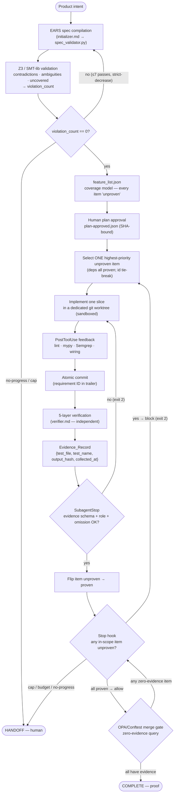
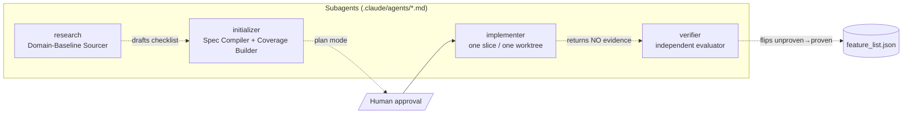
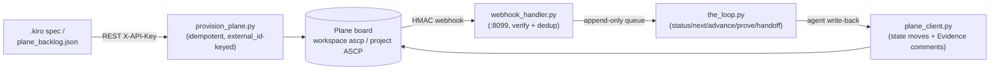

# ASCP — System Architecture

> **Agentic-Driven SDLC Platform** — an autonomous **Spec-to-Evidence** software-delivery control plane that runs on the Claude Code substrate, plus a self-hosted **Plane** PM control plane that makes every gate decision, agent run, and HANDOFF visible.

This document is the authoritative architecture reference. It is grounded line-by-line in the live repository: the reconciled `.kiro/specs/spec-to-evidence-control/{requirements,design,tasks}.md`, the 26 tool modules under `tools/`, the 6 Claude Code hooks and 4 subagents under `.claude/`, the 8 Postgres migrations under `db/migrations/`, the 4 CI workflows under `.github/workflows/`, the Z3 harness `verification/formal_verification_merged.py`, and the `plane-integration/` REST/webhook surface.

---

## 1. The governing invariant

Everything below is shaped by one rule:

> **Deterministic gates — Claude Code hooks, CI, and OPA — decide whether delivery is complete, computed solely from verifiable facts. Model self-assessment and probabilistic predictions only inform; they never gate.**

Concretely:

- **"Done" is a machine fact, not a self-report.** A coverage item is `proven` only when a complete, content-addressed `Evidence_Record` exists; the completion verdict is recomputed from the actual repository state.
- **The model cannot talk past the gate.** Enforcement lives in command-type hooks (which fail *closed*, exit 2) and required CI status checks — not in prompts or `CLAUDE.md`.
- **Ambiguity resolves to blocked.** The completion gate is fail-closed and non-bypassable by configuration (REQ-GATE-005).
- **Predictions are walled off.** No gate decision reads a prediction; this is machine-proved by Z3 (`CHECK-5`) and runtime-mirrored by `predictive_router.gate_decision_is_prediction_independent`.

The system is specified by **32 numbered EARS requirements** (Requirement 1–32), **32 correctness properties** (Property 1–32, Hypothesis-tested), an **8-table** durable Postgres store, **57 tasks**, and a unified **Z3 harness of 34 machine-checked assertions** (14 core + 12 Kiro + 8 new), all passing. Phases 0–6 are built and on `main` behind **5 required CI checks**.

---

## 2. The closed-loop pipeline (intent → proof)

The control plane is a closed loop: terse product intent goes in; verified software with attached, content-addressed evidence comes out — and the loop physically cannot terminate as COMPLETE while any in-scope requirement is unproven.



**Stage by stage:**

| # | Stage | Mechanism | Where enforced |
|---|-------|-----------|----------------|
| 1 | **Intent → EARS spec** | Initializer compiles atomic, individually-testable requirements with IDs, one of five EARS patterns, priority, and ≥1 machine-checkable acceptance criterion | `initializer.md`, `spec_validator.py` |
| 2 | **Z3 validation** | EARS → SMT-lib; `check-sat` for contradictions, completeness (UNMAPPED), vacuity, plus a vague-adjective scanner → `{contradictions, ambiguities, uncovered, violation_count}` | `spec_validator.py` |
| 3 | **Spec-completion loop** | Bounded ≤7 passes, **strict-decrease-or-HANDOFF**; the Stop hook blocks termination while `violation_count > 0` | `stop_hook.py`, `run_state` |
| 4 | **Coverage model** | `feature_list.json` — every item `{id, type, priority, dependencies, acceptance_criteria, status='unproven', in_scope}` | `feature_list_init.py`, schema |
| 5 | **Plan approval** | Human writes `plan-approved.json` carrying a `feature_list_sha` binding approval to a specific coverage model | PreToolUse plan gate |
| 6 | **One slice / one worktree** | Implementer takes exactly one highest-priority eligible item, builds it in an isolated `git worktree` inside a sandbox | `implementer.md`, `sandbox_guard.py` |
| 7 | **5-layer verify** | Independent Verifier runs structural, semantic, behavioral, security, perf+a11y layers | `verifier.md`, `perf_a11y_verifier.py` |
| 8 | **Evidence_Record** | Four required fields; `output_hash` is a canonicalized, content-addressed SHA-256 over the verification artifact | `evidence_collector.py` |
| 9 | **Completion gate** | Stop hook + OPA/Conftest + GitHub required checks; COMPLETE only when zero in-scope items are unproven and all have evidence | `stop_hook.py`, `coverage_gate.py`, ruleset |
| 10 | **Proof** | Merge allowed only when the OPA zero-evidence query returns zero rows; traceability + audit chain reconstructable | OPA, `audit_verify.py`, Postgres |

**Two terminal states, mutually exclusive:** **COMPLETE** (every in-scope item proven with evidence, all gates green) and **HANDOFF** (iteration cap, cost budget, or the no-progress predicate reached). A HANDOFF run is *never* marked COMPLETE — Z3 `CHECK-3` proves a naive cap cannot route to COMPLETE under an unproven item.

### The load-bearing HANDOFF-first ordering

The single most important control-flow decision in the system lives in `stop_hook.py::evaluate_stop`. **HANDOFF triggers are evaluated *before* the unproven-items gate, on purpose.**

```
evaluate_stop(event):
  1. cap reached?        (spec phase: spec_pass_count ≥ 7;
                          impl phase: iteration_count ≥ 25)   → HANDOFF, allow (exit 0)
  2. budget exceeded?    (token_cost_usd ≥ TOKEN_BUDGET)      → HANDOFF, allow (exit 0)
  3. no-progress?        (impl phase, N=3 window)             → HANDOFF, allow (exit 0)
  ── only if NOT in HANDOFF ──
  4. violation_count < 0  → block (validator error, fail closed)
  5. violation_count > 0  → block (spec violations remain)
  6. zero in-scope items  → block (INIT state, not COMPLETE)
  7. any item ≠ 'proven'  → block (the ONLY legitimate exit-2 continuation path)
  8. else                 → allow (COMPLETE)
```

If the unproven check ran *first*, a run that has legitimately hit its cap would be forced to keep working past the cap — an **infinite block**. At HANDOFF the in-scope items are *expected* to remain unproven, so the HANDOFF carve-out returns `allow` (exit 0) and lets a human pick the run up. This is backed by Z3 `CHECK-5b/5c/8c` (block-on-cap / block-on-no-progress is UNSAT). The `stop_hook_active` reentrancy guard (`with_reentrancy_guard`) prevents the Stop hook from re-triggering itself while a block is active.

---

## 3. The Claude Code hook layer (6 hooks)

Hooks are the **sole deterministic mid-flight intervention layer** — not prompts, not `CLAUDE.md` (REQ-STEER-001). All six are **`command`-type** so they fail *closed*; HTTP/MCP hooks (which fail open) are forbidden for hard policy. The exit-code contract: **`0` = proceed, `2` = blocking error fed to the model via stderr, any other non-zero = non-blocking feedback** (exit 1 does **not** block).

Registered in `.claude/settings.json`:

```json
{ "hooks": {
  "PreToolUse":   [{ "hooks": [{ "type": "command", "command": "python3 .claude/hooks/pre_tool_use_hook.py" }] }],
  "PostToolUse":  [{ "matcher": "Write|Edit|MultiEdit",
                     "hooks": [{ "type": "command", "command": "python3 .claude/hooks/post_tool_use_hook.py" }] }],
  "Stop":         [{ "hooks": [{ "type": "command", "command": "python3 .claude/hooks/stop_hook.py" }] }],
  "SubagentStop": [{ "hooks": [{ "type": "command", "command": "python3 .claude/hooks/subagent_stop_hook.py" }] }],
  "SessionStart": [{ "hooks": [{ "type": "command", "command": "python3 .claude/hooks/session_start_hook.py" }] }],
  "PreCompact":   [{ "hooks": [{ "type": "command", "command": "python3 .claude/hooks/pre_compact_hook.py" }] }]
}}
```

| Hook | Type | Fires on | What it does | Blocks |
|------|------|----------|--------------|--------|
| **`PreToolUse`** | true prevention gate (exit 2) | every tool call | A battery of sub-gates: plan-approval, scope-sequencing, integrity, checklist-approval, artifact-protection, status-transition, secret-block | See sub-gates below |
| **`PostToolUse`** | next-turn forcing function | `Write\|Edit\|MultiEdit` | Runs lint + mypy + Semgrep + `wiring_checker` on changed files; returns findings as next-turn feedback | **Nothing** — exit 1, non-blocking |
| **`Stop`** | completion gate (exit 2) | agent ends its turn | `evaluate_stop` — the HANDOFF-first ordering above | Termination while any in-scope item is unproven and no HANDOFF trigger is active |
| **`SubagentStop`** | acceptance gate (exit 2) | subagent result returned | Validates the Evidence_Record four-field schema (verifier results), role separation (implementer cannot self-verify), and the omission-declaration guard | Acceptance of malformed/self-graded/undeclared results |
| **`SessionStart`** | informational (cannot block) | session begins | Loads git status + `claude-progress.txt` + `feature_list.json`; on resume, computes the resumed-state hash via `state_integrity.py` and writes `run_state.resume_integrity_ok` | Nothing |
| **`PreCompact`** | checkpoint writer (cannot block) | context compaction imminent | Checkpoints progress + evidence + `feature_list.json` to git; **produces** the durable `run_state.resume_state_hash` baseline | Nothing |

### `PreToolUse` sub-gates

The PreToolUse hook registers with no matcher (fires on every tool); each sub-gate self-scopes:

| Sub-gate | Blocks | Requirement |
|----------|--------|-------------|
| **plan gate** | All implementation `Write`/`Edit`/`MultiEdit` until `plan-approved.json` exists **and** its `feature_list_sha` matches the canonical SHA-256 of the current coverage model | REQ-HITL-001, REQ-EXEC-004, 18.4 |
| **scope gate** | New worktree / slice while any prior-slice item is unproven (Z3 `CHECK-6a`) | REQ-EXEC-005 |
| **integrity guard** | First write of a *resumed* session when `resume_integrity_ok == false`; NULL/absent baseline → allow (fresh runs never blocked) | REQ-STATE-005 |
| **checklist-approval guard** | Discovery using a `DRAFT` (unapproved) checklist (Z3 `CHECK-12`) | REQ-SPEC-016 |
| **artifact guard** | Edits to protected files (`feature_list.json` schema, `tests/`, CI config) and destructive ops (`rm -rf`, `DROP TABLE`); the **Verifier** is the one actor permitted to write `tests/` via an `actor_agent`-keyed carve-out | REQ-STEER-003, REQ-COV-002 |
| **status guard** | Any transition outside `{unproven→proven, unproven→failed, failed→unproven, proven→unproven (amendment-gated)}`; any into `proven` without a complete Evidence_Record; any deletion/truncation/reorder of the item id-sequence (append-only) | REQ-COV-002/003/006/007 |
| **secret-block guard** | Any call whose prompt / span attributes / URL / Bash args would carry a secret (live prevention, not just an offline test) | REQ-SEC-005 (17.5), Property 20 |

**Actor independence:** identity is resolved from runtime signals only (`CLAUDE_AGENT_NAME`, hook stdin `session_id`) via `actor_identity.py` — never from a field the writing agent places in the payload. Both SubagentStop and PreToolUse stamp the resolved identity over whatever the agent supplied, so a forged `actor_agent` cannot promote a self-graded flip to `proven`.

**Audit-log producer rule:** every gate that returns an allow/block decision calls `audit_log.append(event, tool, decision, reason, requirement_id, actor_agent)` — Stop, SubagentStop (both gates), and every blocking PreToolUse sub-gate. `PostToolUse` is **exempt** because it never gates; its OTel `hook.feedback` span is informational telemetry, not an audit entry.

---

## 4. The 4 subagents and scoped permissions

Each subagent is a Markdown file under `.claude/agents/` with YAML frontmatter; Claude Code auto-discovers them by convention (no explicit registration). Permission scoping is enforced by the `tools:` allowlist, not prose. The four agents are the system's **memory** (initializer), **builder** (implementer), **verifier**, and **researcher/auditor**.



| Agent | Role | `tools:` allowlist | Write scope | No access to |
|-------|------|--------------------|-------------|--------------|
| **`initializer.md`** | EARS spec compilation, Z3 validation, builds `feature_list.json`, enters plan mode (never writes `plan-approved.json` — only the human does) | Read/Write spec artifacts | spec prose `requirements.md`, `spec.json`, `feature_list.json`, checklists | `tests/`, CI config, implementation source |
| **`implementer.md`** | Implements exactly **one** highest-priority unproven item per session in an isolated worktree; one atomic commit with the requirement ID in the trailer; returns with **no** Evidence_Record | `[Read, Grep, Glob, Edit, Write, Bash]` | implementation source **in its assigned worktree only** (sandbox-confined) | `tests/`, schema, CI, other worktrees, verification |
| **`verifier.md`** | Independent evaluation across all five layers; assembles Evidence_Records; flips `unproven → proven` only when all checks pass and coverage ≥ 85% | `[Read, Grep, Glob, Bash]` — **no Write/Edit on src** | `tests/` + the `feature_list.json` `status` field and attached `evidence` sub-object (via the artifact-guard carve-out) | implementation source, CI config, schema |
| **`research.md`** | Sources domain-baseline checklists (competitive analysis, standards, OSS refs); every claim carries a source URL + authority-tier label and passes an independent fact-check before human review | Read/Write `baselines/` only | `baselines/` | implementation source, tests, CI |

**Role separation is the heart of independence (Property 24):** the Implementer returns with no Evidence_Record and the SubagentStop hook **blocks** any evidence-bearing result whose `actor_agent` is `implementer.md`. The system never grades its own homework.

---

## 5. The 8-table Postgres durable store

All mutable run state lives **outside model context** — in files, git history, and a managed Postgres store (Neon serverless canonically; the self-hosted Plane `plane-db` Postgres 15.7 in the local deployment). The store is the single source of truth for coverage queries, reconstructable independently of any model session. Migrations `001`–`008` apply in numeric order.

| # | Migration | Table | Holds |
|---|-----------|-------|-------|
| 001 | `001_requirements.sql` | `requirements` | Authoritative spec record: id, type, `nfr_subtype`, priority, EARS pattern/statement, provenance (`stated`/`inferred`) |
| 002 | `002_coverage_items.sql` | `coverage_items` | Mutable status view: `status ∈ {unproven, proven, failed}`, `subtype`, `in_scope` (a `BEFORE UPDATE` trigger rejects an unattributed flip to `in_scope=false`) |
| 003 | `003_traceability_links.sql` | `traceability_links` | Bidirectional requirement ↔ implementation ↔ test ↔ evidence ↔ commit ↔ owner graph |
| 004 | `004_evidence_records.sql` | `evidence_records` | The four-field record + `actor_agent`; a `CHECK` enforces the `^sha256:[a-f0-9]{64}$` `output_hash` format the JSON Schema also enforces |
| 005 | `005_run_state.sql` | `run_state` | Per-session resumption state: `phase`, `iteration_count`, `spec_pass_count`, `token_cost_usd`, `violation_count`/`prev_violation_count`, `retry_count`, `resume_integrity_ok`, `is_resume`, `first_write_done`, `resume_state_hash`, `stop_hook_active`, `no_progress_n` |
| 006 | `006_domain_baseline_checklists.sql` | `domain_baseline_checklists` | Product-class checklist version history; `approved_at` NULL = draft |
| 007 | `007_requirement_versions.sql` | `requirement_versions` | Amendment history (REQ-COV-007) — gates the `proven → unproven` amendment re-entry |
| 008 | `008_gate_audit_log.sql` | `gate_audit_log` | Hash-chained tamper-evident gate decisions (REQ-AUDIT-001/002) |

**Fail-closed availability (Note N-25):** when Postgres is unavailable, every gate falls back to file-backed state (`feature_list.json`) and reaches the **same** allow/block decision it would from the DB — it **never fails open**. On any divergence, the more conservative (blocking) result wins. `gate_audit_log` writes append to a file-backed segment and reconcile (replay + re-chain) on reconnect, so no decision goes unlogged.

**File-canonical scoping (REQ-16.3):** `feature_list.json` is canonical for `acceptance_criteria`, `dependencies`, and `priority`; Postgres mirrors only the coverage-status subset needed for the traceability graph and OPA/evidence queries. `store.py` provides a stdlib `sqlite3` reference backend mirroring all eight tables so tests exercise the same shapes and gates with no Postgres dependency.

---

## 6. Verification and security gates

### The 5-layer verification engine

The independent Verifier checks each slice across five layers (REQ-VERIFY-001, extended by REQ-VERIFY-007/008):

| Layer | Checks | Tools | Evidence |
|-------|--------|-------|----------|
| **Structural** | lint, type-check, AST analysis | `ruff`, `mypy`, `wiring_checker.py` (`ast`) | — |
| **Semantic** | unit + integration tests; line coverage ≥ 85% on touched files | `pytest`, `pytest-cov` (`coverage.json`) | test output hash |
| **Behavioral** | E2E render assertions | Playwright (trace/screenshot) | captured trace |
| **Security** | SAST (HIGH/CRITICAL = fail) | Semgrep + CodeQL | — |
| **Perf + a11y** | latency/Core Web Vitals budgets; zero WCAG-A/AA violations; declared-screen/state render | `perf_a11y_verifier.py` → k6/Lighthouse, axe-core, Playwright | report/trace hash |

The fifth layer dispatches deterministically on the coverage item's `subtype` discriminator (`performance` → k6/Lighthouse, `accessibility` → axe-core, `ui-screen` → Playwright over `declared_states` = `empty`/`loading`/`error`/`ready`) — not by guessing from text.

**Evidence hashing (`evidence_collector.py`):** `output_hash` is `sha256` over the **canonicalized** verification artifact (volatile fields stripped, collections sorted, JSON deterministically serialized) so a re-run on the same code rehashes identically. The raw artifact is retained as a content-addressed blob keyed by `output_hash`; the four-field record holds only the `sha256:` reference.

### Security and supply-chain gates

| Gate | Mechanism | Enforced at | Requirement |
|------|-----------|-------------|-------------|
| **OPA coverage gate** | Conftest `deny` rules over `feature_list.json`: any in-scope item not `proven`, or `proven` without complete evidence, or zero in-scope items → deny; default-deny on parse failure | merge CI (`coverage-gate.yml`), twinned by `coverage_gate.py` | REQ-GATE-002/003, Property 22 |
| **Secrets scan** | gitleaks diff-scan (trufflehog acceptable alt); SARIF artifact | merge CI (`secrets-scan.yml`) + commit-side PreToolUse secret-block | REQ-17.2 / 17.5, Property 32 |
| **DAST (ZAP)** | OWASP ZAP baseline passive scan (`zaproxy/action-baseline@v0.12.0`, `fail_action: true`) against a CI-booted localhost target | merge CI (`zap-baseline.yml`) | REQ-SEC-008 |
| **DeepEval quality gate** | Faithfulness ≥ 0.8, answer-relevancy ≥ 0.7; deterministic LLM-judge (`claude-opus-4-8` via Vertex, temp 0, fixed seed) — a quality bar, **not** the completion gate | merge CI (`deepeval_gate.py`) | REQ-EVAL-001 |
| **SAST** | Semgrep (edit-time, feedback only) + CodeQL (CI gate, 0 HIGH/CRITICAL) | PostToolUse + CI | REQ-SEC-001 |
| **Kill-switch** | OpenFeature + self-hosted `flagd`; `kill.<capability>` / `kill.all` queried at start-of-turn; **fail-closed** (unreachable flagd → disabled) within ≤30 s, no restart | `kill_switch.py` | REQ-CTRL-001 |
| **Sandbox isolation** | devcontainer (local) / E2B (CI); network egress denied by default; writes confined to the per-slice worktree mounted in | `sandbox_guard.py` | REQ-17.4 |
| **SLSA provenance** | Signed build provenance, `gh attestation verify` | merge | REQ-SEC-003 |

---

## 7. The Z3 formal-verification harness (34 checks)

`verification/formal_verification_merged.py` encodes the system's non-negotiable invariants as Z3 (v4.16.0) SAT/UNSAT assertions. It **self-counts to 34** at runtime (`TOTAL = checks_run`, never hardcoded) and exits 0 only when all pass — it is the first required CI check.

```
Result: 34/34 checks passed
Groups: core-14 (CHECK-1..5c) + Kiro-12 (CHECK-6a..9c) + new-8 (CHECK-10a..13b) = 34
```

The harness machine-checks the **completion / HANDOFF / exit-code** family. Representative invariants:

| Check | Proves | Invariant |
|-------|--------|-----------|
| `CHECK-1`, `CHECK-3` | `complete ∧ unproven` is UNSAT | Cannot be COMPLETE while anything is unproven |
| `CHECK-3` | naive-cap → COMPLETE under unproven is UNSAT | Cap routes only to HANDOFF, never COMPLETE |
| `CHECK-4f` | write-without-approved-plan is UNSAT | No code write without `plan-approved.json` |
| `CHECK-5` | differing prediction → differing gate is UNSAT | Gates are prediction-independent |
| `CHECK-5b/5c/8c` | block-on-cap / block-on-no-progress is UNSAT | HANDOFF-first ordering is correct |
| `CHECK-6a` | `newSlice ∧ priorUnproven` is UNSAT | No new slice while prior slice unproven |
| `CHECK-7a/7c` | proven with missing/zero evidence is UNSAT | Four-field evidence schema enforced |
| `CHECK-8b` | no-progress → COMPLETE is UNSAT | No-progress routes only to HANDOFF |
| `CHECK-9a` | advance-while-UNMAPPED is UNSAT | UNMAPPED blocks advancement |
| `CHECK-10a/10b` | amendment monotonicity | A re-amended item must be re-proven to complete |
| `CHECK-11a/11b` | `resumeHashMismatch ∧ runProceeds` is UNSAT | Integrity gate blocks a corrupted resume |
| `CHECK-12a/12b` | DRAFT-checklist-used-for-discovery is UNSAT | Checklist-approval-before-use |
| `CHECK-13a/13b` | null omission ∧ accepted is UNSAT | Omission-declaration gate |

**Deliberately runtime-enforced, not Z3-encoded** (documented, not gaps): the three-state status-transition edge set (PreToolUse status guard), the standalone token-budget routing (`evaluate_stop`), wiring/dead-code reachability (Property 11 + integration tests), and orphan detection. These have no closed SAT/UNSAT gating invariant and are pinned by Hypothesis properties + integration tests instead.

The 32 correctness **Properties** are the Hypothesis-tested runtime mirror of these invariants and run as the second required CI check (`Property + spine test suite`).

---

## 8. Durable orchestration (Phase 5) and predictive routing (Phase 6)

Both phases are **optional and off the gating path** — the inner planner/implementer/verifier loop stays on Claude Code's own subagents + hooks (REQ-ORCH-001). They add capability without ever touching the completion verdict.

### Phase 5 — durable outer loop (`durable_orchestrator.py`, `event_bus.py`)

A pure-Python reference of the Temporal/Inngest durable-execution semantics for crash-safe multi-hour/multi-day runs (REQ-ORCH-002, 15.2 — wrap the loop invoking `claude -p` as a durable step, each tool call a separate activity):

- **Activity wrapper** — runs a side-effecting function under a bounded `RetryPolicy`; on retry exhaustion it raises `Handoff` (the anti-loopmaxxing terminal state) — never loops forever.
- **Durable workflow + deterministic replay** — an append-only `Event` history; re-running against an existing history *replays* recorded results without re-executing side effects, so a crash-restart yields identical decisions.
- **Checkpoint / resume** — serializes history to a content-addressed blob (SHA-256-guarded); `resume` reconstructs an equivalent workflow.
- **`event_bus.py`** — Inngest-style `emit`/`on`/`run_step`/`deliver`: at-least-once delivery with per-(delivery, handler) dedup → exactly-once effects on top of `run_step` memoization.

Nothing here decides COMPLETE; deterministic gates still own that.

### Phase 6 — predictive routing (`predictive_router.py`) — OFF-GATE

Advisory next-step routing: given a feature signature and historical outcomes, `predict_route` advises which agent/model/context is most likely to succeed, injected **only as context** (a `UserPromptSubmit`/`SessionStart` hook or MCP retrieve tool). The critical invariant (Property 4 / REQ-19.2, Z3 `CHECK-5`): **predictions never gate.** `gate_decision_is_prediction_independent` is the runtime witness — it re-evaluates a candidate gate over the same coverage state under the prediction, adversarially perturbed predictions, and no prediction, and returns True only if every verdict is identical. Predicted-routing spans are tagged distinctly so routing can be disabled on drift.

---

## 9. The Plane PM control plane integration

A self-hosted **Plane v1.3.1** instance (`http://localhost:8090`, workspace `ascp`, project `ASCP`) is the human-facing surface: every coverage item, gate decision, agent run, and HANDOFF is a Plane issue moving through a **12-state agent workflow** (`Backlog → Agent-Triaged → Spec-Compiling → Spec-Verified → Plan-Approved → Agent-Executing → In-Verification → Human-Review → Done`, plus the three terminal cancelled states `HANDOFF`, `Blocked`, `Failed`). The board is organized to Tier-1 grade (modules, cycles, views, and an onboarding page) per `docs/plane/PLANE_BLUEPRINT.md`.

The integration is a **bidirectional contract** (`plane-integration/`, stdlib-only):



| Module | Role |
|--------|------|
| **`provision_plane.py`** | REST provisioner — builds the workspace from the reconciled spec (`plane_backlog.json`): 8 epics → 49 stories → 186 tasks. Idempotent, keyed by `external_id` (`external_source="ascp-kiro"`); a local state file maps logical keys → Plane UUIDs so re-runs skip existing objects. Custom-field values are encoded into a structured metadata block and mapped to labels (community edition has no custom-property API). |
| **`webhook_handler.py`** | Plane → agent ingest. HMAC-SHA256 verifies `X-Plane-Signature`, dedups on `X-Plane-Delivery`, routes state-changes into an append-only dispatch queue (`.agent_queue.jsonl`). Decouples fast 200-OK receipt from slow agent runs. State → role: `Agent-Triaged`→initializer, `Plan-Approved`→implementer, `Agent-Executing`/`In-Verification`→verifier. |
| **`the_loop.py`** | The mechanical PM interface the autonomous loop drives: `status`, `next`, `advance <id> <state> <role>` (enforces actor authority + gate order), `prove <id> <tf> <tn> <hash>` (attach a four-field Evidence_Record then set `Done` — verifier only), `handoff <id> <reason> <role>`. |
| **`plane_client.py`** | Agent → Plane write-back (`X-API-Key`): moves items through the 12-state workflow and attaches Evidence_Records as comments. |

**The completion-gate discipline is mirrored into Plane:** an item reaches `Done` **only** via `prove` (verifier + complete Evidence_Record); cap/budget/no-progress route to `HANDOFF` (a terminal state distinct from `Done`); and the two human-only transitions — plan approval (`Plan-Approved`, backed by SHA-bound `plan-approved.json`) and PR review (`Done`, backed by a required reviewer in the GitHub ruleset) — are refused for any agent role.

---

## 10. Observability

Phase 3 (`observability.py`) makes the run a live, requirement-tagged, auditable trace.

- **OTel spans** for every model call, tool invocation, and subagent task (`CLAUDE_CODE_ENABLE_TELEMETRY=1`), streamed to the backend as each span closes (export interval ≤ 5 s), not batched at run-end.
- **W3C Baggage** propagates the active `requirement.id` to every child span (Property 12) — traceability is reconstructable from the live trace alone.
- **Hook decision forwarding** — gate-making hooks (Stop, PreToolUse, SubagentStop) emit a `hook.decision` span carrying `hook.event`, `tool.name`, `decision` (allow/block), `reason`, `requirement.id`, `actor_agent` (same attribution as the durable `gate_audit_log` row). Non-gating hooks emit only informational `hook.feedback`.
- **Reasoning-loop detector** (REQ-OBS-006) — a `claude.span.kind="reasoning"` attribute on an OTel INTERNAL span (not a new SpanKind); the detector fires on **K=3** identical tool-call signatures, bounding comprehension debt.
- **Tamper-evident audit** — `gate_audit_log` is a SHA-256 hash chain (`entry_hash = sha256(canonical_row || prev_hash)`); `audit_verify.py` recomputes the chain on-demand and as a CI check, failing closed on the first broken link (Property 28).
- **Backend** — Langfuse (MIT core) by default; license documented for compliance (SigNoz MIT; Arize Phoenix Elastic License 2.0).

---

## 11. Component inventory

The control plane is **26 tool modules** + **6 hooks** + **4 subagents** + **2 verification harnesses**, backed by **8 migrations**, **4 CI workflows**, and **4 Plane-integration modules**. Phases below match the build sequence (0 = spine).

### Hooks (`.claude/hooks/`)

| Component | Phase | Role |
|-----------|-------|------|
| `stop_hook.py` | 0 | Completion gate — `evaluate_stop`, HANDOFF-first ordering, reentrancy guard |
| `pre_tool_use_hook.py` | 0 | True prevention gate — plan/scope/integrity/checklist/artifact/status/secret sub-gates |
| `session_start_hook.py` | 0 (+2) | Loads git/progress/coverage; on resume computes integrity flag |
| `subagent_stop_hook.py` | 0 (+2/+3) | Evidence-schema + role-separation + omission-declaration acceptance gate |
| `post_tool_use_hook.py` | 1 | Lint + mypy + Semgrep + wiring feedback (non-blocking) |
| `pre_compact_hook.py` | 1 | Checkpoint + resume-state-hash producer |

### Subagents (`.claude/agents/`)

| Component | Phase | Role |
|-----------|-------|------|
| `initializer.md` | 0 | Spec compiler + coverage-model builder (memory) |
| `implementer.md` | 0 | One-slice coder (builder) |
| `verifier.md` | 0 | Independent 5-layer evaluator (verifier) |
| `research.md` | 0 | Domain-baseline checklist sourcer (researcher/auditor) |

### Tools (`tools/` — 26 modules)

| Component | Phase | Role |
|-----------|-------|------|
| `spec_validator.py` | 0 | Z3-backed EARS validator → `{contradictions, ambiguities, uncovered, violation_count}` |
| `evidence_collector.py` | 0 | Assembles + canonicalizes Evidence_Records; computes `output_hash` |
| `feature_list_init.py` | 0 | Seeds an empty, schema-valid `feature_list.json` |
| `materialize_feature_list.py` | 0/1 | Compiles a website EARS spec into a coverage model |
| `coverage.py` | 0 | Coverage-model query helpers (`is_complete`) |
| `coverage_gate.py` | 1 | Python twin of the OPA zero-evidence merge policy |
| `opa_input.py` | 1 | Builds the Conftest/OPA input document |
| `wiring_checker.py` | 1 | Repo-wide call-graph / dead-code analysis → WIRING candidates |
| `orphan_detector.py` | 1 | Forward/backward orphan detection (traceability gate) |
| `req_id_scan.py` | 1 | Shared requirement-ID regex (trailer/comment extraction) |
| `traceability_writer.py` | 2 | Commit-trailer parser + requirement↔code↔test link builder |
| `perf_a11y_verifier.py` | 1 | The Verifier's 5th layer (perf / a11y / ui-screen) |
| `sandbox_guard.py` | 1 | Sandbox + worktree-isolation host-side checks |
| `actor_identity.py` | 0 | Runtime-only actor-identity resolution (anti-forgery) |
| `model_fingerprint.py` | 0 | Stable fingerprint of the coverage model (plan-approval freeze) |
| `prove_trivial_slice.py` | 0 | End-to-end spine demonstration ("done" is a machine fact) |
| `store.py` | 2 | Durable-store abstraction over the 8 tables (sqlite3 reference backend) |
| `state_integrity.py` | 2 | Resumed-state hash recompute + `resume_integrity_ok` |
| `audit_log.py` | 2 | Tamper-evident gate-decision hash-chain producer |
| `audit_verify.py` | 3 | Hash-chain verifier (on-demand + CI) |
| `observability.py` | 3 | OTel spans, Baggage, hook-decision forwarding, reasoning-loop detector |
| `deepeval_gate.py` | 3 | DeepEval faithfulness/relevancy quality gate |
| `kill_switch.py` | 2 | OpenFeature/flagd kill-switch client (fail-closed) |
| `durable_orchestrator.py` | 5 | Temporal/Inngest-style durable workflow + replay + checkpoint |
| `event_bus.py` | 5 | Inngest-style durable-step event bus |
| `predictive_router.py` | 6 | Off-gate predictive routing + prediction-independence witness |

### Verification, data, CI, PM

| Component | Path | Role |
|-----------|------|------|
| Z3 harness | `verification/formal_verification_merged.py` | 34 machine-checked assertions (required CI check #1) |
| Actor-separation harness | `verification/actor_separation.py` | Actor-independence formal model |
| Migrations | `db/migrations/001…008` | The 8-table durable store |
| `ci.yml` | `.github/workflows/` | Z3 harness (34/34) + property/spine suite |
| `coverage-gate.yml` | `.github/workflows/` | OPA zero-evidence merge gate |
| `secrets-scan.yml` | `.github/workflows/` | gitleaks diff-scan |
| `zap-baseline.yml` | `.github/workflows/` | OWASP ZAP baseline DAST |
| `provision_plane.py` · `webhook_handler.py` · `the_loop.py` · `plane_client.py` | `plane-integration/` | Plane REST provisioner, webhook handler, loop driver, agent write-back |

**The 5 required CI status checks on `main`** (`docs/github-ruleset.md`): (1) `Z3 formal-verification harness (34/34)`, (2) `Property + spine test suite`, (3) `Zero-evidence coverage gate`, (4) `gitleaks secrets diff-scan`, (5) `zap-baseline`. The gate is enforced, fail-closed, and — at the full spec posture (`enforce_admins: true`, `required_approving_review_count: 1`) — non-bypassable.

---

## 12. End-to-end data flow

```mermaid
sequenceDiagram
    participant H as Human
    participant I as Initializer
    participant Hook as Hook Layer
    participant Impl as Implementer
    participant Ver as Verifier
    participant DB as Postgres (8 tables)
    participant CI as CI / OPA Gate
    participant Plane as Plane board

    H->>I: product intent
    I->>I: EARS → SMT-lib → Z3 (spec_validator.py)
    I->>I: domain-baseline expansion → feature_list.json (all unproven)
    I->>DB: persist requirements + coverage_items
    I->>H: plan mode (spec + coverage model)
    H->>I: write plan-approved.json (feature_list_sha bound)
    I->>Plane: items → Spec-Verified / Plan-Approved

    loop each highest-priority unproven item (deps proven)
        Hook->>Impl: SessionStart — load git + progress + coverage
        Hook->>Hook: PreToolUse — plan + scope + secret gates
        Impl->>Impl: implement one slice in a sandboxed worktree
        Hook->>Hook: PostToolUse — lint + mypy + Semgrep + wiring (feedback)
        Impl->>DB: atomic commit (requirement ID in trailer) → traceability_links
        Ver->>Ver: 5-layer verify (structural/semantic/behavioral/security/perf+a11y)
        Ver->>Ver: evidence_collector.py → output_hash (canonicalized)
        Hook->>Hook: SubagentStop — evidence schema + role + omission
        Hook->>DB: gate_audit_log.append (hash-chained) + OTel hook.decision
        Ver->>DB: flip unproven → proven + Evidence_Record
        Ver->>Plane: prove → Done (verifier-only)
        Hook->>Hook: Stop — HANDOFF-first; block if any in-scope unproven
    end

    CI->>CI: OPA zero-evidence query + gitleaks + ZAP + audit-chain
    CI->>H: merge allowed only when every in-scope item is proven-with-evidence
```

**The guarantee, restated:** intent enters as natural language; it leaves as merged software where every in-scope requirement is `proven` with a content-addressed Evidence_Record, every gate decision is hash-chain-auditable, and the loop was *physically incapable* of declaring COMPLETE one step earlier. Agents accelerate the work; deterministic gates — proved correct by 34 Z3 assertions and 32 Hypothesis properties — decide when it is done.

---

## Appendix — canonical counts

| Quantity | Value | Source |
|----------|-------|--------|
| EARS requirements | **32** (Requirement 1–32) | `requirements.md` |
| Correctness properties | **32** (Property 1–32, Hypothesis) | `design.md` |
| Z3 machine-checked assertions | **34** (14 core + 12 Kiro + 8 new) | `formal_verification_merged.py` (self-counted) |
| Postgres tables / migrations | **8** (`001`–`008`) | `db/migrations/` |
| Implementation tasks | **57** | `tasks.md` |
| Claude Code hooks | **6** | `.claude/hooks/`, `settings.json` |
| Subagents | **4** | `.claude/agents/` |
| Tool modules | **26** | `tools/` |
| CI workflows | **4** | `.github/workflows/` |
| Required CI status checks | **5** | `docs/github-ruleset.md` |
| Build phases | **0–6** (0–4 required, 5–6 optional/off-gate) | `design.md` |
| Plane agent-workflow states | **12** (9 active + 3 terminal cancelled) | `PLANE_BLUEPRINT.md` |
